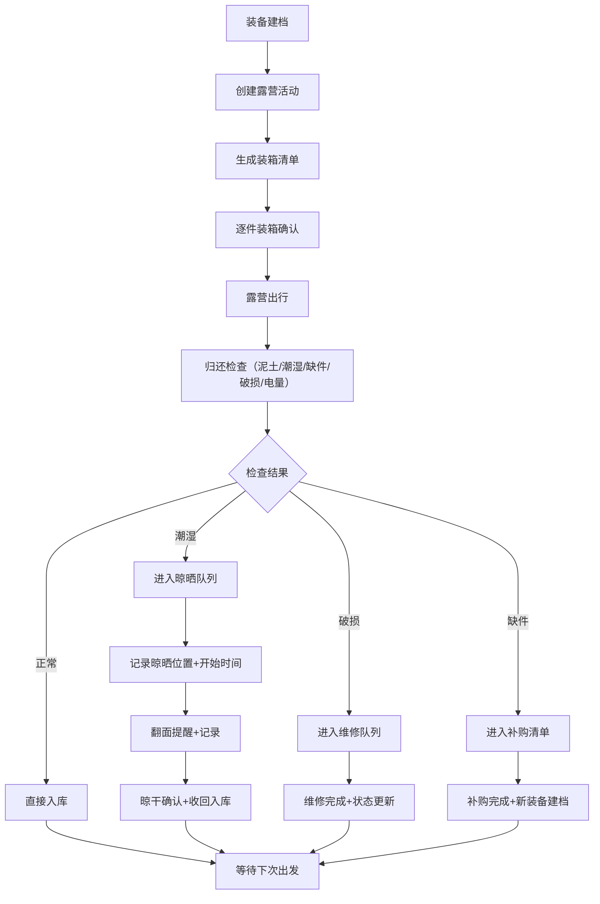

## 1. 产品概述

露营装备归还与晾晒管理系统，解决露营归来后装备未正确晾晒导致发霉、损坏的问题。系统管理装备全生命周期：档案建档、出发装箱、归还检查、晾晒维护、维修补购。

- 目标用户：露营爱好者、家庭露营组织者、户外俱乐部
- 核心价值：确保每件装备归营后得到正确维护，延长装备寿命，避免下次出行发现装备损坏

## 2. 核心功能

### 2.1 用户角色
| 角色 | 注册方式 | 核心权限 |
|------|----------|----------|
| 装备管理员 | 本地应用，无需注册 | 装备档案管理、装箱清单、归还检查、晾晒管理、维修补购 |

### 2.2 功能模块
1. **首页仪表板**：待晾晒、待维修、缺件补购、下次露营不可用装备四大看板 + 快速入口
2. **装备档案**：六类装备（帐篷/天幕/睡袋/炉具/桌椅/灯具）管理，含编号、购买日期、存放箱、照片
3. **装箱清单**：按露营活动生成待装箱清单，勾选确认装箱
4. **归还检查**：逐件检查（泥土/潮湿/缺件/破损/电量），自动生成晾晒/维修/补购队列
5. **晾晒管理**：晾晒队列追踪，记录位置、开始时间、翻面、收回时间
6. **维修补购**：破损维修进度、缺件补购清单

### 2.3 页面详情
| 页面名称 | 模块名称 | 功能描述 |
|----------|----------|----------|
| 首页仪表板 | 四大状态看板 | 待晾晒数量+详情、待维修数量+详情、缺件补购数量+详情、不可用装备数量+详情 |
| 首页仪表板 | 快速操作区 | 新建露营活动、快捷入库、查看装箱清单 |
| 首页仪表板 | 最近活动列表 | 最近几次露营活动的状态摘要 |
| 装备档案 | 分类筛选栏 | 按六大类别切换，搜索功能 |
| 装备档案 | 装备卡片网格 | 装备照片、编号、名称、类别、存放箱、状态标签 |
| 装备档案 | 新增/编辑表单 | 编号、名称、类别、品牌、购买日期、存放箱、照片上传、备注 |
| 装箱清单 | 活动选择 | 选择/创建露营活动 |
| 装箱清单 | 分类清单 | 按类别列出需装箱装备，勾选确认 |
| 装箱清单 | 装箱进度 | 进度条+已装/待装统计 |
| 归还检查 | 活动选择 | 选择已完成的露营活动 |
| 归还检查 | 逐件检查卡片 | 装备照片+名称+五个检查项（泥土/潮湿/缺件/破损/电量） |
| 归还检查 | 检查完成汇总 | 自动进入晾晒/维修/补购队列的装备统计 |
| 晾晒管理 | 晾晒队列 | 当前晾晒中的装备卡片，显示位置、开始时间、已晾晒时长 |
| 晾晒管理 | 翻面/收回操作 | 记录翻面时间、收回时间，自动计算总晾晒时长 |
| 晾晒管理 | 晾晒历史 | 已完成的晾晒记录 |
| 维修补购 | 待维修列表 | 破损装备+维修状态+预计完成时间 |
| 维修补购 | 补购清单 | 缺失装备+优先级+采购状态 |

## 3. 核心流程

露营装备完整生命周期流程：
1. 建档 → 在装备档案中录入所有装备信息
2. 出发 → 创建露营活动，生成装箱清单，逐件确认装箱
3. 归来 → 进入归还检查流程，逐件检查五项指标
4. 分流 → 正常装备直接入库；潮湿装备进入晾晒队列；破损进入维修；缺件进入补购
5. 晾晒 → 记录晾晒位置和开始时间，翻面提醒，晾干后收回入库
6. 维护 → 维修完成、补购到位后更新装备状态
7. 下次出发 → 首页看板确保所有装备可用

## 4. 用户界面设计

### 4.1 设计风格
- **主色调**：森林绿 `#2D5016`（露营自然感）+ 土橘色 `#C4652A`（帐篷泥土色点缀）
- **辅助色**：米白背景 `#FAF7F2`、墨绿深灰 `#1A2E0F`
- **状态色**：晾晒-天蓝 `#4A90A4`、维修-橙红 `#D94F30`、补购-琥珀 `#E8A93C`、不可用-深灰 `#6B7280`
- **按钮风格**：圆角8px，主色填充+hover微亮变，有轻微阴影
- **字体**：标题用 "Noto Serif SC" 衬线体（自然手写感），正文用 "Noto Sans SC" 无衬线体
- **布局风格**：卡片式布局，圆角12px，柔和阴影，分类用标签页切换
- **图标风格**：lucide-react 线性图标，搭配户外主题emoji点缀

### 4.2 页面设计概述
| 页面名称 | 模块名称 | UI元素 |
|----------|----------|--------|
| 首页仪表板 | 四大看板 | 2x2网格卡片，每卡有图标、数字、标题，点击跳转详情，数字动画计数 |
| 首页仪表板 | 快速操作 | 横向排列三个大号圆角按钮，带图标+文字 |
| 装备档案 | 分类标签 | 顶部横向滚动标签页，每个类别用emoji+文字，选中有下划线 |
| 装备档案 | 卡片网格 | 响应式网格，卡片顶部是照片（无照片则类别色块+emoji），底部信息 |
| 归还检查 | 检查卡片 | 装备照片+名称，下方五个开关/评分，滑过有绿色对勾动效 |
| 晾晒管理 | 晾晒卡片 | 天蓝主题色，显示晾晒位置图标，进度条（晾晒进度），两个操作按钮 |

### 4.3 响应式
- 桌面优先（≥1024px）：侧边导航 + 主内容区
- 平板（768-1023px）：顶部折叠导航 + 主内容区
- 移动端（<768px）：底部Tab导航 + 单列卡片布局，检查卡片改为竖向排列
