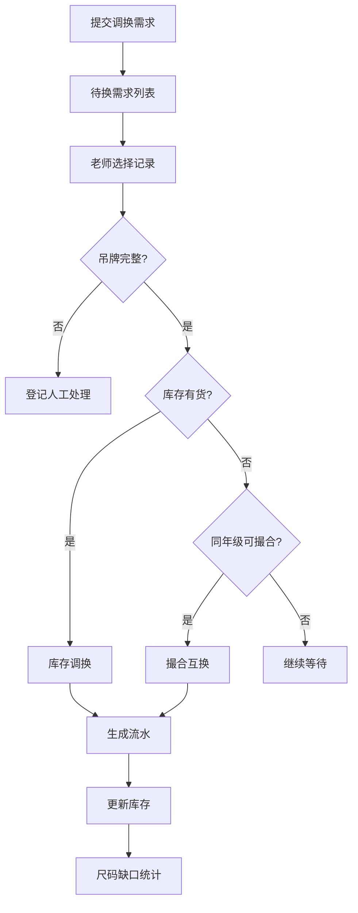

# 校服调换管理系统 PRD

## 1. 产品概述

校服调换管理系统是一款面向学校老师和总务部门的校服调换管理工具，解决校服发放后家长群中尺码调换需求混乱的问题，通过系统化管理待换需求、库存匹配、流水记录和缺口统计，提高调换效率。

- 主要解决家长群中"150换160"式零散调换信息难以追踪匹配的痛点
- 目标用户为班级老师（确认调换、匹配库存、撮合互换）和总务部门（缺口统计、库存管理）

## 2. 核心功能

### 2.1 用户角色

| 角色 | 登录方式 | 核心权限 |
|------|----------|----------|
| 老师 | 默认登录 | 查看待换需求、匹配库存、撮合互换、确认调换、登记吊牌问题 |
| 总务 | 默认登录 | 管理库存、查看流水记录、查看尺码缺口统计表 |

### 2.2 功能模块

1. **待换需求页**：按班级分组展示所有调换需求卡片，支持筛选和搜索
2. **库存管理页**：展示各尺码各类型校服库存数量，支持入库出库
3. **流水记录页**：展示所有换入换出操作流水，支持按时间、班级筛选
4. **尺码缺口表**：按班级、尺码、衣服类型统计缺口数量，供总务参考
5. **调换确认弹窗**：老师确认调换时的操作界面，支持库存匹配和同年级撮合

### 2.3 页面详情

| 页面名称 | 模块名称 | 功能描述 |
|----------|----------|----------|
| 待换需求页 | 班级分组列表 | 按班级分组展示调换需求卡片，展开/收起班级 |
| 待换需求页 | 调换需求卡片 | 展示学生姓名、班级、原尺码、想换尺码、衣服类型、吊牌状态、拍照凭证、联系电话 |
| 待换需求页 | 操作按钮 | 匹配库存、撮合互换、标记人工处理 |
| 库存管理页 | 库存总览 | 按衣服类型和尺码展示库存数量 |
| 库存管理页 | 入库出库操作 | 支持手动调整库存数量 |
| 流水记录页 | 流水列表 | 展示所有调换流水，包含时间、操作类型、学生信息、尺码变化 |
| 流水记录页 | 筛选功能 | 按时间范围、班级、操作类型筛选 |
| 尺码缺口表 | 缺口统计 | 按班级、尺码、衣服类型统计缺口数量，颜色区分缺口程度 |
| 调换确认弹窗 | 库存匹配 | 自动匹配库存中是否有目标尺码 |
| 调换确认弹窗 | 互换撮合 | 查找同年级是否有反向需求可撮合 |
| 调换确认弹窗 | 吊牌校验 | 吊牌不完整时禁止直接调换，只能登记人工处理 |

## 3. 核心流程

### 3.1 调换登记流程
家长/学生提交调换需求 → 系统生成待换记录 → 老师在待换需求列表中查看

### 3.2 老师确认调换流程
老师选择待换记录 → 检查吊牌状态 → 吊牌完整则继续 → 匹配库存或撮合互换 → 确认调换 → 生成流水记录 → 更新库存

### 3.3 吊牌不完整处理流程
老师选择待换记录 → 吊牌已拆 → 标记为待人工处理 → 生成待处理记录 → 总务人工跟进

### 3.4 缺口统计流程
系统汇总所有待换需求 → 按班级/尺码/衣服类型分组 → 计算净缺口 → 生成缺口统计表

## 4. 用户界面设计

### 4.1 设计风格
- **主色调**：深蓝色 (#1e40af) 代表学校的正式感和专业性
- **辅助色**：琥珀色 (#f59e0b) 用于强调和警示
- **成功色**：翠绿色 (#10b981) 用于确认和成功状态
- **警告色**：橙红色 (#f97316) 用于吊牌不完整等警示
- **中性色**：石板灰系列，保持清晰的信息层级
- **卡片风格**：圆角 12px，轻微阴影，悬停时阴影加深
- **字体**：思源黑体 / Noto Sans SC，清晰易读
- **布局**：顶部导航 + 左侧菜单 + 主内容区

### 4.2 页面设计概览

| 页面名称 | 模块名称 | UI 元素 |
|----------|----------|---------|
| 待换需求页 | 班级分组 | 折叠面板、班级标签、人数徽章 |
| 待换需求页 | 需求卡片 | 头像、姓名标签、尺码对比、吊牌状态徽章、联系电话、操作按钮 |
| 库存管理页 | 库存总览 | 尺码表格、数量标签、入库出库按钮 |
| 流水记录页 | 流水列表 | 时间线布局、操作类型图标、学生信息、尺码变化 |
| 尺码缺口表 | 缺口统计 | 热力图表格、颜色深浅表示缺口程度、合计行 |

### 4.3 响应式
- 桌面端优先设计，支持平板自适应
- 卡片在窄屏时堆叠展示
- 表格在移动端支持横向滚动

### 4.4 交互细节
- 卡片悬停时轻微上浮，阴影加深
- 按钮点击有按压反馈
- 页面切换有淡入过渡
- 吊牌不完整的卡片有橙色边框高亮
- 缺口严重的单元格有红色背景警示
