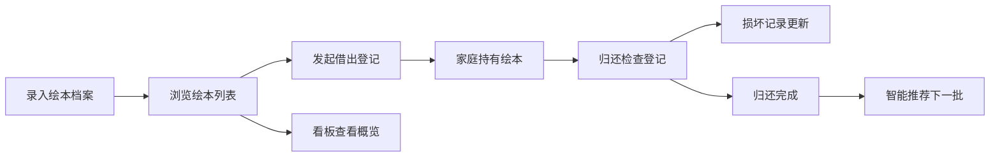

## 1. 产品概述

儿童绘本轮换借阅系统，为家长群提供绘本共享管理工具。解决家长间互借绘本时的借阅记录混乱、逾期遗忘、书籍损坏追踪等问题。通过智能推荐和可视化看板，提高绘本流转效率和社区互动。

## 2. 核心功能

### 2.1 用户角色
| 角色 | 注册方式 | 核心权限 |
|------|----------|----------|
| 家长用户 | 无需注册，本地使用 | 绘本管理、借阅登记、归还检查、查看推荐和看板 |

### 2.2 功能模块
1. **看板首页**：逾期提醒、热门绘本、破损待修、家庭借阅概览
2. **绘本档案管理**：绘本列表、新增/编辑绘本、搜索筛选
3. **借阅管理**：借出登记、归还检查、借阅记录
4. **智能推荐**：按年龄段和主题推荐，降低重复借阅

### 2.3 页面详情
| 页面名称 | 模块名称 | 功能描述 |
|----------|----------|----------|
| 看板首页 | 逾期提醒卡片 | 展示逾期未还的绘本列表，支持快速操作 |
| 看板首页 | 热门绘本排行 | 展示借阅次数最多的TOP绘本 |
| 看板首页 | 破损待修列表 | 展示有损坏记录待处理的绘本 |
| 看板首页 | 家庭借阅概览 | 展示每个家庭的当前借阅和历史统计 |
| 绘本档案 | 绘本列表 | 卡片式展示所有绘本，支持搜索和筛选 |
| 绘本档案 | 绘本表单 | 录入书名、年龄段、主题、页数、机关、破损、封面 |
| 借阅管理 | 借出登记 | 选择家庭、孩子年龄、日期、是否愿意交换 |
| 借阅管理 | 归还检查 | 检查缺页、涂画、撕拉页、贴纸、附件缺失 |
| 借阅管理 | 借阅记录 | 完整的借还历史流水 |
| 智能推荐 | 推荐列表 | 按年龄和主题推荐绘本，重复借过的降权 |

## 3. 核心流程

## 4. 用户界面设计

### 4.1 设计风格
- **主色调**：温暖的蜜橘橙 #FF8C42 搭配奶油米白 #FFF8F0，童趣温馨
- **辅助色**：薄荷绿 #4ECDC4（状态正常）、珊瑚红 #FF6B6B（逾期警告）、薰衣紫 #9B8EC7（主题标签）
- **按钮风格**：圆角胶囊按钮，带柔和阴影，hover时有轻微上浮动画
- **字体**：标题使用圆润手写体风格，正文使用清爽无衬线字体
- **布局风格**：卡片式布局，大量圆角，柔和渐变背景，emoji装饰增强童趣
- **图标风格**：使用 lucide-react 线性图标，配合书籍、家庭、日历等emoji

### 4.2 页面设计概览
| 页面名称 | 模块名称 | UI 元素 |
|----------|----------|---------|
| 看板首页 | 统计卡片组 | 四色渐变统计卡片，数字大字号，emoji图标，入场动画 |
| 看板首页 | 列表区域 | 分区卡片，逾期用红色标识，热门用奖杯图标 |
| 绘本档案 | 绘本网格 | 卡片悬浮效果，封面图优先展示，底部标签行 |
| 绘本档案 | 表单弹窗 | 分区表单，封面预览，标签多选 |
| 借阅管理 | 时间线 | 借还记录时间轴，状态图标区分 |
| 借阅管理 | 检查表 | 勾选项列表，损坏描述文本框 |
| 智能推荐 | 推荐卡片 | 匹配度百分比徽章，推荐理由标签 |

### 4.3 响应式
- 桌面端优先设计（≥1280px）
- 平板端（768-1279px）：网格列数自适应，侧边栏折叠为顶部导航
- 移动端（<768px）：单列布局，底部Tab导航
