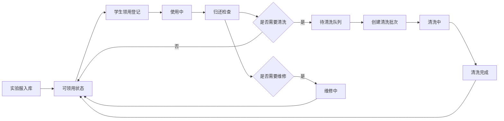

## 1. 产品概述

实验服领用和清洗管理系统，用于管理高校实验室白大褂的全生命周期，解决袖口脏污、扣子掉落、清洗状态无人跟踪等问题。

- 目标用户：实验室管理员、任课教师、选修实验课程的学生
- 核心价值：实现实验服从档案建立、领用登记、归还检查、清洗批次管理到重新上架的完整闭环管理，提升实验室设备管理效率。

## 2. 核心功能

### 2.1 用户角色

| 角色 | 核心权限 |
|------|----------|
| 管理员 | 实验服档案管理、领用/归还登记、清洗批次管理、数据统计查看 |
| 教师 | 查看各尺码库存、逾期未还列表、待清洗数量、高频破损原因统计 |
| 学生 | 查看个人领用记录、归还提醒 |

### 2.2 功能模块

1. **实验服档案管理**：新建/编辑/删除实验服档案，记录尺码、编号、所属实验室、清洗批次、破损状态、照片
2. **领用登记**：学生领用时登记课程、教师、实验日期、预计归还日期
3. **归还检查**：归还时检查污渍、破洞、扣子、口袋残留、是否接触危险试剂
4. **清洗批次管理**：需要清洗的实验服进入清洗批次，完成后重新上架
5. **统计仪表板**：各尺码库存、逾期未还、待清洗数量、高频破损原因统计

### 2.3 页面详情

| 页面名称 | 模块名称 | 功能描述 |
|----------|----------|----------|
| 仪表板 | 统计概览 | 展示库存总数、在库数量、领用中、待清洗、逾期未还等关键指标卡片 |
| 仪表板 | 尺码库存分布 | 柱状图展示各尺码（S/M/L/XL/XXL）的库存数量 |
| 仪表板 | 高频破损原因 | 饼图统计污渍、破洞、掉扣子等各破损原因的占比 |
| 仪表板 | 逾期未还列表 | 展示超过预计归还日期的领用记录 |
| 实验服档案 | 档案列表 | 表格展示所有实验服，支持按编号、尺码、实验室、状态筛选 |
| 实验服档案 | 新建/编辑档案 | 表单录入：编号、尺码、所属实验室、照片、备注 |
| 实验服档案 | 档案详情 | 展示实验服完整信息，包含领用历史、清洗历史、破损记录 |
| 领用登记 | 领用表单 | 选择实验服、录入学生姓名/学号、课程、教师、实验日期、预计归还 |
| 领用登记 | 当前领用列表 | 展示所有领用中的记录，支持快速归还操作 |
| 归还检查 | 检查表单 | 逐项检查：污渍、破洞、扣子、口袋残留、危险试剂接触，添加照片和备注 |
| 归还检查 | 检查结果处理 | 判定是否需要清洗/维修，自动转入对应状态 |
| 清洗管理 | 批次列表 | 展示清洗批次，包含批次号、创建时间、实验服数量、状态 |
| 清洗管理 | 新建批次 | 选择待清洗实验服，创建新的清洗批次 |
| 清洗管理 | 完成清洗 | 标记批次为已完成，实验服自动转为可领用状态 |

## 3. 核心流程

### 3.1 领用流程
管理员在系统中选择可领用的实验服，录入学生信息、课程信息和实验日期，确认领用后实验服状态变更为"使用中"。

### 3.2 归还与检查流程
学生归还实验服时，管理员逐项检查外观状况，记录破损情况和是否需要清洗。检查通过且无需清洗的直接上架；需清洗的进入待清洗队列；需维修的标记为维修中。

### 3.3 清洗流程
管理员将待清洗实验服批量创建清洗批次，记录清洗方式和日期。清洗完成后，实验服状态变更为"可领用"，重新上架。

## 4. 用户界面设计

### 4.1 设计风格
- **主色调**：医疗蓝 (#2563EB) 搭配实验室白，传达专业、洁净的氛围
- **辅助色**：成功绿 (#10B981)、警告橙 (#F59E0B)、危险红 (#EF4444)
- **按钮样式**：圆角矩形，主按钮有轻微阴影，悬停时颜色加深
- **字体**：思源黑体 - 现代、清晰、易读的中文无衬线字体
- **布局风格**：卡片式布局，左侧导航栏 + 顶部标题栏 + 主内容区
- **图标风格**：线性简洁图标，与实验/医疗场景匹配

### 4.2 页面设计概述

| 页面名称 | 模块名称 | UI元素 |
|----------|----------|--------|
| 仪表板 | 统计概览 | 卡片网格布局，每个指标卡有图标 + 数值 + 趋势提示 |
| 仪表板 | 图表区域 | 左侧柱状图（尺码库存），右侧饼图（破损原因） |
| 实验服档案 | 档案列表 | 顶部筛选栏 + 数据表格，每行可展开查看详情 |
| 实验服档案 | 新建档案 | 模态框表单，分步骤录入基本信息和照片上传 |
| 领用登记 | 领用表单 | 实验服选择器 + 学生信息表单，支持扫码快速选择 |
| 归还检查 | 检查表单 | 卡片式检查项，开关 + 严重程度选择 + 照片上传 |
| 清洗管理 | 批次列表 | 时间线式批次展示，每批次可展开查看包含的实验服 |

### 4.3 响应式
- 桌面端优先设计，主内容区最小宽度 1024px
- 平板端：导航栏折叠为抽屉式，图表自适应缩小
- 移动端：单列布局，表格转为卡片列表展示
