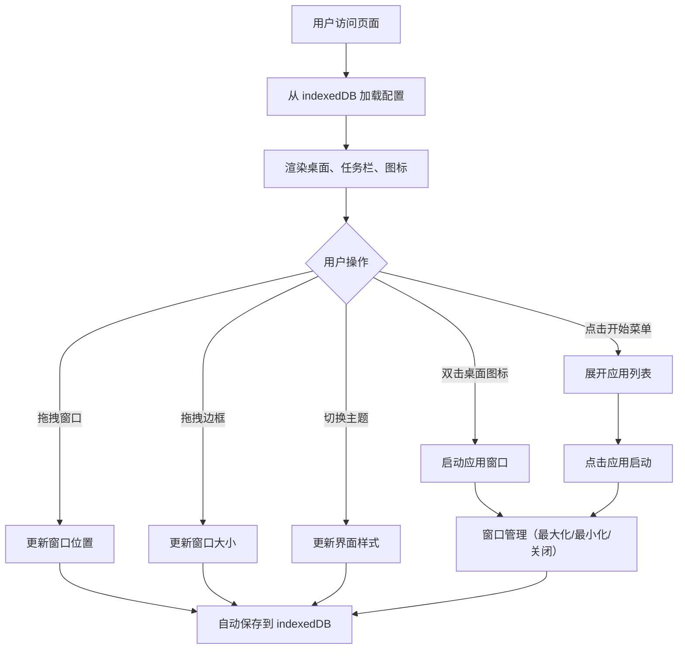

## 1. 产品概述

网页版虚拟桌面系统，模拟经典操作系统（Windows/macOS）的桌面交互体验，在浏览器中提供完整的桌面环境。

- 主要目的：在浏览器中打造一个可交互的虚拟桌面操作系统，支持多任务窗口管理、内置应用、主题切换等功能
- 目标用户：对桌面操作系统交互感兴趣的用户、需要在浏览器中使用多个工具的用户
- 市场价值：展示前端技术能力，提供一个可扩展的桌面应用框架

## 2. 核心功能

### 2.1 功能模块

1. **桌面环境**：桌面背景、图标展示、小组件、拖拽排序
2. **任务栏**：开始菜单、运行中应用图标、系统托盘、时间显示
3. **窗口管理系统**：窗口拖拽移动、边框拖拽缩放、最大化/最小化/关闭、z-index 层级切换
4. **内置应用集**：文件管理器、文本编辑器、计算器、画图工具、浏览器壳、音乐播放器
5. **主题系统**：浅色主题、深色主题、Win95 复古主题
6. **数据持久化**：桌面布局、打开的应用、用户偏好设置通过 indexedDB 存储

### 2.2 页面详情

| 页面名称 | 模块名称 | 功能描述 |
|-----------|-------------|---------------------|
| 虚拟桌面 | 桌面区域 | 展示桌面图标和小组件，支持图标拖拽定位 |
| 虚拟桌面 | 底部任务栏 | 左侧开始菜单按钮、中间运行中应用、右侧系统托盘和时间 |
| 虚拟桌面 | 开始菜单 | 点击展开显示所有内置应用列表，点击启动应用 |
| 虚拟桌面 | 应用窗口 | 每个应用以独立窗口形式运行，支持拖拽、缩放、最大化 |
| 虚拟桌面 | 主题切换 | 通过设置切换不同主题风格 |

## 3. 核心流程

### 3.1 用户操作流程

1. 用户打开网页，系统从 indexedDB 加载之前的桌面布局和偏好设置
2. 桌面展示图标和小组件，任务栏显示在底部
3. 用户点击开始菜单，查看应用列表
4. 用户双击桌面图标或点击开始菜单中的应用，启动应用窗口
5. 用户可以拖拽窗口移动位置、拖拽边框改变大小、点击按钮最大化/最小化/关闭
6. 点击任务栏上的应用图标可以切换窗口 z-index 或恢复最小化的窗口
7. 用户切换主题，界面风格实时变化
8. 所有操作自动保存到 indexedDB，下次打开时恢复

### 3.2 流程图

## 4. 用户界面设计

### 4.1 设计风格

- **主色调**：支持三套主题配色
  - 浅色主题：白色背景 + 蓝色强调色 (#0078d4)
  - 深色主题：深灰背景 + 蓝色强调色 (#4cc2ff)
  - Win95 复古：经典灰色背景 + 凸起/凹陷 3D 边框
- **按钮风格**：
  - 现代主题：圆角按钮，悬停有过渡动画
  - Win95 主题：经典 2px 凸起边框，点击时凹陷
- **字体**：
  - 现代主题：使用系统无衬线字体 (system-ui, -apple-system, sans-serif)
  - Win95 主题：使用 "MS Sans Serif", "Tahoma" 等经典像素风格字体
- **布局风格**：
  - 任务栏固定在底部，高度 48px（现代）/ 28px（Win95）
  - 窗口采用经典标题栏 + 内容区域结构
  - 桌面图标采用网格排列，支持自由拖拽
- **图标风格**：
  - 现代主题：简洁扁平化 SVG 图标
  - Win95 主题：经典 16x16/32x32 像素风格图标

### 4.2 页面设计概述

| 页面名称 | 模块名称 | UI 元素 |
|-----------|-------------|-------------|
| 虚拟桌面 | 桌面区域 | 背景图/纯色、图标网格、拖拽占位符、右键菜单 |
| 虚拟桌面 | 任务栏 | 开始按钮、应用图标区域、托盘区域、时间显示 |
| 虚拟桌面 | 开始菜单 | 应用列表、搜索框、用户头像、关机按钮 |
| 虚拟桌面 | 应用窗口 | 标题栏（图标+标题+控制按钮）、内容区域、边框拖拽手柄 |
| 虚拟桌面 | 主题切换 | 设置面板、主题预览卡片 |

### 4.3 响应式

- 桌面端优先设计，支持 1280px 及以上宽度
- 窗口最小尺寸限制：宽度 320px，高度 240px
- 触摸设备优化：增加拖拽区域，优化点击热区

### 4.4 动画与交互

- 窗口打开/关闭：缩放 + 淡入淡出动画
- 窗口最大化/还原：平滑过渡动画
- 图标拖拽：半透明预览 + 放置指示器
- 主题切换：全局颜色平滑过渡
- 任务栏图标悬停：轻微上浮效果
