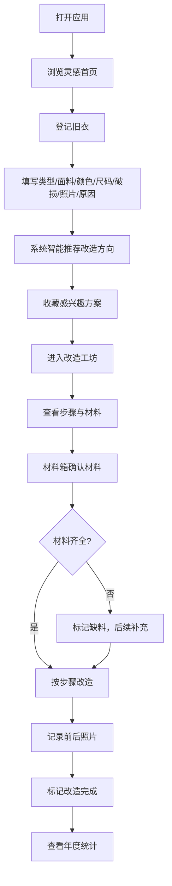

## 1. 产品概述

旧衣改造灵感板——让衣柜里不穿的衬衫、牛仔裤、毛衣重获新生。用户登记旧衣信息后，系统智能推荐改造方向，追踪改造进度，管理材料清单，让每件旧衣都有第二次生命。
- 解决旧衣闲置浪费问题，降低快时尚对环境的影响
- 面向注重可持续生活方式的手工爱好者与普通用户

## 2. 核心功能

### 2.1 用户角色

| 角色 | 注册方式 | 核心权限 |
|------|----------|----------|
| 普通用户 | 无需注册，本地使用 | 登记旧衣、查看推荐、收藏灵感、记录改造、管理材料、查看统计 |

### 2.2 功能模块

1. **灵感首页**: 分组展示旧衣改造推荐（容易改 / 材料缺 / 等灵感）
2. **旧衣登记**: 填写旧衣信息并获取改造推荐
3. **改造工坊**: 查看改造详情、记录步骤与前后照片
4. **材料箱**: 管理材料清单，缺料提醒
5. **年度统计**: 可视化展示环保成果

### 2.3 页面详情

| 页面名称 | 模块名称 | 功能描述 |
|----------|----------|----------|
| 灵感首页 | 分组卡片 | 按"容易改"、"材料缺"、"等灵感"三组展示旧衣卡片，每张卡片显示旧衣缩略图、类型、推荐改造方向 |
| 灵感首页 | 快速登记入口 | 页面底部/顶部悬浮按钮，快速跳转登记页 |
| 灵感首页 | 筛选与搜索 | 按衣服类型、面料、颜色筛选 |
| 旧衣登记 | 基本信息表单 | 类型（衬衫/牛仔裤/毛衣/T恤/裙子/外套）、面料（棉/麻/丝绸/羊毛/化纤/混纺）、颜色、尺码 |
| 旧衣登记 | 破损与情感 | 破损位置（领口/袖口/膝盖/拉链/纽扣/面料磨损/无破损）、照片上传、舍不得扔的原因 |
| 旧衣登记 | 智能推荐 | 根据衣服属性自动推荐1-3个改造方向，含所需工具、难度星级、预计时间 |
| 改造工坊 | 改造详情 | 展示推荐方向的完整说明：步骤分解、所需材料、注意事项 |
| 改造工坊 | 步骤记录 | 用户可添加自己的改造步骤，记录文字和照片 |
| 改造工坊 | 前后对比 | 改造前/改造后照片并排展示，支持标记完成 |
| 改造工坊 | 收藏灵感 | 收藏感兴趣的改造方案 |
| 材料箱 | 材料清单 | 展示所有常用工具与材料：剪刀、针线、纽扣、拉链、布料、缝纫机等 |
| 材料箱 | 库存管理 | 标记已有/缺少的材料，缺料项红色高亮提示 |
| 材料箱 | 智能关联 | 根据进行中的改造项目，自动提示还缺哪些材料 |
| 年度统计 | 环保成就 | 今年少扔了几件衣服、完成了多少个改造项目 |
| 年度统计 | 类型分析 | 哪类衣服最适合再利用的排行 |
| 年度统计 | 时间线 | 改造项目完成时间线 |

## 3. 核心流程

用户打开应用 → 在首页浏览分组灵感卡片 → 点击"登记旧衣"填写信息 → 系统根据属性推荐改造方向 → 用户收藏感兴趣的方案 → 进入改造工坊查看步骤 → 在材料箱确认材料是否齐全 → 按步骤改造并记录前后照片 → 完成后查看年度统计

## 4. 用户界面设计

### 4.1 设计风格

- 主色调：陶土橙 (#C67B5C) + 鼠尾草绿 (#8B9E7E)，辅以暖奶油白 (#FAF5EF)
- 按钮风格：圆角胶囊形按钮，轻微阴影，hover 时微上浮
- 字体：展示字体使用 Playfair Display（标题），正文使用 Noto Sans SC
- 布局风格：卡片式布局，顶部导航，分组标签切换
- 图标风格：Lucide 线性图标，搭配手绘纹理装饰元素
- 整体氛围：温暖、手工感、可持续、治愈

### 4.2 页面设计概览

| 页面名称 | 模块名称 | UI 元素 |
|----------|----------|---------|
| 灵感首页 | 顶部导航 | Logo + 页面标签切换，暖色渐变底栏 |
| 灵感首页 | 分组标签 | 三个标签（容易改/材料缺/等灵感），胶囊形切换，当前标签高亮 |
| 灵感首页 | 灵感卡片 | 圆角卡片，旧衣照片+类型标签+改造方向+难度星级，hover微浮起 |
| 灵感首页 | 悬浮按钮 | 右下角"+"号，陶土橙色，点击跳转登记页 |
| 旧衣登记 | 表单区域 | 分步表单，步骤指示器，输入框带图标前缀 |
| 旧衣登记 | 照片上传 | 虚线边框拖拽区，支持点击上传，照片预览缩略图 |
| 旧衣登记 | 推荐结果 | 卡片式展示1-3个推荐，每个含方向名、工具列表、难度星级、预计时间 |
| 改造工坊 | 步骤时间线 | 左侧竖线时间线，圆形节点，展开/折叠步骤详情 |
| 改造工坊 | 前后对比 | 并排两张大图，改造前灰调/改造后彩色，滑动对比 |
| 改造工坊 | 收藏按钮 | 右上角心形图标，点击切换收藏状态，动画效果 |
| 材料箱 | 材料网格 | 网格布局，每个材料一张卡片，图标+名称+状态标签（已有/缺少） |
| 材料箱 | 缺料提示 | 顶部横幅，红色背景，显示当前缺料数量，点击展开详情 |
| 年度统计 | 数字大卡 | 三张大数字卡片（少扔/完成/最适合），配合图标和说明文字 |
| 年度统计 | 图表区 | 柱状图/饼图展示分类数据，柔和配色 |

### 4.3 响应式设计

- 桌面优先，最大宽度 1280px 居中
- 平板适配：卡片从三列变两列
- 移动端适配：卡片单列，底部导航替代顶部导航

### 4.4 动效设计

- 页面加载：卡片依次淡入上浮，stagger 延迟
- 标签切换：滑动过渡，内容区淡入
- 收藏按钮：心形弹跳缩放动画
- 改造完成：撒花/彩带庆祝动画
- 卡片交互：hover 微上浮 + 阴影加深
