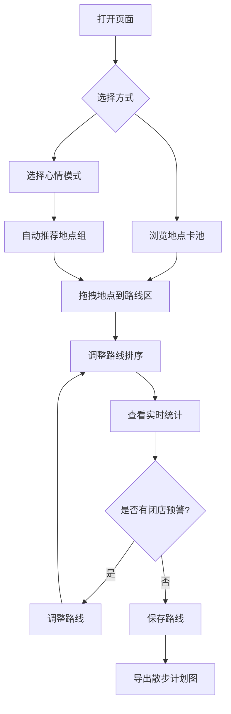

## 1. 产品概述

城市散步路线拼图 — 一个轻松的周末闲逛路线规划工具。用户像拼图一样从地点卡池里挑选想去的地方，拖拽排序成一条散步路线，实时看到总时长、距离、花费和闭店预警。支持心情模式一键推荐，平面路线图可视化，多路线保存与导出。

- 目标用户：周末想出门闲逛但不想做严肃攻略的年轻人
- 核心价值：把路线规划从"导航任务"变成"拼图游戏"，轻松有趣

## 2. 核心功能

### 2.1 用户角色
无需注册，本地使用即可

### 2.2 功能模块
1. **主页面**：地点卡池 + 路线规划区 + 平面路线图 + 心情模式 + 路线管理

### 2.3 页面详情
| 页面名称 | 模块名称 | 功能描述 |
|---------|---------|---------|
| 主页面 | 地点卡池 | 左侧展示所有可选地点卡片，支持按标签筛选，拖拽添加到路线 |
| 主页面 | 路线规划区 | 右侧展示已选路线，支持拖拽排序、删除、实时统计 |
| 主页面 | 路线统计栏 | 实时计算总时长、总步行距离、总花费、闭店时间预警 |
| 主页面 | 心情模式 | 晒太阳/安静/拍照/吃东西 四种模式，点击自动推荐一组地点 |
| 主页面 | 平面路线图 | 简化平面地图，显示地点位置、路径连线、当前选中点高亮 |
| 主页面 | 路线管理 | 保存多条路线、加载已保存路线、导出散步计划图 |

## 3. 核心流程

用户打开页面 → 浏览地点卡池或选择心情模式 → 拖拽想去的地点到路线区 → 调整排序 → 查看实时统计和路线图 → 保存路线 → 导出计划图

## 4. 用户界面设计

### 4.1 设计风格
- 主色调：暖橙色 #F97316 作为活力点缀，配合奶油白 #FFF8F0 底色，深棕 #3D2C2E 作为文字
- 辅助色：薄荷绿 #34D399 用于路线状态正常，珊瑚红 #EF4444 用于预警
- 按钮风格：圆角胶囊形，微阴影，悬停有弹性缩放
- 字体：标题用粗体圆润风格，正文用清爽无衬线
- 布局：左中右三栏 — 左侧地点卡池，中间路线图，右侧路线规划
- 图标/emoji：地点卡使用手绘风图标，配合趣味 emoji 标注

### 4.2 页面设计概览
| 页面名称 | 模块名称 | UI 元素 |
|---------|---------|---------|
| 主页面 | 地点卡池 | 网格布局卡片，每张卡含图标+名称+时长+距离+预算+标签，可拖拽 |
| 主页面 | 路线规划区 | 垂直列表，卡片序号+拖拽手柄+删除按钮，底部统计栏 |
| 主页面 | 路线统计栏 | 四个指标卡(时长/距离/花费/预警)，动态数字，预警红色闪烁 |
| 主页面 | 心情模式 | 顶部四个情绪按钮，带图标动画，选中态发光 |
| 主页面 | 平面路线图 | Canvas 绘制，地点节点+曲线连线+当前选中脉冲动画 |
| 主页面 | 路线管理 | 底部工具栏，保存/加载/导出按钮，路线列表弹窗 |

### 4.3 响应式
- 桌面优先设计，三栏布局
- 平板适配：路线图折叠为顶部横条
- 移动端适配：单栏上下布局，地点卡池改为水平滚动

### 4.4 3D 场景指导
不适用
