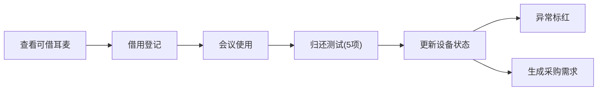

## 1. 产品概述

办公室会议耳麦借用管理系统，解决会议前耳麦没电、接收器丢失、麦克风故障等问题。为员工提供便捷的耳麦借用流程，为管理员提供设备状态监控和采购决策支持。

## 2. 核心功能

### 2.1 用户角色

| 角色 | 注册方式 | 核心权限 |
|------|----------|----------|
| 员工 | 无需注册，直接使用 | 耳麦档案、借用登记、归还测试 |
| 管理员 | 无需注册，直接使用 | 所有员工权限，设备管理，采购管理 |

### 2.2 功能模块

1. **看板页**：可借耳麦、逾期未还、故障设备、下场会议需求、需要采购型号
2. **耳麦档案**：品牌、连接方式、编号、所在柜子、适配会议软件、电池状态、照片
3. **借用登记**：会议室、会议时间、借用人、预计归还、是否需要备用接收器
4. **归还测试**：收音、降噪、蓝牙、线控、外观

### 2.3 页面详情

| 页面名称 | 模块名称 | 功能描述 |
|---------|----------|----------|
| 看板页 | 设备概览卡片 | 展示可借/逾期/故障/需求/采购 五个看板模块 |
| 耳麦档案页 | 耳麦列表 | 搜索、筛选、新增、编辑、删除耳麦档案 |
| 耳麦档案页 | 耳麦卡片 | 展示耳麦详细信息，低电量/接收器丢失/麦克风异常标红 |
| 借用登记页 | 借用表单 | 选择耳麦、填写借用信息 |
| 归还测试页 | 测试表单 | 五项功能测试，异常标红 |

## 3. 核心流程

员工打开看板查看可借耳麦 → 选择耳麦进行借用登记 → 会议结束后归还并进行五项测试 → 系统记录测试结果并更新设备状态 → 管理员查看故障设备和采购需求

## 4. 用户界面设计

### 4.1 设计风格
- 主色调：深灰色（#1e293b）搭配科技蓝（#3b82f6）
- 警示色：红色（#ef4444）用于低电量、故障标红
- 成功色：绿色（#10b981）用于正常状态
- 按钮风格：圆角8px，悬浮阴影
- 字体：现代无衬线字体
- 布局：卡片式布局，顶部导航
- 图标：lucide-react图标库

### 4.2 页面设计概述

| 页面名称 | 模块名称 | UI元素 |
|----------|----------|--------|
| 看板页 | 概览卡片 | 卡片网格、统计数字、状态标签、悬停动画 |
| 耳麦档案页 | 列表卡片 | 搜索框、筛选器、表格、图片预览 |
| 借用登记页 | 表单模态框 | 下拉选择、日期选择器、单选按钮 |
| 归还测试页 | 测试表单 | 开关按钮、测试项列表、提交按钮 |

### 4.3 响应式
- Desktop-first设计
- 移动端自适应布局
- 触控优化按钮尺寸

### 4.4 异常状态标红规则
- 电池电量 < 30%：电量状态标红
- 接收器丢失：状态标签标红
- 麦克风收音测试不通过：测试项标红
- 逾期未还：借用记录标红
