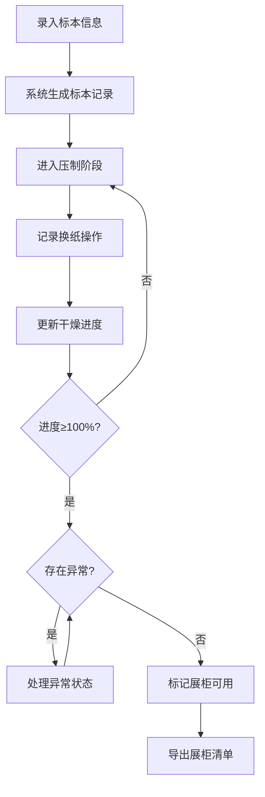

## 1. 产品概述

植物标本压制管理系统，为自然社团提供标本制作全流程数字化管理。解决压纸更换记不清、干燥程度靠口头、展柜清单整理繁琐等痛点，帮助社团成员科学管理每份标本的制作过程。

- **目标用户**：自然社团成员、指导老师
- **核心价值**：数字化跟踪标本压制进度，智能预警异常状态，一键导出展柜清单

## 2. 核心功能

### 2.1 用户角色

| 角色 | 使用方式 | 核心权限 |
|------|---------|---------|
| 社团成员 | 直接使用 | 录入、编辑、查看所有标本，标记状态，导出清单 |

### 2.2 功能模块

1. **标本录入**：录入采集地点、植物部位、压制日期、吸水纸批次、压板重量、换纸周期
2. **标本列表**：卡片展示所有标本，显示干燥进度条和状态标签
3. **异常提醒**：发霉、卷边、颜色褪变、标签缺项四类异常状态高亮提示
4. **清单导出**：筛选合格标本导出为展柜清单（CSV 格式）
5. **换纸记录**：记录每次换纸操作，计算干燥进度

### 2.3 页面详情

| 页面名称 | 模块名称 | 功能描述 |
|---------|---------|---------|
| 管理主页 | 顶部统计 | 显示总标本数、干燥中、已完成、异常数量统计 |
| 管理主页 | 录入表单 | 表单录入标本基础信息，字段含校验 |
| 管理主页 | 标本卡片列表 | 卡片式展示，含干燥进度、状态标签、操作按钮 |
| 管理主页 | 状态操作面板 | 标记发霉/卷边/颜色褪变/标签缺项，记录换纸，标记完成 |
| 管理主页 | 导出面板 | 筛选已完成且无异常的标本，一键导出 CSV |

## 3. 核心流程

用户打开页面 → 录入新标本信息 → 系统自动计算干燥进度 → 定期标记换纸/异常状态 → 达到干燥标准后标记完成 → 筛选合格标本导出展柜清单

## 4. 用户界面设计

### 4.1 设计风格

- **主色调**：自然深绿 `#2D5A27` + 纸张米白 `#F5F1E8` + 苔藓暖绿 `#6B8E4E`
- **辅助色**：警示橙 `#E07B39`（异常）、完成金 `#B8860B`（已干燥）、危险红 `#A03232`（发霉）
- **按钮风格**：圆角矩形，微立体阴影，hover 有轻微上浮动画
- **字体**：标题用 Lora（衬线体，学术感），正文用 Source Sans Pro（清晰易读）
- **布局风格**：左右分栏（左录入、右列表），卡片网格布局
- **图标风格**：使用 lucide-react，线性风格，自然元素

### 4.2 页面设计概览

| 页面名称 | 模块名称 | UI 元素 |
|---------|---------|---------|
| 管理主页 | 顶部统计 | 四个圆角统计卡片，不同状态对应不同背景色，数字大号加粗 |
| 管理主页 | 录入表单 | 左侧固定面板，两列表单，输入框带淡绿边框，聚焦时加深 |
| 管理主页 | 标本卡片 | 白底阴影卡片，顶部进度条，状态标签用胶囊形 badge，底部操作按钮行 |
| 管理主页 | 导出面板 | 右上角悬浮按钮，点击展开筛选条件和导出按钮 |

### 4.3 响应式

桌面端左右分栏布局（录入表单占 35%，列表占 65%），平板端上下堆叠，移动端单列自适应，触摸目标 ≥ 44px。

### 4.4 交互细节

- 卡片 hover 时阴影加深 + 轻微上移 2px
- 进度条采用渐变填充，带细微光泽动画
- 异常状态标签有脉冲动画提醒
- 表单提交成功有绿色对勾反馈
- 导出按钮点击后有加载态，完成后提示下载
