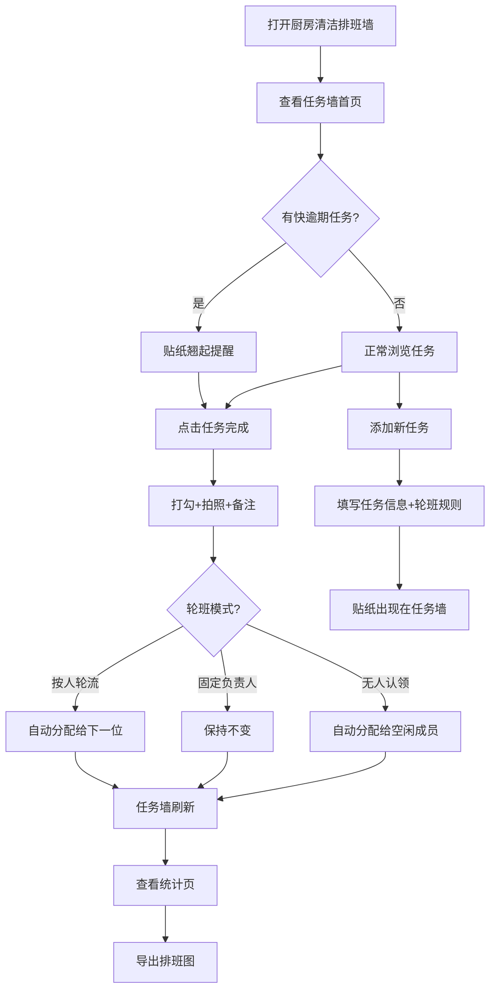

## 1. 产品概述

厨房清洁排班墙——一款面向合租室友或家庭成员的厨房清洁任务管理工具。模拟冰箱门上贴便签的视觉体验，让家务分工一目了然、不再被遗忘。

- 解决合租/家庭中清洁任务无人认领、遗忘拖延、分工不均的痛点
- 让厨房清洁变成可视化的"贴纸墙"，而非冷冰冰的公司表格

## 2. 核心功能

### 2.1 用户角色

| 角色 | 说明 |
|------|------|
| 家庭成员/室友 | 所有使用者平等，均可添加任务、认领任务、完成任务 |

### 2.2 功能模块

1. **任务墙首页**：冰箱门风格的贴纸任务墙，按时间分组展示任务
2. **任务管理**：添加/编辑清洁任务，设置频率、负责人、耗时、难度
3. **任务完成**：打勾完成、上传前后对比照、写备注
4. **轮班规则**：按人轮流、固定负责人、无人认领自动分配
5. **统计页**：个人完成排行、拖延任务榜、厨房清洁状态总览
6. **导出排班图**：生成本周排班图，可分享到群聊

### 2.3 页面详情

| 页面名称 | 模块名称 | 功能描述 |
|----------|----------|----------|
| 任务墙首页 | 时间分组区 | 按「今天」「本周」「本月」分组展示任务贴纸 |
| 任务墙首页 | 贴纸卡片 | 展示任务名、负责人头像、频率、难度、倒计时；快逾期贴纸翘起 |
| 任务墙首页 | 添加按钮 | 底部浮动「贴新便签」按钮 |
| 任务添加/编辑弹窗 | 基本信息 | 任务名称、频率（每天/每周/每两周/每月）、预计耗时、难度（1-5星） |
| 任务添加/编辑弹窗 | 轮班设置 | 选择轮班模式：按人轮流/固定负责人/无人认领自动分配 |
| 任务添加/编辑弹窗 | 负责人选择 | 添加家庭成员列表，选择/分配负责人 |
| 任务完成弹窗 | 完成操作 | 打勾确认、上传前后照片（本地上传）、写一句备注 |
| 统计页 | 个人排行 | 展示每位成员完成次数排行，带奖杯图标 |
| 统计页 | 拖延榜 | 展示经常拖延的任务，标红警示 |
| 统计页 | 清洁状态 | 厨房整体清洁度评分（基于近期完成情况），带仪表盘可视化 |
| 导出页 | 排班图预览 | 预览本周排班图（带冰箱门背景风格） |
| 导出页 | 导出操作 | 一键导出为图片，可保存或分享 |

## 3. 核心流程

**主流程**：用户打开任务墙 → 看到按时间分组的贴纸 → 点击快逾期的任务完成 → 打勾+拍照+备注 → 轮班自动流转到下一位

**任务创建流程**：点击添加 → 填写任务信息 → 选择轮班规则 → 贴纸出现在任务墙

**逾期提醒流程**：任务接近截止时间 → 贴纸视觉翘起+颜色变红 → 提醒负责人尽快完成

## 4. 用户界面设计

### 4.1 设计风格

- **主色调**：奶白色冰箱门底色（#F5F0EB），搭配暖色系便签贴纸（鹅黄 #FFF9C4、淡绿 #C8E6C9、淡粉 #F8BBD0、淡蓝 #BBDEFB）
- **按钮风格**：圆润磁性贴风格，带轻微阴影，hover 时微微弹起
- **字体**：使用手写风格字体（如 Caveat）做标题，正文字体使用 Noto Sans SC
- **布局风格**：冰箱门磁性板布局，贴纸轻微旋转、有阴影、可重叠
- **图标/表情风格**：使用 emoji 风格图标 🧹🧽🫧🍳，搭配 lucide 图标
- **贴纸翘起效果**：快逾期任务贴纸右下角翘起，增加 box-shadow 和 transform: rotate

### 4.2 页面设计概览

| 页面名称 | 模块名称 | UI 元素 |
|----------|----------|---------|
| 任务墙首页 | 冰箱门背景 | 奶白磨砂质感背景，顶部磁性条导航，底部磨砂金属质感工具栏 |
| 任务墙首页 | 时间分组标签 | 金属质感标签卡：今天(红)、本周(黄)、本月(绿) |
| 任务墙首页 | 贴纸卡片 | 便签纸风格卡片，轻微随机旋转(-2°~2°)，图钉/磁贴固定效果，翘起动画 |
| 任务添加弹窗 | 便签表单 | 便签纸底纹表单，手写风格标题，彩色选择器 |
| 统计页 | 排行榜 | 黑板风格背景，粉笔字效果，奖杯/星星装饰 |
| 统计页 | 清洁仪表盘 | 圆形仪表盘，绿→黄→红渐变，指针动画 |
| 导出页 | 排班图 | 冰箱门风格排班表，磁性贴纸布局，带日期标题 |

### 4.3 响应式

- 桌面优先设计，最大宽度 1200px 居中
- 移动端自适应：贴纸从网格变为单列，底部导航栏
- 触摸优化：贴纸点击区域不小于 44px

### 4.4 3D 场景指导

不适用，本项目为 2D 界面。
