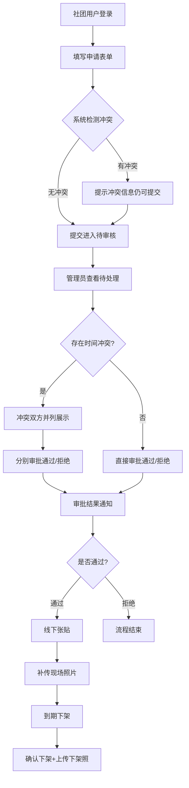

## 1. 产品概述

食堂展板预约管理系统——解决校园社团在食堂门口展板上海报张贴的排期冲突问题，让申请、审批、冲突检测、现场确认与数据统计全流程数字化。
- 目标用户：社团负责人（申请张贴）、展板管理员（审批与运维）
- 核心价值：杜绝"谁先贴谁占"的混乱，用时间维度排期+冲突自动检测保障公平，同时通过数据汇总辅助管理决策

## 2. 核心功能

### 2.1 用户角色

| 角色 | 进入方式 | 核心权限 |
|------|----------|----------|
| 社团用户 | 选择社团+密码登录 | 提交申请、查看自己申请状态、补传现场照片、确认下架 |
| 管理员 | 管理员账号登录 | 审批申请、查看冲突、管理展板、查看汇总统计 |

### 2.2 功能模块

1. **申请页**：社团提交海报张贴申请表单
2. **审批页**：管理员查看待处理申请、冲突检测、过期下架提醒
3. **展板页**：展板总览+日历视图，查看每块展板排期与照片
4. **汇总页**：数据看板，展板热度、社团活跃度、冲突集中日期

### 2.3 页面详情

| 页面名称 | 模块名称 | 功能描述 |
|----------|----------|----------|
| 申请页 | 申请表单 | 填写活动名、社团名、目标展板区域、起止日期、海报尺寸、上传电子图、联系人 |
| 申请页 | 我的申请列表 | 查看本人历史申请及状态（待审核/已通过/已拒绝/已过期），补传张贴照片、确认下架 |
| 审批页 | 待处理队列 | 按提交时间排序的待审批列表，一键展开详情 |
| 审批页 | 冲突检测面板 | 自动检测同一展板时间段重叠，列出冲突双方（申请A vs 申请B），冲突申请不可单独通过 |
| 审批页 | 过期下架提醒 | 列出已到截止日期但未确认下架的申请，提醒管理员催促 |
| 展板页 | 展板地图 | 展板位置示意，点击进入单块展板详情 |
| 展板页 | 日历视图 | 按月查看某展板的排期占位情况 |
| 展板页 | 照片记录 | 每条已通过申请的现场张贴照和下架照 |
| 汇总页 | 展板热度排行 | 哪块展板申请最多/通过率最高 |
| 汇总页 | 社团活跃排行 | 哪个社团申请次数最多 |
| 汇总页 | 冲突热力图 | 按日期维度展示冲突集中时段 |

## 3. 核心流程

**社团申请流程**：社团用户登录 → 填写申请表单 → 系统自动检测冲突 → 提交进入待审核 → 管理员审批（冲突时需处理双方） → 通过后线下张贴 → 补传现场照片 → 到期下架 → 确认下架并上传下架照

**管理员审批流程**：登录 → 查看待处理列表 → 点开申请详情 → 系统高亮冲突项 → 冲突双方并列展示 → 选择通过/拒绝（冲突双方需分别决策） → 审批完成

## 4. 用户界面设计

### 4.1 设计风格

- **主色调**：暖橙 #E8652E + 深墨 #1A1A2E，搭配奶油白 #FFF8F0 作底色——呼应食堂烟火气与校园展板的活力感
- **辅助色**：冲突红 #E63946、通过绿 #2D936C、待审金 #F4A261
- **按钮风格**：圆角 8px，主按钮填充色+悬停加深，次要按钮描边
- **字体**：标题用 ZCOOL KuaiLe（站酷快乐体）增添校园趣味，正文用 Noto Sans SC 保证可读性
- **布局**：左侧固定导航栏 + 右侧内容区，卡片式内容组织
- **图标**：线性风格（Lucide Icons），搭配色彩点缀

### 4.2 页面设计概览

| 页面名称 | 模块名称 | UI 元素 |
|----------|----------|---------|
| 申请页 | 申请表单 | 居中卡片式表单，展板选择用可视化区域图点选，日期用日历选择器，电子图拖拽上传区 |
| 申请页 | 我的申请列表 | 状态标签色彩区分，行展开显示详情，补传照片按钮，确认下架按钮 |
| 审批页 | 待处理队列 | 左侧列表+右侧详情双栏，待处理数字角标，时间线式排序 |
| 审批页 | 冲突检测面板 | 冲突对以对比卡片展示（左A右B），重叠时间高亮红色，通过/拒绝按钮分列 |
| 审批页 | 过期下架提醒 | 独立Tab页，黄色警告条目，一键催促按钮 |
| 展板页 | 展板地图 | 食堂门口俯视简笔画风格，展板块可点击，已占/空闲色彩区分 |
| 展板页 | 日历视图 | 月历格子，占位时段色块+社团名缩写，hover 弹出详情 |
| 展板页 | 照片记录 | 瀑布流照片墙，每张标注日期和状态 |
| 汇总页 | 展板热度排行 | 横向柱状图，橙到红渐变色 |
| 汇总页 | 社团活跃排行 | 纵向条形图，前3名奖牌图标 |
| 汇总页 | 冲突热力图 | 日历热力图，颜色深浅代表冲突数量 |

### 4.3 响应式

桌面优先设计，导航栏在移动端收起为底部Tab栏，卡片单列堆叠，日历视图简化为列表模式

### 4.4 3D 场景指引

不适用
