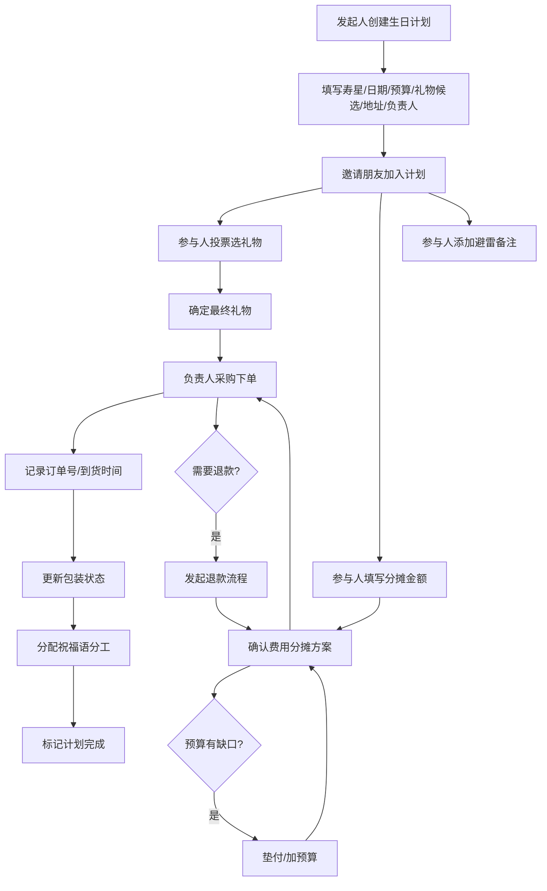

## 1. 产品概述

**亲友生日礼物合伙账** — 一个解决多人合买生日礼物时费用分摊不清问题的轻量 Web 应用。用户可以创建生日计划、邀请朋友投票选礼物、分摊费用、追踪订单，再也不用为"谁出了多少"而头疼。

- 核心痛点：多人合买礼物时费用分摊混乱、投票不透明、垫付记录不清
- 目标用户：朋友/同事/家人群体，习惯凑钱送礼的用户
- 产品价值：让合买礼物从混乱变透明，从计划到收货全程可追踪

## 2. 核心功能

### 2.1 用户角色

| 角色 | 说明 | 核心权限 |
|------|------|----------|
| 发起人 | 创建生日计划的人 | 创建计划、编辑计划、指定负责人、管理退款/加预算 |
| 参与人 | 被邀请加入计划的朋友 | 投票、填写分摊金额、备注避雷、标记付款状态 |
| 负责人 | 被指定采购礼物的人 | 填写订单信息、到货状态、包装状态、祝福语分工 |

### 2.2 功能模块

1. **首页（计划列表）**: 查看所有生日计划、创建新计划、快速查看预算缺口
2. **创建/编辑计划页**: 填写寿星信息、日期、预算、礼物候选、收货地址、负责人
3. **计划详情页**: 投票选礼物、分摊付款、避雷备注、预算追踪、垫付记录
4. **订单追踪页**: 订单号、到货时间、包装状态、祝福语分工
5. **统计页**: 年度送礼记录、人均花费、热门礼物排行

### 2.3 页面详情

| 页面名称 | 模块名称 | 功能描述 |
|----------|----------|----------|
| 首页 | 计划列表 | 展示所有生日计划卡片，显示寿星头像、日期倒计时、预算缺口百分比、状态标签（进行中/已购买/已完成） |
| 首页 | 快捷操作 | 创建新计划按钮、筛选/排序（按日期/状态） |
| 创建计划页 | 基本信息 | 填写寿星姓名、生日日期、总预算金额 |
| 创建计划页 | 礼物候选 | 添加多个礼物候选项（名称、图片、价格、链接），支持删除和排序 |
| 创建计划页 | 物流信息 | 填写收货地址、指定负责人 |
| 创建计划页 | 邀请朋友 | 添加参与人姓名列表 |
| 计划详情页 | 投票区 | 展示所有礼物候选，每人可投一票，实时显示投票结果柱状图 |
| 计划详情页 | 费用分摊 | 每人填写愿意分摊的金额，显示已筹集/预算缺口/垫付金额 |
| 计划详情页 | 避雷备注 | 添加备注如"不喜欢香水""对花粉过敏"等，所有人可见 |
| 计划详情页 | 付款状态 | 显示谁已付款/未付款/垫付了多少，支持标记付款 |
| 订单追踪页 | 订单信息 | 填写订单号、快递公司、预计到货时间 |
| 订单追踪页 | 包装状态 | 标记包装进度：未包装/包装中/已包装 |
| 订单追踪页 | 祝福语分工 | 分配谁写贺卡、谁负责什么祝福内容 |
| 退款/加预算页 | 退款流程 | 记录退款原因、金额、退款给谁 |
| 退款/加预算页 | 加预算流程 | 填写加预算原因、新增金额、重新分摊 |
| 统计页 | 年度送礼记录 | 按时间线展示今年给谁送过什么礼物 |
| 统计页 | 花费统计 | 每个人累计花了多少钱的饼图/柱状图 |
| 统计页 | 热门礼物 | 最受欢迎的礼物类型/候选排行 |

## 3. 核心流程

**主流程：创建计划 → 邀请参与 → 投票选礼物 → 分摊付款 → 采购下单 → 追踪到货 → 完成**

## 4. 用户界面设计

### 4.1 设计风格

- **主色调**: 暖橘色 (#FF6B35) + 奶油白 (#FFF8F0)，传达温暖庆祝感
- **辅助色**: 薄荷绿 (#2EC4B6) 用于成功/已付款状态，玫瑰粉 (#FF85A1) 用于强调/警告
- **深色底**: 深棕灰 (#2D2A26) 用于文字和深色卡片
- **按钮风格**: 圆角胶囊按钮，轻微阴影，hover 时微弹跳动效
- **字体**: 标题使用 Playfair Display（优雅感），正文使用 Noto Sans SC（中文友好）
- **布局风格**: 卡片式布局，柔和圆角，微毛玻璃效果
- **图标/装饰**: 使用 confetti/礼物盒/气球等生日元素装饰，微动效

### 4.2 页面设计概览

| 页面名称 | 模块名称 | UI 元素 |
|----------|----------|---------|
| 首页 | 计划列表 | 暖色渐变背景、计划卡片带寿星首字母头像、倒计时徽章、预算进度条、状态胶囊标签 |
| 首页 | 快捷操作 | 右下角浮动 "+" 按钮、点击展开创建表单 |
| 创建计划页 | 表单区 | 分步表单（步骤条导航）、输入框带图标前缀、礼物候选可拖拽卡片、地址选择器 |
| 计划详情页 | 投票区 | 礼物卡片横向排列、投票按钮带心跳动效、投票结果动态柱状图 |
| 计划详情页 | 费用分摊 | 环形进度图显示筹集率、人员列表带付款状态图标、垫付金额高亮 |
| 计划详情页 | 避雷备注 | 便签风格卡片、⚠️ 图标、滚动列表 |
| 订单追踪页 | 订单时间线 | 垂直时间线组件、状态节点带图标、包装进度步骤条 |
| 统计页 | 数据可视化 | 年度时间线、花费柱状图、热门礼物词云/排行列表 |

### 4.3 响应式设计

- 桌面端优先设计，最大宽度 1200px 居中
- 平板端（768px-1024px）: 卡片从三列变两列，侧边栏折叠
- 移动端（< 768px）: 单列布局，底部导航栏，大按钮触控友好

### 4.4 动效设计

- 页面切换：淡入淡出 + 轻微上移
- 卡片 hover：微浮起 + 阴影加深
- 投票按钮：点击心跳动效
- 进度条：加载时流畅动画填充
- 完成状态：confetti 撒花庆祝动效
