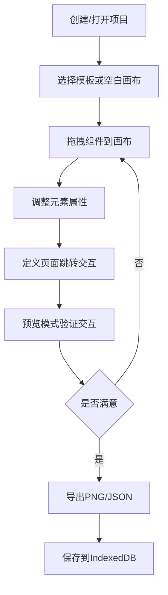
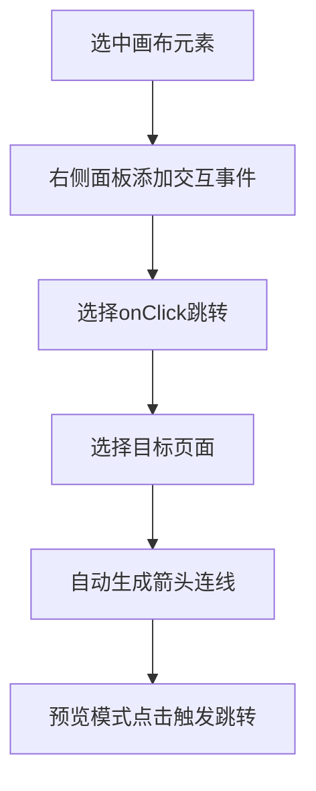

## 1. 产品概述

WireFrame Studio 是一款基于浏览器的低保真原型线框图设计工具，面向产品经理、UX设计师和开发者，提供快速搭建原型页面的能力。所有组件强制走灰白手绘感的线框图风格，而非高保真设计稿，帮助团队聚焦于信息架构与交互逻辑而非视觉细节。

- 核心价值：用最短时间将想法转化为可交互的低保真原型，支持多页面跳转与真实交互预览
- 目标用户：产品经理、UX设计师、前端开发者、创业团队

## 2. 核心功能

### 2.1 用户角色

| 角色 | 使用方式 | 核心权限 |
|------|----------|----------|
| 设计者 | 直接使用 | 创建/编辑原型项目、组件库管理、模板使用、导入导出 |

### 2.2 功能模块

1. **编辑器主页**：画布编辑区、组件库面板、属性面板、多页面Tab、顶部工具栏
2. **预览模式**：全屏原型播放、页面跳转交互体验
3. **项目管理**：多项目保存与加载、IndexedDB持久化

### 2.3 页面详情

| 页面名称 | 模块名称 | 功能描述 |
|----------|----------|----------|
| 编辑器主页 | 左侧组件库 | 四大类组件：基础形状、表单组件、移动端组件、通用组件，支持拖拽添加到画布 |
| 编辑器主页 | 中央画布 | 接收拖拽生成元素、选中拖动/改大小/旋转/复制/锁定/编组、缩放平移 |
| 编辑器主页 | 右侧属性面板 | 修改元素大小位置、文字内容、颜色描边、圆角阴影，保持低保真风格 |
| 编辑器主页 | 顶部页面Tab | 多页面管理、新增/删除/重命名页面、页面间跳转交互定义 |
| 编辑器主页 | 交互连线 | 选中元素添加onClick跳转事件，页面间出现箭头连线显示流程 |
| 编辑器主页 | 自定义组件 | 选中一组元素保存为可复用组件，添加到组件库 |
| 编辑器主页 | 模板系统 | 10套常用模板一键加入画布（移动端App、后台管理、登录页等） |
| 预览模式 | 全屏预览 | 隐藏编辑器外框，全屏播放原型，点击带跳转的元素切换页面 |
| 项目管理 | 项目列表 | IndexedDB存储多项目，新建/打开/删除项目 |

## 3. 核心流程

**原型创建流程**：用户创建项目 → 选择模板或从空白开始 → 从组件库拖拽组件到画布 → 调整属性 → 定义页面间跳转交互 → 预览验证 → 导出交付

**交互连线流程**：选中元素 → 添加onClick事件 → 选择跳转目标页面 → 自动生成页面间箭头连线 → 预览模式下点击触发跳转

## 4. 用户界面设计

### 4.1 设计风格

- **核心风格**：低保真线框图，灰白配色，手绘感边框，拒绝高保真渲染
- **主色调**：#F5F5F5（浅灰背景）、#333333（深灰文字/边框）、#666666（次要文字）、#E0E0E0（分割线）
- **强调色**：#4A90D9（选中态/交互态蓝色）
- **按钮风格**：1px灰色描边、无填充或极浅灰填充、轻微手绘感圆角
- **字体**：画布内组件使用手绘风格字体（如 Sketchy / Comic Sans 回退），UI界面使用清晰的无衬线字体
- **布局风格**：三栏布局（左组件库 + 中央画布 + 右属性面板），顶部工具栏
- **图标风格**：线框风格线性图标，2px描边

### 4.2 页面设计概述

| 页面名称 | 模块名称 | UI元素 |
|----------|----------|--------|
| 编辑器主页 | 左侧组件库 | 可折叠分类面板、组件缩略图卡片、拖拽手柄、搜索框 |
| 编辑器主页 | 中央画布 | 无限画布（可缩放平移）、网格背景、元素选中框+控制点、页面Tab栏 |
| 编辑器主页 | 右侧属性面板 | 输入框组（宽高/XY/旋转）、颜色选择器（仅灰阶+少量强调色）、文字编辑区、交互事件区 |
| 编辑器主页 | 顶部工具栏 | 页面Tab、预览按钮、撤销重做、缩放控件、主题切换、导入导出、项目名 |
| 预览模式 | 全屏播放 | 无编辑器边框、仅保留页面内容、底部页面导航指示器、ESC退出提示 |
| 项目管理 | 项目列表 | 卡片式项目列表、新建项目按钮、删除确认弹窗 |

### 4.3 响应式

- 桌面优先设计，最小支持1280px宽度
- 画布区域自适应填充可用空间
- 组件库和属性面板固定宽度，可折叠

### 4.4 深色/浅色主题

- 浅色主题：白色画布、浅灰UI面板、深灰文字
- 深色主题：深灰画布、深色UI面板、浅灰文字，画布内组件保持线框灰白风格不受影响
