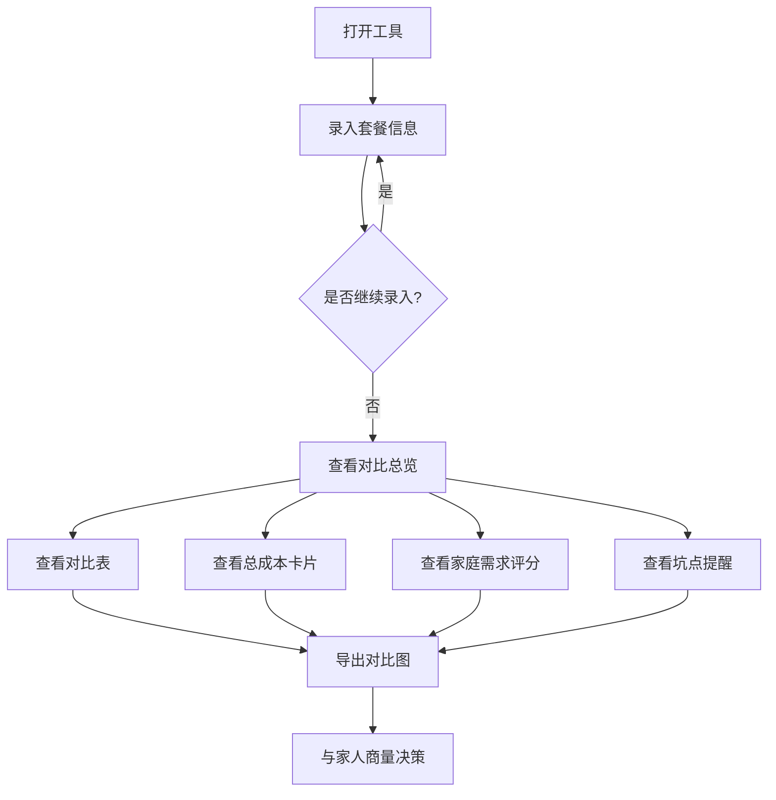

## 1. 产品概述

家庭网费套餐对比工具——帮助用户把运营商宽带套餐的月租、隐藏费用、合约条件全部摊开，自动计算真实总成本，匹配家庭使用场景，并识别常见坑点，最终导出对比图方便和家人商量决策。

- 目标用户：正在选择或更换家庭宽带套餐的普通消费者
- 核心价值：让消费者看清套餐真实成本和隐藏条件，避免被营销话术误导

## 2. 核心功能

### 2.1 用户角色

| 角色 | 使用方式 | 核心权限 |
|------|----------|----------|
| 普通用户 | 无需注册直接使用 | 录入套餐、查看对比、导出图片 |

### 2.2 功能模块

1. **套餐录入页**：录入多个运营商套餐的完整信息
2. **对比总览页**：对比表、总成本卡片、家庭需求评分、坑点提醒

### 2.3 页面详情

| 页面名称 | 模块名称 | 功能描述 |
|----------|----------|----------|
| 套餐录入 | 套餐表单 | 录入月租、宽带速率、合约期、安装费、路由器费用、赠送流量、电视包、提前解约费、优惠结束日期、优惠后月租 |
| 套餐录入 | 套餐卡片列表 | 展示已录入套餐的卡片，支持编辑和删除 |
| 对比总览 | 对比表 | 所有套餐核心参数横排对比，高亮最优项 |
| 对比总览 | 总成本卡片 | 自动计算12个月和24个月的真实花费（含安装费、路由器费、优惠前后月租变化等） |
| 对比总览 | 家庭需求评分 | 根据打游戏、远程办公、老人看电视、多人刷视频四类需求，给每个套餐打匹配度分数 |
| 对比总览 | 坑点提醒 | 自动识别：首年便宜次年涨价、合约期过长、上传速率未标注、解约费过高、优惠到期无提醒等 |
| 对比总览 | 导出对比图 | 将对比结果导出为图片，方便分享给家人 |

## 3. 核心流程

用户打开工具 → 逐个录入候选套餐信息 → 切换到对比总览页 → 查看对比表、总成本、需求评分、坑点提醒 → 导出对比图与家人商量

## 4. 用户界面设计

### 4.1 设计风格

- 主色调：深蓝色(#1a365d)搭配明亮橙色(#ff6b35)强调色，传达"精明消费、理性对比"的氛围
- 辅助色：浅灰(#f7fafc)背景、白色卡片、绿色(#38a169)表示最优、红色(#e53e3e)表示警告
- 按钮风格：圆角8px，主按钮用橙色填充，次按钮用描边
- 字体：标题用加粗无衬线体，正文用常规无衬线体
- 布局风格：单页Tab切换，卡片式布局，顶部导航

### 4.2 页面设计概述

| 页面名称 | 模块名称 | UI元素 |
|----------|----------|--------|
| 套餐录入 | 表单区域 | 运营商名称输入、数字输入框、日期选择器、添加按钮 |
| 套餐录入 | 套餐卡片 | 卡片列表，每张卡片展示套餐摘要，带编辑/删除按钮 |
| 对比总览 | 对比表 | 横向对比表格，最优项绿色高亮，最差项红色标记 |
| 对比总览 | 总成本卡片 | 12月/24月两个大数字卡片，带费用拆解小字 |
| 对比总览 | 需求评分 | 四个需求场景的雷达图或评分条，每个套餐一列 |
| 对比总览 | 坑点提醒 | 警告卡片列表，橙色/红色图标+文字说明 |
| 对比总览 | 导出按钮 | 底部固定导出按钮，点击生成图片 |

### 4.3 响应式设计

- 桌面优先，最小宽度1024px保证表格可读
- 移动端对比表改为纵向卡片对比
- 触摸优化：按钮最小44px点击区域

### 4.4 3D场景指引

- 不适用
