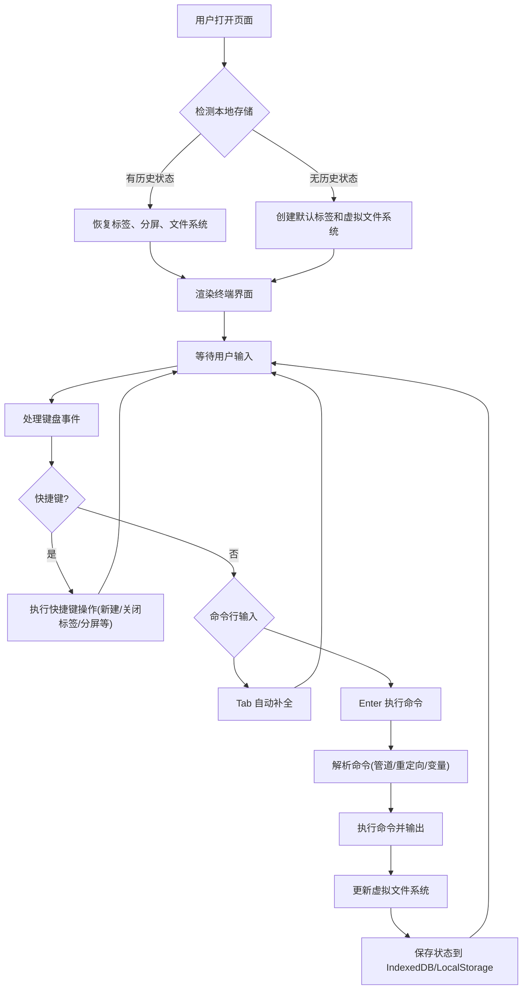

## 1. 产品概述

WebTerminal 是一个运行在浏览器中的全功能伪终端模拟器，提供类似 iTerm2 的命令行体验。内置虚拟文件系统和完整的命令解析器，支持多标签、分屏、管道、重定向、Vim 编辑器等专业终端功能，所有状态持久化存储，刷新页面完全恢复。

- 目标用户：开发者、技术爱好者、需要在线终端环境的学习者
- 核心价值：在浏览器中提供接近原生的终端体验，无需安装任何软件

## 2. 核心功能

### 2.1 用户角色
| 角色 | 注册方式 | 核心权限 |
|------|----------|----------|
| 访客用户 | 无需注册 | 使用全部终端功能，数据存储在本地浏览器 |

### 2.2 功能模块

1. **终端主界面**：整屏深色终端模拟器，包含 Tab 栏和终端内容区
2. **多标签管理**：类似 iTerm 的标签系统，支持新建、关闭、切换标签
3. **分屏系统**：单个标签内支持水平/垂直分屏，独立运行命令
4. **虚拟文件系统**：基于 IndexedDB 的持久化文件系统，支持目录树结构
5. **命令解析器**：完整的 Shell 解析器，支持管道、重定向、环境变量
6. **内置命令集**：cd/ls/mkdir/touch/rm/cat/echo/pwd/mv/cp/head/tail/grep/find/wc/sort/uniq
7. **Vim 编辑器**：简化版 Vim，支持 hjkl 移动、i 插入、:wq 保存退出
8. **主题系统**：Dracula/Solarized/Nord/OneDark/Monokai 五种经典配色
9. **Shell 脚本**：支持 alias、简单的 if/for 流程控制
10. **状态持久化**：所有状态（标签、分屏、文件、历史、alias）存储在本地

### 2.3 功能详情

| 功能模块 | 子功能 | 详细描述 |
|----------|--------|----------|
| 多标签系统 | 新建标签 | Ctrl+T 快捷键新建标签，每个标签独立工作目录和历史 |
| 多标签系统 | 关闭标签 | Ctrl+W 快捷键关闭当前标签，最后一个标签不可关闭 |
| 多标签系统 | 切换标签 | 点击或 Cmd+数字切换标签 |
| 分屏系统 | 水平分屏 | 单个标签左右分两块，各跑各的命令 |
| 分屏系统 | 垂直分屏 | 单个标签上下分两块，各跑各的命令 |
| 分屏系统 | 关闭分屏 | 关闭分屏恢复单屏 |
| 虚拟文件系统 | 文件操作 | 基于 IndexedDB 存储，支持目录和文件的增删改查 |
| 虚拟文件系统 | 路径解析 | 支持绝对路径、相对路径、~ 家目录 |
| 命令解析 | 管道符 | `ls | grep xxx` 支持多个命令管道连接 |
| 命令解析 | 重定向 | `ls > out.txt` 标准输出重定向到文件 |
| 命令解析 | 环境变量 | `$HOME` `$PATH` `$PS1` 等环境变量支持 |
| 命令解析 | 通配符 | `*` `?` 简单通配符支持 |
| 内置命令 | cd | 切换工作目录，支持 cd ~ cd .. cd - |
| 内置命令 | ls | 列出目录内容，支持 -l -a 参数 |
| 内置命令 | mkdir | 创建目录，支持 -p 递归创建 |
| 内置命令 | touch | 创建空文件或更新时间戳 |
| 内置命令 | rm | 删除文件或目录，支持 -r -f |
| 内置命令 | cat | 查看文件内容，支持多文件拼接 |
| 内置命令 | echo | 输出文本到终端，支持环境变量展开 |
| 内置命令 | pwd | 显示当前工作目录 |
| 内置命令 | mv | 移动或重命名文件/目录 |
| 内置命令 | cp | 复制文件/目录，支持 -r |
| 内置命令 | head | 显示文件前 N 行，默认 10 行 |
| 内置命令 | tail | 显示文件后 N 行，默认 10 行 |
| 内置命令 | grep | 搜索文件内容，支持正则表达式 |
| 内置命令 | find | 递归查找文件，支持按名称搜索 |
| 内置命令 | wc | 统计行数、单词数、字符数，支持 -l -w -c |
| 内置命令 | sort | 对文本行排序 |
| 内置命令 | uniq | 去除重复行，支持 -c 计数 |
| 自动补全 | 命令补全 | Tab 键补全命令名，多匹配显示候选列表 |
| 自动补全 | 路径补全 | Tab 键补全文件路径，再按循环切换 |
| 命令历史 | 上下键翻页 | ↑↓ 键浏览历史命令 |
| 命令历史 | 模糊搜索 | Ctrl+R 模糊匹配搜索历史 |
| 快捷键 | Ctrl+C | 中断当前命令，显示新提示符 |
| 快捷键 | Ctrl+L | 清屏，保留历史在缓冲区 |
| 快捷键 | Ctrl+T | 新建标签 |
| 快捷键 | Ctrl+W | 关闭当前标签 |
| 提示符 | PS1 自定义 | 通过 PS1 环境变量自定义提示符 |
| 提示符 | ANSI 颜色 | 支持 \\033[31m 等颜色控制码 |
| Vim 编辑器 | 移动 | h j k l 方向键移动 |
| Vim 编辑器 | 插入 | i 进入插入模式，Esc 返回普通模式 |
| Vim 编辑器 | 保存 | :w 保存文件 |
| Vim 编辑器 | 退出 | :q 退出，:wq 保存退出，:q! 强制退出 |
| 主题切换 | 5 种主题 | Dracula / Solarized / Nord / OneDark / Monokai |
| Shell 脚本 | alias | 支持 alias ll='ls -l' 别名定义 |
| Shell 脚本 | if 语句 | 简单的 if [ condition ]; then ... fi 支持 |
| Shell 脚本 | for 循环 | 简单的 for i in 1 2 3; do ... done 支持 |
| 持久化 | 状态存储 | 打开的标签、分屏布局、文件系统、命令历史、alias 全部存储 |
| 持久化 | 恢复 | 页面刷新后完整还原所有状态 |

## 3. 核心流程

## 4. 用户界面设计

### 4.1 设计风格
- **主色调**：深色主题，默认使用 Dracula 配色，背景深紫黑色，文字淡白色
- **字体**：使用 JetBrains Mono 或 Fira Code 等宽字体，终端专用字体
- **布局**：全屏布局，顶部 Tab 栏，下方终端内容区
- **Tab 风格**：磨砂玻璃效果，当前标签高亮显示，hover 有轻微发光效果
- **终端风格**：字符矩阵渲染，支持光标闪烁，平滑滚动
- **动画**：标签切换淡入淡出，命令输出逐字显示，光标呼吸效果

### 4.2 页面设计

| 区域 | 模块 | UI 元素 |
|------|------|---------|
| 顶部 | Tab 栏 | 标签列表、加号按钮、当前标签高亮、关闭按钮、主题切换 |
| 主体 | 终端内容区 | 命令历史输出、当前输入行、闪烁光标、滚动条 |
| 分屏 | 分割线 | 可拖拽分割线，悬停高亮 |
| Vim 模式 | 编辑器 | 行号显示、当前行高亮、模式指示器(NORMAL/INSERT) |
| 搜索 | Ctrl+R | 浮动搜索框，历史匹配实时高亮 |
| 自动补全 | 候选框 | 浮动候选列表，方向键选择，Enter 确认 |

### 4.3 响应式设计
- 桌面端：全屏显示，支持窗口大小变化自动适配终端列数
- 平板端：适当缩小字体，保持可用
- 移动端：简化布局，支持触摸滑动滚动

### 4.4 视觉细节
- **光标**：块状光标，闪烁频率 500ms，半透明效果
- **选中文字**：反色高亮，半透明背景
- **滚动条**：细滚动条，悬浮显示，与主题配色一致
- **分屏分隔线**：1px 细线，悬浮时加粗高亮，支持拖拽调整大小
- **命令输出**：命令行前缀灰色高亮，输出文字正常颜色
- **错误输出**：红色文字显示错误信息
