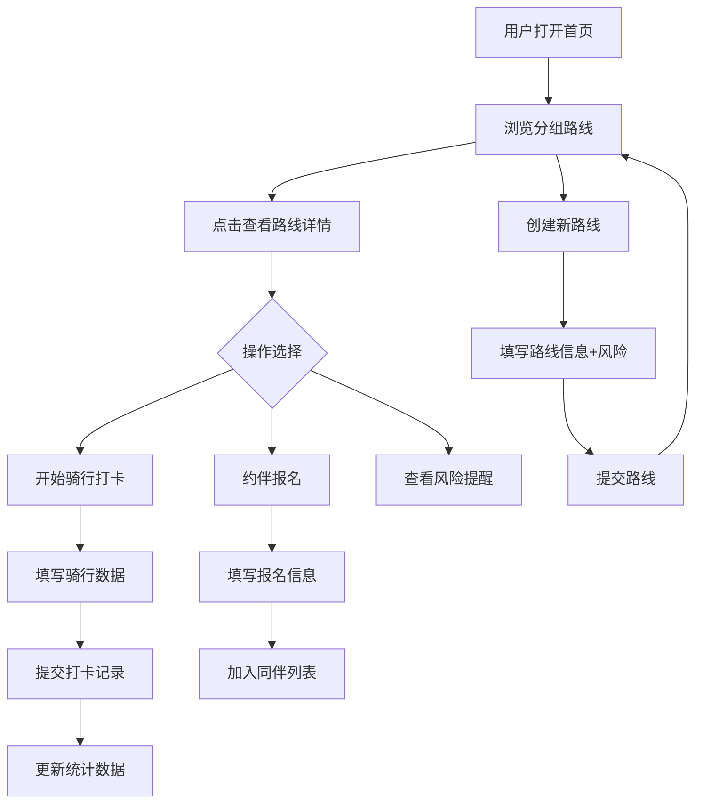

# 城市骑行路线打卡应用 - 产品需求文档

## 1. 产品概述

城市骑行路线打卡应用，为城市骑行爱好者提供路线分享、骑行记录、同伴约骑的一站式平台。解决骑行群体依赖社交群甩定位、路线信息不完整、安全风险不透明的痛点。

- 目标用户：城市骑行爱好者、周末休闲骑手、公路车/山地车玩家
- 核心价值：结构化路线信息、安全风险提醒、骑行数据统计、社交约伴

## 2. 核心功能

### 2.1 用户角色

| 角色 | 注册方式 | 核心权限 |
|------|----------|----------|
| 普通用户 | 直接使用（本地存储） | 创建路线、打卡记录、约伴报名、查看统计 |

### 2.2 功能模块

1. **首页**：路线分类分组展示（轻松骑、爬坡多、夜骑友好、施工绕行）、搜索筛选
2. **路线创建页**：起点终点、距离、爬升、路况、补给点、沿途照片、风险提醒
3. **路线详情页**：路线信息展示、风险提醒、骑行记录列表、约伴报名入口
4. **骑行打卡页**：记录用时、平均速度、体感难度、爆胎/迷路情况
5. **约伴报名页**：填写车型、能否领骑、集合时间
6. **统计页**：本月公里数、最常骑路线、问题路段分析

### 2.3 页面详情

| 页面名称 | 模块名称 | 功能描述 |
|----------|----------|----------|
| 首页 | 顶部导航 | Logo、页面切换、创建路线按钮 |
| 首页 | 分类标签栏 | 轻松骑/爬坡多/夜骑友好/施工绕行 分组切换 |
| 首页 | 路线卡片列表 | 展示路线缩略图、名称、距离、爬升、标签、风险标识 |
| 路线创建页 | 基本信息表单 | 路线名称、起点、终点、距离、爬升输入 |
| 路线创建页 | 路况选择 | 柏油路/水泥路/砂石路/混合路况 多选 |
| 路线创建页 | 补给点设置 | 是否有便利店/饮水点/卫生间/修车店 |
| 路线创建页 | 风险提醒 | 隧道没灯/机动车多/共享单车禁停区/下雨路滑 多选 |
| 路线创建页 | 照片上传 | 沿途风景照片展示区 |
| 路线详情页 | 路线概览 | 地图示意、关键数据卡片 |
| 路线详情页 | 风险提示区 | 醒目颜色标识的风险清单 |
| 路线详情页 | 骑行记录 | 历史打卡列表，含骑手、用时、难度评分 |
| 路线详情页 | 约伴区 | 活动列表、报名入口 |
| 骑行打卡页 | 数据表单 | 用时、均速、体感难度、问题备注 |
| 骑行打卡页 | 问题上报 | 爆胎/迷路/摔车/其他问题 勾选 |
| 约伴报名页 | 报名表单 | 昵称、车型、能否领骑、集合时间 |
| 约伴报名页 | 同伴列表 | 已报名人员展示 |
| 统计页 | 本月概览 | 总公里、总次数、总爬升 数据卡片 |
| 统计页 | 最常骑路线 | 按次数排序的路线排行榜 |
| 统计页 | 问题分析 | 各路线问题发生次数统计图表 |

## 3. 核心流程

## 4. 用户界面设计

### 4.1 设计风格

- **主色调**：深绿渐变 #059669 → #10B981（骑行/自然/活力感）
- **辅助色**：琥珀橙 #F59E0B（警告/风险提醒）、日落红 #EF4444（危险）、天空蓝 #0EA5E9（信息）
- **中性色**：石板灰系列 Slate，背景深灰 #0F172A，卡片 #1E293B
- **按钮风格**：圆角 12px，主按钮带渐变填充，hover 时轻微上浮 + 阴影加强
- **字体**：标题使用 Space Grotesk（粗体几何感），正文使用 Inter（清晰易读）
- **布局风格**：深色主题卡片式布局，导航顶栏固定，内容区左右留白充足
- **图标风格**：Lucide 线性图标，配合 emoji 增强视觉识别（🚴 ⚠️ 📊 📍）

### 4.2 页面设计概览

| 页面名称 | 模块名称 | UI 元素 |
|----------|----------|---------|
| 首页 | Hero 区 | 大标题 + 搜索框 + 渐变背景光斑动画 |
| 首页 | 分类标签 | 胶囊形 Tab，选中态填充主色，带下划线动画 |
| 首页 | 路线卡片 | 左侧小图，右侧信息堆叠，底部风险标签组，hover 微缩放 |
| 路线创建页 | 表单区 | 分组 Fieldset，输入框深色描边，focus 时主色发光边框 |
| 路线详情页 | 风险区 | 琥珀/红色背景条，带警告图标和脉冲动画 |
| 统计页 | 数据卡片 | 大号数字 + 渐变底部边框，进入时交错淡入 |

### 4.3 响应式

- 桌面端优先设计（1440px 基准）
- 平板端（768px）：卡片两列布局，导航简化
- 移动端（375px）：单列布局，底部 Tab 导航，表单全宽

### 4.4 动画效果

- 页面切换：路由切换时整体淡入 + Y轴 8px 向上滑动
- 卡片进入：stagger 交错动画，每张延迟 50ms
- 风险提醒：首次加载时脉冲闪烁 2 次
- 表单提交：按钮旋转加载态，成功后绿色勾选动画
