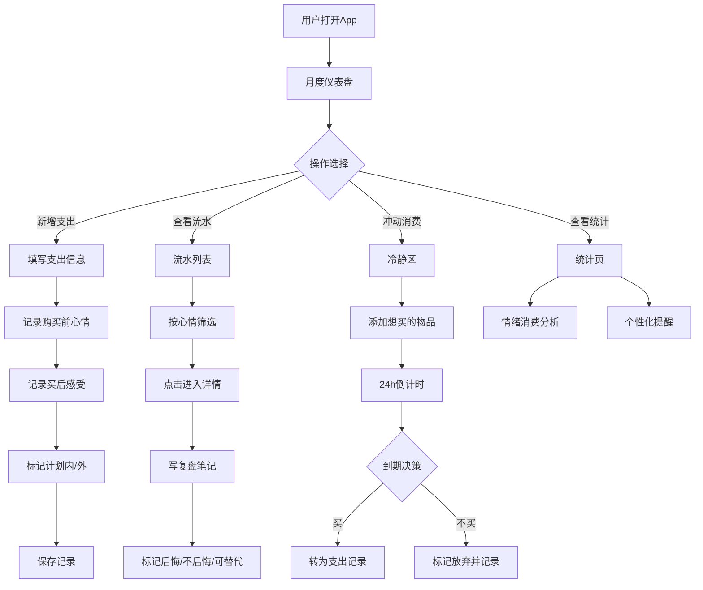

## 1. 产品概述

心账——个人预算情绪账本，不只是记账，更要理解每一笔消费背后的情绪动机。帮助用户建立消费与情绪之间的觉察力，减少冲动消费，培养更健康的消费习惯。

- 目标用户：希望控制支出、理解自身消费心理的个人用户
- 核心价值：将情绪觉知融入日常记账，让每一次花钱都有迹可循、有思可省

## 2. 核心功能

### 2.2 功能模块

1. **月度仪表盘页**：月度预算总览、各类别预算进度条、超支预警、本月情绪消费摘要
2. **新增支出页**：录入金额、类别、商家、支付方式、是否计划内、购买前心情、买完后感受
3. **流水列表页**：按时间/类别/心情筛选支出记录，支持情绪标签过滤
4. **支出详情页**：查看支出详情、写复盘笔记、标记后悔/不后悔/可替代
5. **冷静区页**：冲动消费暂存区，24小时冷静期倒计时，到期提醒决策
6. **统计页**：情绪与消费类别的关联分析、个性化消费提醒建议

### 2.3 页面详情

| 页面名称 | 模块名称 | 功能描述 |
|----------|----------|----------|
| 月度仪表盘 | 预算总览 | 显示本月总预算、已花费、剩余金额 |
| 月度仪表盘 | 类别预算条 | 生活、吃饭、交通、娱乐、学习各类预算进度，超80%变橙、超100%变红 |
| 月度仪表盘 | 情绪消费摘要 | 本月各情绪下的消费占比饼图 |
| 月度仪表盘 | 快捷操作 | 快速新增支出、进入冷静区 |
| 新增支出 | 基本信息 | 金额输入、类别选择、商家名称、支付方式 |
| 新增支出 | 情绪记录 | 购买前心情选择（焦虑/开心/平静/冲动/压力/无聊/难过）、买完后感受（满足/后悔/无所谓/意外惊喜） |
| 新增支出 | 计划标记 | 是否计划内消费开关 |
| 流水列表 | 筛选栏 | 按类别、心情、时间范围筛选 |
| 流水列表 | 支出卡片 | 金额、类别、商家、心情标签、复盘状态标识 |
| 支出详情 | 详情展示 | 完整支出信息和情绪记录 |
| 支出详情 | 复盘区 | 写复盘笔记、标记后悔/不后悔/可替代 |
| 冷静区 | 待购清单 | 想买但暂未决定的东西列表 |
| 冷静区 | 倒计时 | 每项24小时倒计时，到期后可标记买/不买 |
| 冷静区 | 决策统计 | 冷静期后最终选择不买的比例 |
| 统计页 | 情绪消费图 | 各情绪下的消费金额和笔数 |
| 统计页 | 类别情绪热力图 | 哪种类别最容易在哪种情绪下花钱 |
| 统计页 | 个性化提醒 | 根据消费习惯生成的3-5条具体提醒建议 |

## 3. 核心流程

**录入支出流程**：用户打开新增支出页 → 填写金额和基本信息 → 选择购买前心情 → 选择买后感受 → 标记是否计划内 → 保存记录

**冲动消费冷静流程**：用户想买东西 → 添加到冷静区 → 24小时倒计时开始 → 到期后弹出决策提示 → 用户决定买/不买 → 记录决策结果

**复盘流程**：用户查看流水列表 → 点击某笔支出进入详情 → 撰写复盘笔记 → 标记后悔程度 → 保存复盘

## 4. 用户界面设计

### 4.1 设计风格

- **主色调**：深靛蓝(#1a1a2e)为底，暖珊瑚(#ff6b6b)和柔金(#ffd93d)作为强调色
- **辅助色**：薄荷绿(#6bcb77)表示正向情绪/节省，淡紫(#c4b5fd)表示冷静/反思
- **风格定位**：夜间手账风格——深色背景如深夜独处，暖色标注如心情感悟，字体选择偏手写质感
- **字体**：标题使用 ZCOOL XiaoWei（站酷小薇体），正文使用 Noto Sans SC
- **按钮**：圆角胶囊形，带微妙阴影和hover浮起效果
- **布局**：卡片式布局，每张卡片带微妙毛玻璃效果，间距宽松
- **动效**：页面切换淡入淡出，预算条平滑动画，心情选择弹性缩放

### 4.2 页面设计概览

| 页面名称 | 模块名称 | UI元素 |
|----------|----------|--------|
| 月度仪表盘 | 预算总览 | 大数字展示总预算/已花/剩余，渐变背景卡片 |
| 月度仪表盘 | 类别预算条 | 横向进度条，正常绿色→80%橙色→100%红色，带脉冲动画预警 |
| 月度仪表盘 | 情绪摘要 | 环形图，各情绪对应颜色，中心显示本月主情绪 |
| 月度仪表盘 | 快捷操作 | 底部悬浮按钮，珊瑚色圆形+号 |
| 新增支出 | 金额输入 | 大字号居中显示，数字键盘风格 |
| 新增支出 | 心情选择 | 情绪表情图标阵列，选中弹性放大+光晕 |
| 新增支出 | 类别选择 | 彩色标签横向滚动选择 |
| 流水列表 | 筛选栏 | 顶部情绪标签横滑筛选，选中高亮 |
| 流水列表 | 支出卡片 | 毛玻璃卡片，左侧类别色条，右下心情小标签 |
| 支出详情 | 复盘区 | 可展开文本域，三个状态按钮(后悔/不后悔/可替代) |
| 冷静区 | 倒计时 | 圆形进度倒计时环，到期闪烁提示 |
| 统计页 | 热力图 | 网格式热力图，颜色深浅代表消费频率 |

### 4.3 响应式

- 桌面优先设计，最大宽度480px居中（手机端体验为主）
- 平板和桌面端适当放宽卡片间距，但不改变整体布局
- 触控优化：按钮最小44px点击区域，滑动操作支持

### 4.4 动效设计

- 页面切换：淡入淡出 300ms
- 预算条：宽度变化 ease-out 500ms
- 心情选择：scale(1.2) 弹性回弹 300ms
- 冷静区倒计时：圆环顺滑递减动画
- 卡片悬停：translateY(-2px) + 阴影增强
