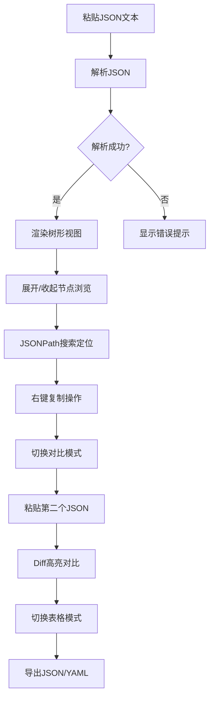

## 1. 产品概述

JSON 可视化工具 - 专为开发者和数据分析师设计的 JSON 数据处理工具，支持大型 JSON 数据的可视化浏览、搜索、对比和导出。

- 解决大 JSON 数据难以阅读和分析的痛点，提供直观的树形结构展示
- 面向开发者、测试工程师、数据分析师，提升 JSON 数据处理效率

## 2. 核心功能

### 2.1 功能模块

1. **JSON 编辑器与树形视图**：左侧文本编辑器，右侧实时树形可视化
2. **JSONPath 搜索**：顶部搜索栏，支持 JSONPath 语法定位高亮
3. **右键菜单**：复制路径、复制值、复制整段子树
4. **JSON 对比模式**：左右两栏对比，高亮新增/删除/修改
5. **表格扁平化**：数组转表格展示，字段转列便于查看
6. **导出功能**：导出格式化 JSON 或 YAML

### 2.2 页面详情

| 页面名称 | 模块名称 | 功能描述 |
|-----------|-------------|---------------------|
| 主页面 | 顶部导航栏 | 模式切换（视图/对比/表格）、搜索框、导出按钮 |
| 主页面 | JSON 编辑器 | 左侧文本输入区，支持语法高亮、格式化、压缩 |
| 主页面 | 树形可视化区 | 右侧树形展开，节点可展开收起，类型颜色区分 |
| 主页面 | 右键菜单 | 每个节点右键操作：复制路径、复制值、复制子树 |
| 对比模式 | 双栏编辑器 | 左右两个 JSON 输入区 |
| 对比模式 | Diff 高亮 | 新增（绿色）、删除（红色）、修改（黄色）标记 |
| 表格模式 | 数据表格 | 数组转行，字段转列，支持排序筛选 |

## 3. 核心流程

用户粘贴 JSON → 自动解析为树形结构 → 展开/收起节点浏览 → 使用 JSONPath 搜索定位 → 右键复制需要的数据 → 切换对比模式比较两个 JSON → 切换表格模式查看数组数据 → 导出为格式化 JSON 或 YAML

## 4. 用户界面设计

### 4.1 设计风格
- **主色调**：深色主题，背景 #1e1e2e，编辑器背景 #282a36
- **类型颜色**：
  - Key（键名）：蓝色 #82aaff
  - String（字符串）：绿色 #c3e88d
  - Number（数字）：紫色 #c792ea
  - Boolean（布尔）：红色 #f07178
  - Null：橙色 #f78c6c
- **按钮风格**：圆角 6px，悬停有微动画
- **字体**：JetBrains Mono 等宽字体（代码区），Inter（界面文本）
- **布局**：分栏布局，可拖拽调整左右宽度
- **图标**：简洁线性图标，使用 Lucide React

### 4.2 页面设计概览

| 页面名称 | 模块名称 | UI 元素 |
|-----------|-------------|-------------|
| 主页面 | 顶部导航 | 深色背景，模式切换标签，搜索框，导出按钮 |
| 主页面 | 编辑器区域 | 左侧代码编辑器带行号，右侧树形视图带缩进线 |
| 主页面 | 树形节点 | 折叠箭头、类型图标、颜色区分的键值对 |
| 主页面 | 右键菜单 | 深色悬浮菜单，带图标和快捷键提示 |
| 对比模式 | 双栏布局 | 左右对称，中间分隔线，行级 diff 高亮 |
| 表格模式 | 数据表格 | 斑马纹，固定表头，可调整列宽 |

### 4.3 响应式
- 桌面端优先设计
- 中等屏幕：编辑器与树形视图上下排列
- 小屏幕：标签页切换不同视图
