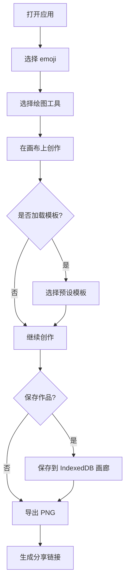

## 1. 产品概述

Emoji 拼图艺术工具是一款创意像素画制作应用，用户可以使用 emoji 在 32x32 网格画布上创作独特的像素艺术作品。目标用户为喜欢创意表达、社交媒体分享的年轻用户群体。

产品价值：提供简单有趣的 emoji 创作体验，让用户无需专业设计技能也能制作精美的 emoji 拼图艺术。

## 2. 核心功能

### 2.1 功能模块

1. **主编辑页**：32x32 网格画布、emoji 选择面板、绘图工具栏、预设模板、导出分享
2. **画廊页**：浏览保存的作品、管理本地存储的作品

### 2.2 页面详情

| 页面名称 | 模块名称 | 功能描述 |
|-----------|-------------|---------------------|
| 主编辑页 | 32x32 网格画布 | 支持点击绘制 emoji，显示当前画笔状态 |
| 主编辑页 | emoji 选择面板 | 分类展示上千种 emoji，支持搜索过滤、滚轮浏览 |
| 主编辑页 | 绘图工具栏 | 四种工具：单格画、整列填、整行填、油漆桶填充 |
| 主编辑页 | 预设模板 | 提供猫头、心形、圣诞树等精美模板一键加载 |
| 主编辑页 | 导出分享 | 导出 PNG 图片、生成分享链接（mock） |
| 画廊页 | 作品列表 | IndexedDB 存储的作品展示，支持查看和删除 |

## 3. 核心流程

用户选择 emoji → 选择绘图工具 → 在画布上创作 → 可选加载预设模板 → 保存作品到本地画廊 → 导出 PNG 或分享

## 4. 用户界面设计

### 4.1 设计风格

- **主色调**：渐变色粉紫系 (#FF6B9D → #C44DFF)，活力年轻
- **辅助色**：浅蓝 (#6BCFFF)、暖黄 (#FFD93D)
- **中性色**：深灰 (#1A1A2E)、中灰 (#4A4A6A)、浅灰 (#F5F5FA)
- **按钮风格**：圆润胶囊形按钮，带微渐变和阴影
- **字体**：展示字体用 "Fredoka One"，正文字体用 "Noto Sans SC"
- **布局风格**：三栏布局，左侧 emoji 面板、中间画布、右侧工具/模板面板
- **视觉效果**：毛玻璃背景、柔和阴影、微交互动画

### 4.2 页面设计概览

| 页面名称 | 模块名称 | UI 元素 |
|-----------|-------------|-------------|
| 主编辑页 | 画布区域 | 32x32 白色网格，带边框高亮，hover 状态放大效果 |
| 主编辑页 | emoji 面板 | 分类标签页，网格布局 emoji 按钮，搜索框置顶 |
| 主编辑页 | 工具栏 | 图标按钮组，选中状态高亮，工具提示 |
| 主编辑页 | 模板区 | 卡片式缩略图展示，hover 放大效果 |
| 画廊页 | 作品列表 | 瀑布流卡片展示，缩略图 + 标题 + 时间 |

### 4.3 响应式

- Desktop-first 设计，最小支持 1280px 宽度
- 平板端自适应调整面板宽度
- 移动端单列布局，画布优先显示

### 4.4 交互细节

- emoji 选中时弹跳动画
- 画布格子 hover 时轻微放大
- 工具切换时平滑过渡
- 保存/导出成功有提示动效
