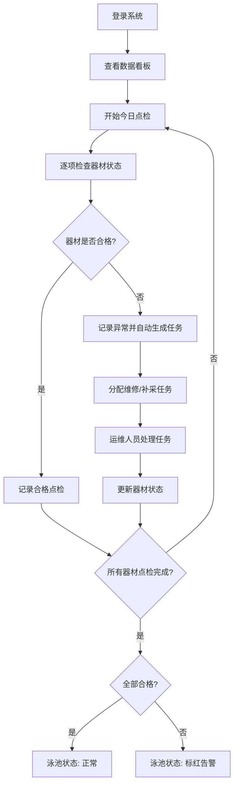

## 1. 产品概述

小区泳池救援器材点检系统，用于规范化管理泳池救生圈、救生杆、警示牌等救援器材的定期检查与维护。系统确保暑期高峰时段泳池安全，杜绝器材缺失或破损导致的安全事故。

- **目标用户**：小区物业管理人员、泳池安全员、运维人员
- **核心价值**：通过数字化点检流程，确保救援器材100%可用，泳池开放前强制全部合格

## 2. 核心功能

### 2.1 用户角色

| 角色 | 核心权限 |
|------|----------|
| 物业管理员 | 全功能权限，器材档案管理、查看所有点检记录、分配任务 |
| 安全员 | 执行点检、记录异常、查看分配的任务 |
| 运维人员 | 处理维修/补采任务、更新器材状态 |

### 2.2 功能模块

1. **数据看板首页**：今日点检进度、异常器材告警、暑期高峰提醒、各区域合格率统计
2. **器材档案管理**：器材增删改查，含位置、类型、编号、购置日期、责任人、照片
3. **点检任务执行**：按点检清单逐项检查并记录状态
4. **维修/补采任务**：异常器材自动生成任务并分配处理
5. **泳池状态管理**：开放前强制检查，不合格自动标红告警

### 2.3 页面详情

| 页面名称 | 模块名称 | 功能描述 |
|-----------|-------------|---------------------|
| 数据看板 | 顶部状态栏 | 显示泳池当前状态（正常/标红告警）、今日日期、暑期高峰提醒横幅 |
| 数据看板 | 统计卡片 | 今日已点检/待点检数量、异常器材数量、处理中任务数量、整体合格率 |
| 数据看板 | 异常器材列表 | 显示所有状态异常的器材，可快速跳转处理 |
| 数据看板 | 区域合格率图表 | 按泳池区域展示合格率柱状图 |
| 器材档案 | 器材列表 | 表格展示所有器材，支持筛选、搜索、分页 |
| 器材档案 | 器材详情/编辑表单 | 位置、类型、编号、购置日期、责任人、照片上传 |
| 点检执行 | 点检列表 | 展示待点检和已点检记录 |
| 点检执行 | 点检表单 | 救生圈（老化/绳索长度）、救生杆（裂纹）、警示牌（清晰度）、急救箱、摄像头遮挡 |
| 任务中心 | 任务列表 | 维修/补采任务，支持状态流转（待处理/处理中/已完成） |
| 任务中心 | 任务详情 | 异常原因、器材信息、处理记录、责任人 |

## 3. 核心流程

泳池安全员每日执行点检，若发现器材异常则系统自动生成维修或补采任务。泳池开放前系统自动校验所有器材是否合格，如有不合格则泳池状态标红禁止开放。

## 4. 用户界面设计

### 4.1 设计风格

- **主色调**：深海蓝 (#0EA5E9) 代表专业与信任，搭配安全橙 (#F97316) 作为告警色
- **辅助色**：安全绿 (#10B981) 表示正常合格，警示红 (#EF4444) 表示异常
- **中性色**：Slate系列灰色，保持简洁专业
- **按钮风格**：圆角8px，带有微妙阴影，悬停时有轻微上浮动画
- **字体**：使用 Noto Sans SC 中文显示字体，标题加粗，正文清晰易读
- **布局**：顶部导航 + 左侧菜单 + 右侧内容区，卡片式组件布局
- **图标风格**：使用 Lucide 线性图标，保持简洁统一
- **背景**：浅灰蓝渐变底色，营造清爽的泳池相关氛围

### 4.2 页面设计概览

| 页面名称 | 模块名称 | UI 元素 |
|-----------|-------------|----------|
| 数据看板 | 顶部状态横幅 | 泳池状态大号指示器（绿色/红色闪烁），暑期提醒横幅带渐变背景 |
| 数据看板 | 统计卡片 | 四张带图标和渐变底部边框的统计卡片，数值动画显示 |
| 数据看板 | 异常器材列表 | 红色左侧边框的告警列表项，悬浮显示操作按钮 |
| 数据看板 | 区域合格率 | 彩色渐变柱状图，显示合格率百分比 |
| 器材档案 | 列表表格 | 带筛选栏的表格，行悬浮高亮，状态标签彩色显示 |
| 器材档案 | 编辑弹窗 | 双列表单布局，照片上传预览区 |
| 点检执行 | 点检清单 | 可折叠分组卡片，逐项勾选/填写异常描述 |
| 任务中心 | 任务看板 | 三列看板布局（待处理/处理中/已完成），支持拖拽状态流转 |

### 4.3 响应式

桌面端优先设计，适配平板和移动端。主要内容区域保持最小1024px宽度，移动端自动收起侧栏为汉堡菜单。
