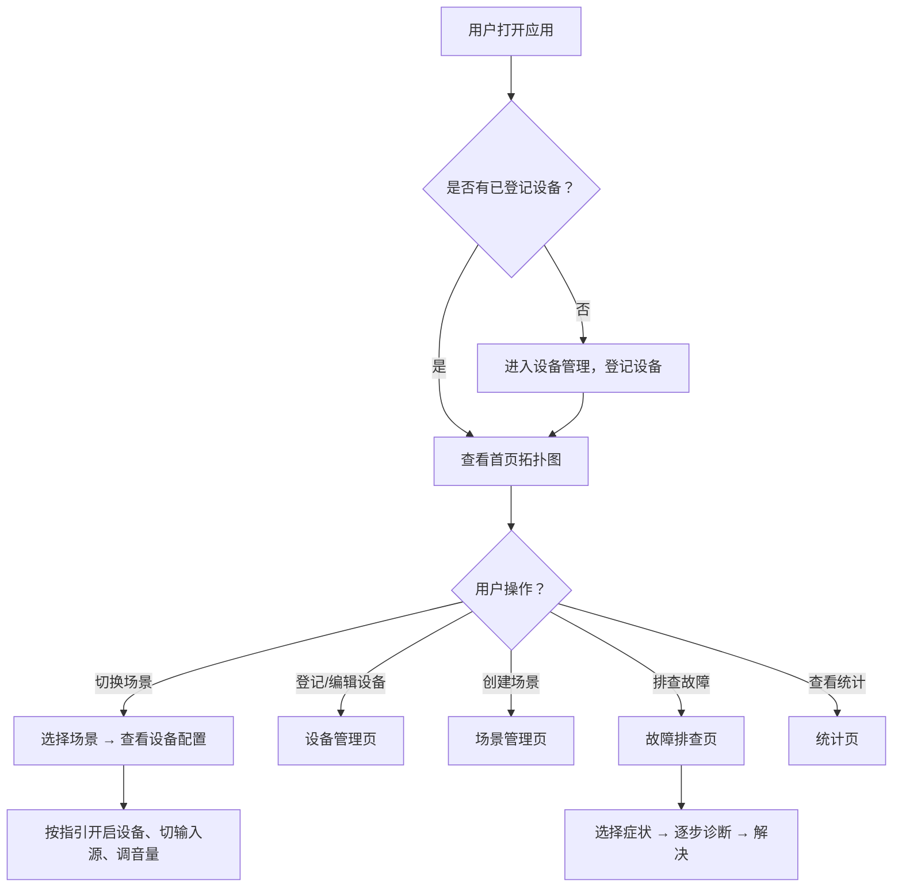

## 1. 产品概述

家庭影音设备遥控台——一个让你彻底搞清客厅里电视、投影、功放、音响、游戏机之间怎么接线的可视化管理工具。告别"这个HDMI口插的啥"的日常困惑，用拓扑图一目了然看清设备连接关系，一键切换观影/游戏/听歌场景，还能排查故障、查看使用统计。

- 目标用户：拥有多台影音设备的家庭用户、影音发烧友
- 核心价值：消除设备接线混乱、简化场景切换、快速定位故障

## 2. 核心功能

### 2.1 用户角色

| 角色 | 说明 |
|------|------|
| 家庭用户 | 单用户本地使用，无需注册登录 |

### 2.2 功能模块

1. **首页**：客厅设备拓扑图、快捷场景切换、设备状态总览
2. **设备管理页**：设备登记/编辑、接口信息、照片上传
3. **场景管理页**：创建/编辑场景、场景执行、场景配置详情
4. **故障排查页**：常见问题诊断、排查步骤指引、历史故障记录
5. **统计页**：场景使用频率、设备故障率、设备活跃度

### 2.3 页面详情

| 页面名称 | 模块名称 | 功能描述 |
|----------|----------|----------|
| 首页 | 设备拓扑图 | 以节点+连线方式展示客厅所有设备及HDMI/音频连接关系，支持拖拽调整位置 |
| 首页 | 快捷场景栏 | 底部横向排列常用场景卡片，点击即可"一键切换"查看该场景需开启的设备和参数 |
| 首页 | 设备状态指示 | 每个设备节点显示在线/离线/故障状态 |
| 设备管理 | 设备列表 | 卡片式展示所有已登记设备，含品牌、型号缩略图 |
| 设备管理 | 设备登记表单 | 填写名称、品牌、型号、接口类型(HDMI/OPTICAL/ARC等)、遥控器位置、连接的目标设备和端口、照片 |
| 设备管理 | 接口详情 | 展示设备所有输入/输出接口，标注已占用/空闲 |
| 场景管理 | 场景列表 | 卡片式展示所有场景，含图标、名称、设备数量 |
| 场景管理 | 场景编辑器 | 选择需开启的设备列表、每个设备的输入源、音量设定、备注 |
| 故障排查 | 症状选择 | 选择故障现象：有画面没声音、遥控器找不到、HDMI口占用、画面闪烁等 |
| 故障排查 | 诊断指引 | 根据症状逐步排查，给出可能原因和解决步骤 |
| 故障排查 | 故障记录 | 记录历史故障及解决方案，方便下次快速查阅 |
| 统计页 | 场景使用统计 | 柱状图展示各场景使用次数和频率 |
| 统计页 | 设备故障统计 | 列表展示设备故障次数排名 |
| 统计页 | 设备活跃度 | 展示各设备在场景中的参与频率 |

## 3. 核心流程

用户首次使用时，先登记所有影音设备，填写设备信息和接口连接关系。之后在首页即可看到客厅设备拓扑图，直观了解投影接功放、功放接音响、游戏机接哪个HDMI口等连接关系。日常使用中，用户可创建"看电影""打游戏""听歌"等场景，每个场景指定需要开启哪些设备、切换到哪个输入源、音量设多少。遇到问题时，进入故障排查页，选择症状获取诊断指引。

## 4. 用户界面设计

### 4.1 设计风格

- **主色调**：深色科技风 — 深灰/近黑底色(`#0a0a0f`)，搭配琥珀橙(`#f59e0b`)作为强调色，青蓝色(`#06b6d4`)作为信息色
- **按钮风格**：圆角微凸，hover时发光效果，主按钮为琥珀橙填充
- **字体**：标题使用 Outfit（几何感、科技感），正文使用 DM Sans（清晰易读）
- **布局风格**：侧边栏导航 + 主内容区，卡片式模块布局
- **图标**：lucide-react 图标库，线条风格与科技主题一致
- **氛围**：暗色调 + 发光线条 + 节点脉冲动画，模拟影音设备面板的酷炫感

### 4.2 页面设计概览

| 页面名称 | 模块名称 | UI 元素 |
|----------|----------|---------|
| 首页 | 设备拓扑图 | 深色画布，设备为发光圆角矩形节点，连接线为带动画的虚线（HDMI用橙色、光纤用青色、音频线用绿色），节点可拖拽，hover显示设备详情浮层 |
| 首页 | 快捷场景栏 | 底部固定横栏，场景卡片横向滚动，卡片含图标+名称，点击触发场景激活动画 |
| 设备管理 | 设备列表 | 网格卡片布局，每卡含设备照片/图标、名称、品牌、状态徽章 |
| 设备管理 | 设备表单 | 侧滑抽屉式表单，含图片上传区、分组字段、接口选择器 |
| 场景管理 | 场景卡片 | 大卡片布局，含场景图标、名称、设备标签列表、一键激活按钮 |
| 场景管理 | 场景编辑器 | 左侧设备勾选列表，右侧参数配置面板（输入源下拉、音量滑块） |
| 故障排查 | 症状选择 | 网格图标选择器，每个症状一个卡片（含图标+描述） |
| 故障排查 | 诊断步骤 | 步骤条式展示，每步含说明和操作按钮 |
| 统计页 | 图表区 | 柱状图、环形图展示数据，深色卡片容器 |

### 4.3 响应式设计

- 桌面端优先，拓扑图在宽屏下展示效果最佳
- 平板端拓扑图可缩放/平移，侧边栏折叠为底部导航
- 移动端简化拓扑图为列表视图，核心功能保留

### 4.4 动效设计

- 拓扑图连接线：流动脉冲动画，表示信号流向
- 设备节点：激活时发光呼吸动画
- 场景切换：卡片翻转动效，设备节点依次点亮
- 页面切换：淡入淡出过渡
- 故障排查：步骤展开时滑入动画
