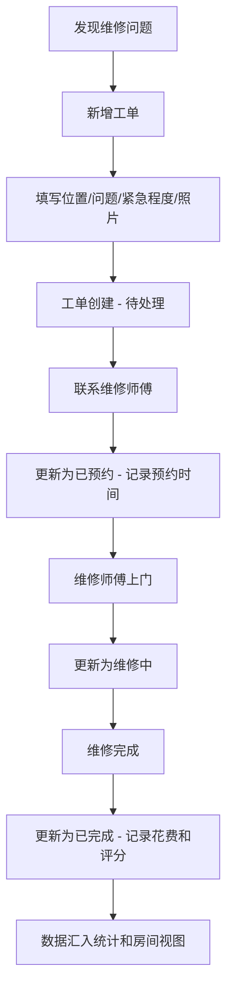

## 1. 产品概述
家庭维修工单本是一款专为中国家庭设计的维修事项管理工具，帮助用户记录和追踪水龙头漏水、灯泡损坏、门锁卡住等日常家居维修问题。通过看板式白板界面、房间视图和费用统计，让家庭维修管理从混乱变得井井有条。
- 解决家庭维修事项散落各处、费用无据可查、维修师傅难以筛选的痛点
- 目标用户为有房家庭，核心价值在于让每一次家庭维修都有迹可循

## 2. 核心功能

### 2.1 用户角色
| 角色 | 注册方式 | 核心权限 |
|------|----------|----------|
| 家庭用户 | 本地使用 | 新增/编辑/删除工单、查看统计、管理联系人标签 |

### 2.2 功能模块
1. **维修白板（首页）**：看板式工单列表，按状态分组展示所有维修事项
2. **新增/编辑工单**：填写维修事项详细信息（位置、问题、紧急程度、照片、费用、联系人、预约时间）
3. **工单详情**：沟通记录、报价记录、上门时间、维修前后照片、花费明细
4. **房间视图**：按房间分类查看历史维修问题
5. **统计页面**：年度费用、区域问题分布、超时工单提醒

### 2.3 页面详情
| 页面名称 | 模块名称 | 功能描述 |
|----------|----------|----------|
| 维修白板 | 状态看板 | 按待处理、已预约、维修中、已完成四列展示工单卡片，支持拖拽切换状态 |
| 维修白板 | 快速新增 | 点击+按钮弹出新增工单表单 |
| 维修白板 | 紧急标记 | 紧急工单卡片高亮红色边框和紧急图标 |
| 维修白板 | 搜索筛选 | 按关键词、房间、紧急程度筛选工单 |
| 新增工单 | 基本信息 | 填写位置（房间选择）、问题描述、紧急程度（低/中/高/紧急） |
| 新增工单 | 附加信息 | 上传照片、填写预计费用、选择联系人、设定预约时间 |
| 工单详情 | 状态流转 | 工单状态切换按钮（待处理→已预约→维修中→已完成） |
| 工单详情 | 沟通记录 | 时间线式展示与维修师傅/物业的沟通内容，支持新增记录 |
| 工单详情 | 报价记录 | 记录多份报价，包含报价人、金额、备注 |
| 工单详情 | 上门时间 | 预约上门时间，支持多次上门记录 |
| 工单详情 | 维修照片 | 维修前和维修后照片分区展示 |
| 工单详情 | 花费明细 | 记录人工费、材料费、其他费用，自动汇总总花费 |
| 工单详情 | 服务评分 | 对本次维修服务打分（1-5星），自动关联到联系人标签 |
| 房间视图 | 房间列表 | 展示厨房、卫生间、卧室、客厅、阳台、玄关等房间卡片 |
| 房间视图 | 历史问题 | 点击房间显示该房间所有历史维修工单及统计 |
| 统计页面 | 年度费用 | 展示今年总维修费用，按月折线图展示趋势 |
| 统计页面 | 区域分布 | 饼图展示各房间维修问题占比 |
| 统计页面 | 超时提醒 | 列出超过7天未完成的待处理/已预约工单 |

## 3. 核心流程

用户发现家中需要维修的问题 → 打开维修白板 → 点击新增按钮 → 填写位置、问题描述、紧急程度等信息 → 工单创建为"待处理"状态 → 联系维修师傅后更新为"已预约" → 维修师傅上门更新为"维修中" → 维修完成更新为"已完成"并记录花费和评分

## 4. 用户界面设计

### 4.1 设计风格
- 主色调：暖橙色 (#E8652D) 代表维修工具的工业感，搭配深灰 (#1A1A2E) 和暖白 (#FAF7F2)
- 辅助色：状态色 - 待处理灰 (#94A3B8)、已预约蓝 (#3B82F6)、维修中橙 (#F59E0B)、已完成绿 (#10B981)
- 按钮风格：圆角微凸，带轻微阴影的3D感按钮
- 字体：标题使用 Noto Sans SC Bold，正文使用 Noto Sans SC Regular
- 布局风格：左侧导航栏 + 主内容区，看板采用横向滚动四列布局
- 图标风格：线条式图标搭配填充式状态标识

### 4.2 页面设计概览
| 页面名称 | 模块名称 | UI 元素 |
|----------|----------|----------|
| 维修白板 | 状态看板 | 四列横向看板，每列头部带状态色标识，工单卡片含紧急标签、房间标签、简述、费用预览 |
| 维修白板 | 顶部导航 | Logo + 搜索框 + 新增按钮 + 页面切换标签 |
| 新增工单 | 表单区域 | 分步表单，基本信息 + 附加信息，底部固定操作按钮 |
| 工单详情 | 左侧主区域 | 状态流转进度条、沟通记录时间线、报价对比卡片、照片画廊 |
| 工单详情 | 右侧信息栏 | 基本信息、花费明细、服务评分星级 |
| 房间视图 | 房间网格 | 3列网格卡片，每张卡片含房间图标、问题数量、最近维修时间 |
| 房间视图 | 问题列表 | 点击房间后展开的历史工单列表 |
| 统计页面 | 数据看板 | 顶部三个数据卡片（总费用/工单数/平均费用），中部双图表，底部超时工单列表 |

### 4.3 响应式设计
- 桌面优先设计，最小宽度 1024px
- 看板在小屏幕下改为纵向堆叠
- 移动端底部导航替代侧边栏

### 4.4 3D 场景指导
不适用
