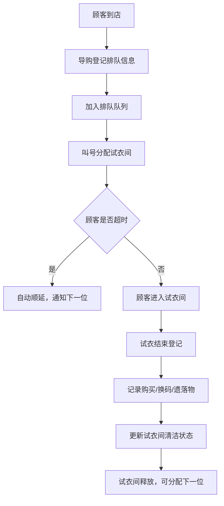

## 1. 产品概述

服装门店试衣间排队管理系统，解决周末高峰期试衣间排队混乱、叫号不清、衣物管理无序等问题，提升门店运营效率和顾客体验。

- 面向门店导购和管理人员，提供试衣间全流程数字化管理
- 核心价值：减少排队混乱、提升试衣转化率、优化试衣间利用率

## 2. 核心功能

### 2.1 用户角色

| 角色 | 登录方式 | 核心权限 |
|------|----------|----------|
| 导购 | 工号登录 | 排队登记、叫号、试衣结束登记 |
| 管理员 | 账号密码 | 试衣间档案管理、数据统计、系统设置 |

### 2.2 功能模块

1. **看板首页**：实时排队状态、可用试衣间、超时提醒、遗落物提醒、转化率统计
2. **试衣间管理**：试衣间档案（编号、楼层、镜灯、清洁状态、照片）
3. **排队管理**：顾客登记、叫号、超时自动顺延
4. **试衣记录**：购买记录、换码记录、遗落物登记、清洁状态更新
5. **数据统计**：各时段转化率、试衣间利用率、导购业绩

### 2.3 页面详情

| 页面名称 | 模块名称 | 功能描述 |
|---------|----------|----------|
| 看板首页 | 实时概览 | 当前排队列表、可用试衣间卡片、超时号码提醒、遗落物列表、转化率趋势图 |
| 看板首页 | 快捷操作 | 快速叫号、试衣结束快捷登记 |
| 试衣间管理 | 档案列表 | 试衣间列表展示、增删改查 |
| 试衣间管理 | 档案编辑 | 编号、楼层、镜灯配置、清洁状态、照片上传 |
| 排队管理 | 顾客登记 | 姓名/手机号尾号、人数、拿入件数、重点尺码、导购分配 |
| 排队管理 | 叫号系统 | 叫号、超时自动顺延、重新叫号 |
| 试衣记录 | 结束登记 | 购买件数、换码记录、遗落物、房间清洁标记 |
| 数据统计 | 转化率 | 按时段统计试衣转化率、购买率、换码率 |

## 3. 核心流程

## 4. 用户界面设计

### 4.1 设计风格

- **主色调**：深酒红色 #8B1A1A，代表服装零售的时尚与专业
- **辅助色**：香槟金 #D4AF37，用于强调和重要数据
- **中性色**：深炭灰 #1A1A1A 为背景，米白 #FAF8F5 为卡片底色
- **按钮风格**：微圆角矩形，悬停时有细腻的阴影和金色边框高亮
- **字体**：标题使用 Playfair Display 衬线字体体现高级感，正文使用 Noto Sans SC 保证可读性
- **布局风格**：卡片式布局，清晰的网格分区，适度的留白和层次感
- **图标**：使用 lucide-react 线性图标，统一描边宽度

### 4.2 页面设计概览

| 页面名称 | 模块名称 | UI元素 |
|---------|----------|--------|
| 看板首页 | 顶部状态栏 | 门店名称、当前时间、在线导购数、整体状态徽章 |
| 看板首页 | 排队区域 | 大号号码卡片、排队进度条、等待时间标签 |
| 看板首页 | 试衣间状态墙 | 网格布局试衣间卡片，颜色区分状态（绿-可用、红-使用中、黄-清洁中） |
| 看板首页 | 数据统计区 | 转化率数字卡片、趋势迷你图、时段筛选器 |
| 排队管理 | 登记表单 | 分组表单、大字号输入框、快速尺码选择器 |
| 排队管理 | 叫号面板 | 大号叫号按钮、倒计时显示、顺延操作 |

### 4.3 响应式设计

- 桌面端为主设计（1920×1080），适配门店大屏展示
- 平板端（1024×768）自适应，导购可手持操作
- 关键操作按钮尺寸不小于 48×48px，便于触控

### 4.4 交互与动画

- 叫号时有脉冲动画提醒，配合音效提示
- 试衣间状态变化有平滑过渡动画
- 排队队列更新有滑入滑出效果
- 超时号码有红色闪烁提醒
