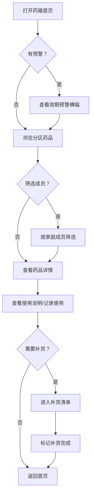

## 1. 产品概述

家庭药箱效期提醒器——一个温暖的药品管理工具，让用户像打开家里的小药箱一样管理家庭药品。解决家庭药品过期浪费、找不到药、不知道谁能用的痛点，帮助家庭成员安全用药。

## 2. 核心功能

### 2.1 用户角色

| 角色 | 说明 | 核心权限 |
|------|------|----------|
| 家庭管理员 | 默认角色 | 添加/编辑/删除药品、管理家庭成员、导出清单 |
| 家庭成员 | 被标签关联的角色 | 查看适用自己的药品、查看补货提醒 |

### 2.2 功能模块

1. **药箱首页**：分区展示药品（常用药、儿童药、外用药、慢病药、急救用品），快过期醒目标注，过期药进入待处理区
2. **药品详情页**：剩余数量、服用说明、禁忌提醒、历史使用记录
3. **添加药品页**：填写药名、用途、适用人群、数量、单位、买入日期、有效期、存放位置、注意事项，上传药盒照片
4. **补货清单页**：数量低或快过期的药品自动归入，支持手动标记已补货
5. **家庭成员筛选**：老人、小孩、自己等标签，快速筛选谁能用哪些药
6. **导出与提醒**：导出药箱清单、过期处理提醒

### 2.3 页面详情

| 页面名称 | 模块名称 | 功能描述 |
|----------|----------|----------|
| 药箱首页 | 分区展示 | 按常用药、儿童药、外用药、慢病药、急救用品五大分区卡片展示药品缩略信息 |
| 药箱首页 | 效期预警横幅 | 顶部显示快过期（30天内）和已过期药品数量，点击可跳转 |
| 药箱首页 | 待处理区 | 已过期药品独立展示区域，红色警示标识，支持一键标记处理 |
| 药箱首页 | 家庭成员筛选栏 | 顶部标签栏，点击筛选对应成员可用的药品 |
| 药品详情页 | 基本信息卡 | 药品名称、用途、药盒照片、存放位置 |
| 药品详情页 | 数量与效期 | 剩余数量（带进度条）、买入日期、有效期（倒计时天数） |
| 药品详情页 | 服用说明 | 用法用量、适用人群标签、注意事项、禁忌提醒 |
| 药品详情页 | 使用记录 | 时间线形式展示历史使用记录（日期、用量、备注） |
| 添加药品页 | 表单录入 | 药名、用途、适用人群（多选）、数量、单位、买入日期、有效期、存放位置、注意事项 |
| 添加药品页 | 照片上传 | 支持上传药盒照片，拍照或从相册选择 |
| 补货清单页 | 自动补货列表 | 数量低于阈值或快过期的药品自动归入，显示原因标签 |
| 补货清单页 | 手动操作 | 标记已补货、调整数量、移出清单 |
| 导出与提醒页 | 导出清单 | 导出当前药箱所有药品清单为文本/图片 |
| 导出与提醒页 | 过期提醒 | 显示已过期和即将过期药品列表，建议处理方式 |

## 3. 核心流程

**添加药品流程**：用户点击添加 → 填写药品信息（名称、用途、人群、数量、日期、位置、注意事项）→ 上传药盒照片 → 保存 → 自动归类到对应分区 → 效期提醒自动计算

**日常查看流程**：打开药箱首页 → 看到效期预警横幅 → 按分区浏览或按家庭成员筛选 → 点击药品查看详情 → 记录使用

**补货流程**：系统自动检测低库存/快过期 → 进入补货清单 → 用户补货后标记完成 → 数量更新

## 4. 用户界面设计

### 4.1 设计风格

- **主色调**：温暖的米白色（#FFF8F0）作为背景，搭配柔和的薄荷绿（#7EC8A0）作为主强调色，珊瑚粉（#FF8A80）作为警告/过期色
- **辅助色**：淡黄色（#FFF3CD）用于即将过期提示，浅蓝色（#D4EDFC）用于信息提示
- **按钮风格**：圆角胶囊形按钮，带柔和阴影，hover 时微微上浮
- **字体**：标题使用圆润的中文字体，正文使用清晰易读的字体
- **布局风格**：卡片式布局，分区用柔和色彩区分，药箱造型隐喻
- **图标/Emoji**：使用温暖的插画风格图标，药品分区用对应颜色小图标标识
- **整体感觉**：像打开一个温暖的木质小药箱，而非冷冰冰的库存表格

### 4.2 页面设计概览

| 页面名称 | 模块名称 | UI 元素 |
|----------|----------|----------|
| 药箱首页 | 效期预警横幅 | 渐变背景色条，红/黄警示图标，数字徽标，可点击跳转 |
| 药箱首页 | 分区卡片 | 五张圆角卡片，每张顶部带分区图标和颜色条，药品以小卡片排列 |
| 药箱首页 | 待处理区 | 底部独立区域，红色虚线边框，过期药品以警告色展示 |
| 药箱首页 | 成员筛选 | 顶部水平滚动的头像标签栏，选中态带下划线和高亮 |
| 药品详情页 | 信息卡 | 大圆角白色卡片，药盒照片左侧，信息右侧排版 |
| 药品详情页 | 数量进度条 | 水平渐变进度条，低量变红 |
| 药品详情页 | 使用时间线 | 竖向时间线，圆点+连线，每条记录含日期和备注 |
| 添加药品页 | 表单 | 分组圆角输入框，日期选择器，多选标签，照片上传区带虚线框 |
| 补货清单页 | 清单列表 | 列表项带原因标签（低量/快过期），勾选按钮，滑出操作 |

### 4.3 响应式设计

- 桌面优先设计，最大宽度 1200px 居中
- 平板：分区卡片两列排列
- 手机：分区卡片单列，成员筛选栏水平滚动

### 4.4 动效设计

- 页面加载：分区卡片依次淡入上浮
- 药品卡片：hover 微微放大并浮起阴影
- 添加药品：成功后卡片弹入对应分区
- 预警横幅：轻微呼吸动画吸引注意
- 过期药品：脉冲红色边框动画
