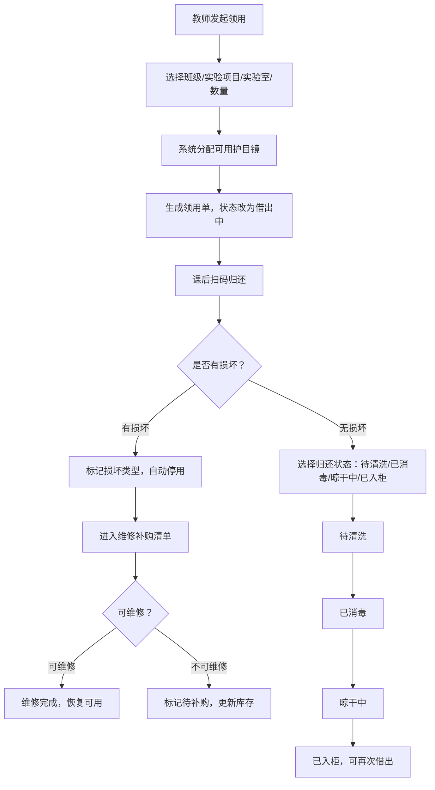
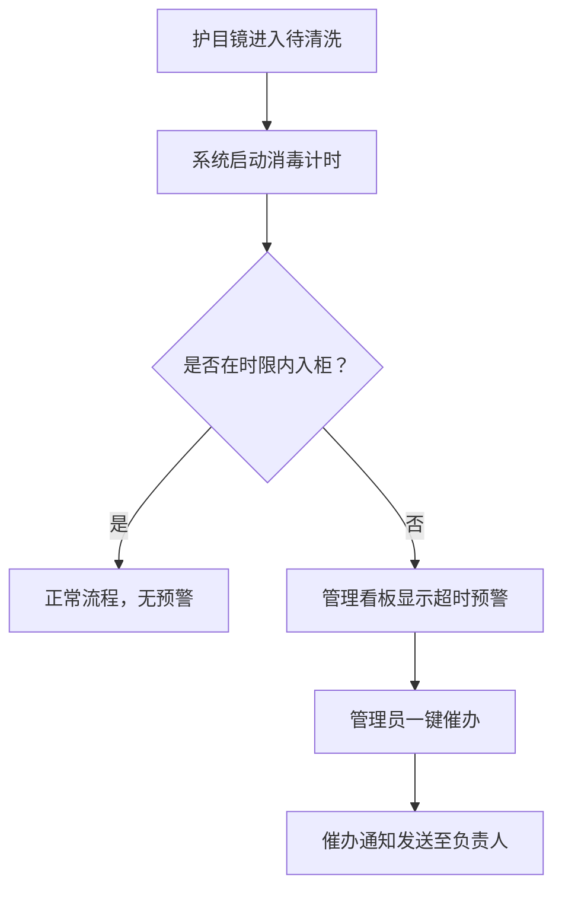

## 1. 产品概述

实验室护目镜管理系统，解决传统"一筐倒"式管理中领用无记录、归还无追踪、损坏无闭环的问题。面向学校实验室管理员和任课教师，实现护目镜从领用、归还、消毒到维修补购的全生命周期数字化管理。

- 核心目标：每副护目镜可追溯，领用归还全流程记录，损坏自动进入补购/维修闭环，管理员实时掌握各实验室库存与消毒状态
- 目标用户：实验室管理员（全局监控与配置）、任课教师（领用与归还操作）

## 2. 核心功能

### 2.1 用户角色

| 角色 | 进入方式 | 核心权限 |
|------|----------|----------|
| 实验室管理员 | 管理员账号登录 | 查看全局看板、管理护目镜台账、处理维修补购清单、配置实验室和班级信息 |
| 任课教师 | 教师账号登录 | 按班级领用护目镜、扫码归还、查看本人领用记录 |

### 2.2 功能模块

1. **管理看板**：实验室可借数量总览、班级归还效率排名、消毒超时预警、实时状态统计
2. **领用管理**：教师按班级批量领用，记录实验项目、数量、实验室、负责老师
3. **归还管理**：逐副扫码归还，状态流转（待清洗→已消毒→晾干中→已入柜），标记损坏类型
4. **护目镜台账**：护目镜完整资料（尺码、所在实验室、最近消毒时间、照片），支持增删改查
5. **维修补购清单**：损坏停用的护目镜自动归入，区分维修与补购，支持处理状态跟踪

### 2.3 页面详情

| 页面名称 | 模块名称 | 功能描述 |
|----------|----------|----------|
| 管理看板 | 实验室库存概览 | 展示每间实验室可用/借出/维修中的护目镜数量，支持卡片与列表切换 |
| 管理看板 | 归还效率监测 | 按班级统计平均归还耗时，高亮归还慢的班级，显示逾期未还记录 |
| 管理看板 | 消毒超时预警 | 列出消毒流程中超时的护目镜，显示当前状态和已等待时长，支持一键催办 |
| 管理看板 | 状态统计饼图 | 全部护目镜状态分布：已入柜、借出中、待清洗、已消毒、晾干中、维修中、已停用 |
| 领用管理 | 领用登记表单 | 选择班级、实验项目、实验室、数量，系统自动分配可用护目镜并生成领用单 |
| 领用管理 | 领用记录列表 | 查看历史领用记录，支持按教师、班级、日期、实验室筛选 |
| 归还管理 | 扫码归还面板 | 输入/扫描护目镜编号，选择归还状态（待清洗/已消毒/晾干中/已入柜），标记损坏情况 |
| 归还管理 | 损坏标记弹窗 | 选择损坏类型（镜片花、松紧带断、鼻托脱落、其他），拍照上传，自动停用并进入补购/维修清单 |
| 护目镜台账 | 护目镜列表 | 展示全部护目镜编号、尺码、所在实验室、当前状态、最近消毒时间、缩略照片 |
| 护目镜台账 | 护目镜详情 | 完整资料查看与编辑：编号、尺码、购入日期、所在实验室、状态流转记录、消毒记录、照片 |
| 护目镜台账 | 新增护目镜 | 录入新护目镜信息：编号、尺码、分配实验室、上传照片 |
| 维修补购清单 | 待处理列表 | 区分"待维修"和"待补购"两类，显示损坏类型、损坏日期、所属实验室 |
| 维修补购清单 | 处理操作 | 标记为已维修（恢复可用）或已补购（更新库存），记录处理时间和备注 |

## 3. 核心流程

**领用-归还-消毒闭环流程**：教师上课前选择班级和实验项目领用护目镜 → 系统分配可用护目镜并生成领用单 → 课后教师逐副扫码归还 → 若有损坏则标记损坏类型并自动停用 → 归还后护目镜进入待清洗状态 → 清洗后标记已消毒 → 晾干后标记晾干中 → 最终入柜标记已入柜 → 管理员可随时查看消毒是否超时。

**消毒超时预警流程**：护目镜归还后进入待清洗状态 → 系统开始计时 → 若超过预设消毒时限（默认24小时）仍未入柜 → 管理看板高亮预警 → 管理员可一键催办负责人员。

## 4. 用户界面设计

### 4.1 设计风格

- **主色调**：深青色(#0F766E)搭配琥珀色(#D97706)强调色，传达实验室专业感与警示感
- **辅助色**：石板灰(#475569)用于次要信息，翡翠绿(#10B981)表示正常/可用，玫红(#E11D48)表示预警/损坏
- **按钮风格**：圆角矩形（8px），主按钮填充色+白色文字，次按钮描边+文字色
- **字体**：标题使用 Noto Sans SC Bold，正文使用 Noto Sans SC Regular
- **布局风格**：左侧固定导航栏 + 右侧内容区，卡片式布局，数据面板使用网格排列
- **图标风格**：线性图标（Stroke 1.5px），统一24px尺寸
- **氛围**：工业精密感，深色侧边栏+浅灰内容区，数据用色彩区分，预警信息用暖色高亮

### 4.2 页面设计概览

| 页面名称 | 模块名称 | UI要素 |
|----------|----------|--------|
| 管理看板 | 实验室库存概览 | 顶部四色统计卡片（可用/借出/维修/停用数量），下方实验室网格卡片，每张卡片显示实验室名+状态进度条 |
| 管理看板 | 归还效率监测 | 横向柱状图按班级排列，颜色从绿到红渐变，逾期记录单独列表显示 |
| 管理看板 | 消毒超时预警 | 带脉冲动画的预警卡片列表，红色时间标签，一键催办按钮 |
| 管理看板 | 状态统计饼图 | 环形饼图居中，中心显示总数，各扇区可点击跳转筛选 |
| 领用管理 | 领用登记表单 | 居中卡片式表单，下拉选择班级/实验项目/实验室，数字输入框选数量，底部确认按钮 |
| 领用管理 | 领用记录列表 | 表格布局，支持筛选器行，行内显示班级标签和状态徽章 |
| 归还管理 | 扫码归还面板 | 大号搜索/输入框居顶，下方为已扫码护目镜卡片堆叠，每张卡片含状态选择下拉 |
| 归还管理 | 损坏标记弹窗 | 模态弹窗，损坏类型图标网格选择，拍照上传区域，备注文本框 |
| 护目镜台账 | 护目镜列表 | 表格+缩略图列，状态列使用彩色徽章，支持多条件筛选侧栏 |
| 护目镜台账 | 护目镜详情 | 左侧大图+基本信息卡，右侧状态时间线，底部操作按钮组 |
| 护目镜台账 | 新增护目镜 | 滑出式侧栏面板，表单分组，图片上传拖拽区 |
| 维修补购清单 | 待处理列表 | 双栏Tab切换（待维修/待补购），每行显示损坏类型图标+护目镜编号+所属实验室+等待天数 |
| 维修补购清单 | 处理操作 | 行内操作按钮，点击弹出确认弹窗，支持添加处理备注 |

### 4.3 响应式设计

- 桌面端优先（1440px+），侧边栏固定展开
- 平板端（768px-1439px），侧边栏可折叠为图标模式，卡片网格从4列调整为2列
- 移动端（<768px），侧边栏收起为底部Tab导航，表格改为卡片列表

### 4.4 3D 场景指引

不适用，本项目无3D场景需求。
