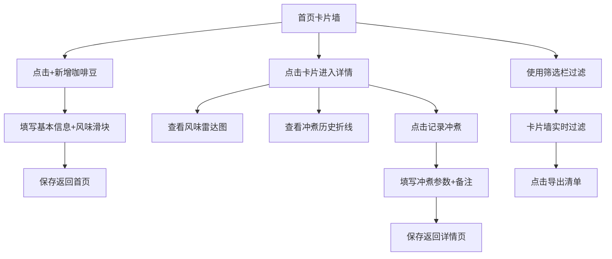

## 1. 产品概述

咖啡豆风味档案——一个精致的个人咖啡收藏柜应用，帮助咖啡爱好者系统化管理每一包咖啡豆的信息、追踪风味感受、记录每次冲煮，并通过数据可视化找到最接近自己理想口味的冲煮方案。
- 目标用户：精品咖啡爱好者、家庭冲煮玩家
- 核心价值：将零散的咖啡体验数据化，从"凭感觉喝"进化为"有据可查的品鉴"

## 2. 核心功能

### 2.1 用户角色
| 角色 | 注册方式 | 核心权限 |
|------|----------|----------|
| 单用户 | 无需注册 | 所有功能（本地应用） |

### 2.2 功能模块
1. **首页**：咖啡豆卡片墙、筛选栏、库存提醒、快速新增入口
2. **新增/编辑咖啡豆页**：基本信息表单 + 风味滑块
3. **咖啡豆详情页**：基本信息、风味雷达图、冲煮记录列表、冲煮历史折线图
4. **新增冲煮记录页**：冲煮参数表单 + 品鉴备注

### 2.3 页面详情
| 页面名称 | 模块名称 | 功能描述 |
|----------|----------|----------|
| 首页 | 咖啡豆卡片墙 | 以咖啡袋造型卡片展示所有豆子，卡片颜色根据烘焙度从浅到深渐变（浅焙→奶咖色，中焙→棕色，深焙→深褐/近黑），展示产地、烘焙度、剩余量 |
| 首页 | 筛选栏 | 按产地、烘焙度、处理法筛选，支持组合筛选 |
| 首页 | 提醒区 | 库存不足（剩余<50g）或开封超过30天的豆子醒目提醒 |
| 首页 | 导出按钮 | 一键导出咖啡豆清单为 JSON/CSV 文件 |
| 新增/编辑咖啡豆 | 基本信息表单 | 产地、烘焙度（浅焙/中浅/中焙/中深/深焙）、处理法（水洗/日晒/蜜处理/厌氧/其他）、购买日期、开封日期、价格、克数 |
| 新增/编辑咖啡豆 | 风味滑块 | 酸度、甜度、苦度、醇厚度、香气五个维度，0-10滑块 |
| 咖啡豆详情 | 风味雷达图 | 五维风味可视化，直观展示酸/甜/苦/醇厚/香气 |
| 咖啡豆详情 | 冲煮历史折线图 | 每次冲煮的综合评分趋势，标记"最接近理想口味"的一次 |
| 咖啡豆详情 | 冲煮记录列表 | 展示所有冲煮记录，可点击查看详情 |
| 新增冲煮记录 | 冲煮参数表单 | 水粉比、水温、研磨粗细（细/中细/中/中粗/粗）、萃取时间、器具（手冲/V60/Chemex/法压壶/虹吸壶/爱乐压/意式/摩卡壶/其他）、个人评分（1-5星） |
| 新增冲煮记录 | 品鉴备注 | 自由文本记录本次冲煮的风味感受 |

## 3. 核心流程

**新增咖啡豆流程**：用户点击首页"+"按钮 → 进入新增页面 → 填写基本信息 → 拖动风味滑块 → 保存 → 返回首页，新卡片出现在卡片墙

**冲煮记录流程**：用户点击某张咖啡豆卡片 → 进入详情页 → 点击"记录冲煮" → 填写冲煮参数和备注 → 保存 → 雷达图和折线图更新

**筛选导出流程**：用户在首页使用筛选栏组合条件 → 卡片墙实时过滤 → 点击导出按钮 → 下载筛选后的清单

## 4. 用户界面设计

### 4.1 设计风格
- **主色调**：暖棕色系（#6F4E37 咖啡棕为主色，#D4A574 奶咖色为辅助色，#F5E6D3 豆奶白为背景色）
- **按钮风格**：圆角柔和，带有微妙的阴影，hover 时有轻微上浮效果
- **字体**：Playfair Display（标题展示字体）+ DM Sans（正文UI字体）
- **布局风格**：卡片网格布局，顶部导航栏，响应式2-4列卡片
- **图标风格**：lucide-react 线性图标，统一风格
- **整体氛围**：像走进一家温暖的精品咖啡馆，木质纹理感、暖光、纸张质感

### 4.2 页面设计概览
| 页面名称 | 模块名称 | UI 元素 |
|----------|----------|---------|
| 首页 | 导航栏 | 咖啡品牌Logo + 筛选按钮组 + 导出按钮 + 新增按钮 |
| 首页 | 提醒横幅 | 琥珀色/红色渐变背景横幅，带图标提示低库存或开封过久 |
| 首页 | 卡片墙 | 网格布局，每张卡片模拟咖啡袋造型，顶部色带随烘焙度变化，左下角产地标签，右下角剩余量指示 |
| 新增/编辑咖啡豆 | 表单区 | 分组卡片式表单，基本信息组 + 风味维度组，滑块带实时数值显示 |
| 咖啡豆详情 | 头部信息卡 | 烘焙度色带 + 产地大字 + 基本参数标签 |
| 咖啡豆详情 | 雷达图区 | 五角雷达图，咖啡色半透明填充 |
| 咖啡豆详情 | 折线图区 | 冲煮评分趋势线，高亮最佳冲煮点 |
| 咖啡豆详情 | 冲煮记录列表 | 时间轴式列表，每条显示器具+评分+简要备注 |
| 新增冲煮记录 | 表单区 | 紧凑表单，数字输入+选择器+评分星星+备注文本框 |

### 4.3 响应式设计
- 桌面端优先，卡片墙 3-4 列
- 平板端 2 列
- 移动端单列，卡片全宽

### 4.4 3D 场景指导
- 不适用
