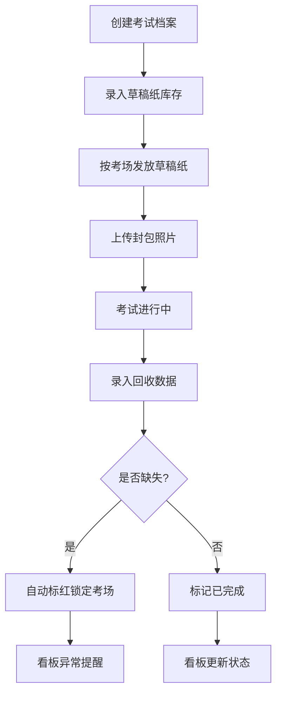

## 1. 产品概述

考试草稿纸发放回收系统，用于管理考试过程中草稿纸从库存到发放再到回收的全生命周期追踪。解决人工点数效率低、缺失难追溯、考场记录不闭环的问题，确保每一张草稿纸都有据可查。

- 目标用户：考场管理人员、监考老师、教务处
- 核心价值：零误差追踪、缺失自动预警、全流程数字化闭环

## 2. 核心功能

### 2.1 用户角色

| 角色 | 进入方式 | 核心权限 |
|------|----------|----------|
| 考务管理员 | 账号登录 | 管理考试档案、库存、看板、全部记录 |
| 监考老师 | 考场码进入 | 领取草稿纸、录入回收数据 |

### 2.2 功能模块

1. **看板页面**：全局状态总览，待发放/待回收/异常/用量/剩余库存
2. **考试档案页面**：管理考试基本信息（科目、年级、考场、监考老师、考生人数、时间）
3. **库存管理页面**：草稿纸批次入库、批次详情（批次号、页数、编号段、封包人）
4. **发放记录页面**：按考场发放，记录考场、张数、领取老师、封包照片
5. **回收录入页面**：按考场回收，录入已用、空白、缺失、异常说明，缺失自动标红锁定

### 2.3 页面详情

| 页面名称 | 模块名称 | 功能描述 |
|----------|----------|----------|
| 看板页面 | 状态统计卡片 | 显示待发放考场数、待回收考场数、数量异常考场数 |
| 看板页面 | 各考场用量图表 | 以柱状图展示各考场发放与回收对比 |
| 看板页面 | 剩余库存概览 | 按批次显示剩余张数与占比 |
| 看板页面 | 异常考场列表 | 缺失考场标红展示，点击进入详情 |
| 考试档案页面 | 档案列表 | 按时间排序展示所有考试档案，支持筛选 |
| 考试档案页面 | 新建档案表单 | 录入科目、年级、考场、监考老师、考生人数、考试时间 |
| 库存管理页面 | 批次列表 | 展示所有入库批次，含批次号、页数、编号段、封包人、入库时间 |
| 库存管理页面 | 新增入库 | 录入批次号、页数、起始编号、结束编号、封包人 |
| 发放记录页面 | 发放列表 | 展示各考场发放记录，含考场、张数、领取老师、封包照片、发放时间 |
| 发放记录页面 | 新增发放 | 选择考场和批次，录入张数、领取老师，上传封包照片 |
| 回收录入页面 | 回收列表 | 展示各考场回收状态，缺失记录标红，已锁定考场带锁标识 |
| 回收录入页面 | 录入回收 | 录入已用张数、空白张数、缺失张数、异常说明，缺失时自动触发标红锁定 |

## 3. 核心流程

用户创建考试档案 → 管理员录入草稿纸库存批次 → 监考老师按考场领取草稿纸并拍照 → 考试结束监考老师录入回收数据 → 系统自动比对发放与回收数量 → 缺失自动标红并锁定考场记录 → 管理员在看板查看全局状态

## 4. 用户界面设计

### 4.1 设计风格

- 主色调：深靛蓝 (#1e3a5f) + 琥珀警示色 (#e67e22)，传达严肃考务感与警示性
- 辅助色：翡翠绿 (#27ae60) 表示正常、赤红 (#e74c3c) 表示异常/缺失
- 按钮风格：微圆角（4px），扁平化设计，主要操作实心填充
- 字体：思源黑体 (Noto Sans SC) 作为界面字体，等宽字体用于编号段显示
- 布局：左侧固定导航栏 + 右侧内容区，卡片式布局
- 图标：线性图标风格，搭配色彩状态指示

### 4.2 页面设计概览

| 页面名称 | 模块名称 | UI要素 |
|----------|----------|--------|
| 看板页面 | 状态统计卡片 | 四宫格卡片，数字大字+标签，异常卡片红色边框脉冲动画 |
| 看板页面 | 考场用量图表 | 柱状图，发放蓝色/回收绿色双柱对比 |
| 看板页面 | 剩余库存 | 水平进度条，按批次堆叠展示 |
| 看板页面 | 异常列表 | 红色背景行，锁图标，点击展开详情 |
| 考试档案页面 | 档案卡片 | 白色卡片，顶部色条标识状态，表单弹窗新建 |
| 库存管理页面 | 批次表格 | 条纹表格，编号段等宽字体，入库弹窗 |
| 发放记录页面 | 发放卡片 | 左侧考场编号+右侧数据，照片缩略图 |
| 回收录入页面 | 回收表单 | 数字输入框组，缺失输入时红色高亮，锁定状态遮罩 |

### 4.3 响应式设计

- 桌面优先设计，最小宽度 1024px
- 看板页面在大屏下四列卡片，中屏两列
- 表格在窄屏下支持水平滚动

### 4.4 动效设计

- 看板数字加载时从0递增动画
- 异常卡片红色边框呼吸脉冲动画
- 发放/回收成功后卡片滑入列表
- 锁定考场时锁图标掉落动画
