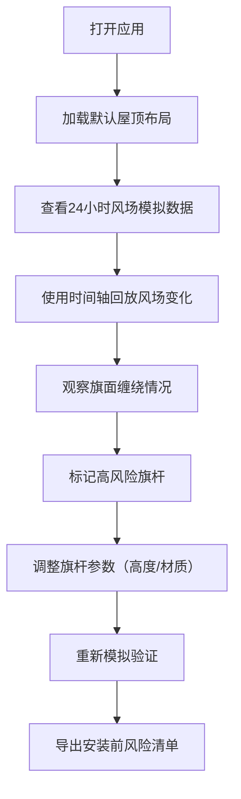

## 1. 产品概述
风速采样旗阵可视化平台，帮助设计师在城市屋顶装置艺术安装前，通过模拟一天内的风场变化，评估旗面缠绕风险，优化旗杆布局和材质选择。

- 主要用途：屋顶旗阵风场模拟与风险评估
- 目标用户：装置艺术设计师、景观建筑师、城市规划师
- 产品价值：降低安装后旗面缠绕风险，优化设计方案，减少后期维护成本

## 2. 核心 Features

### 2.1 用户角色

| 角色 | 注册方式 | 核心权限 |
|------|----------|----------|
| 设计师 | 无需注册，本地使用 | 完整功能：查看、回放、标记、导出 |

### 2.2 Feature 模块

1. **主画布页面**：屋顶平面可视化、旗杆/传感器点位绘制、实时风场动画
2. **数据控制面板**：风向/风速/阵风/噪声/缠绕度实时数据展示
3. **时间轴控制面板**：24小时风场回放、速度控制、时间点跳转
4. **风险标记模块**：高风险旗杆标记（降低高度/更换材质）、风险等级评定
5. **导出模块**：安装前风险清单导出（CSV/JSON格式）

### 2.3 页面详情

| 页面名称 | 模块名称 | Feature 描述 |
|-----------|----------|-------------|
| 主页面 | 屋顶平面画布 | SVG绘制屋顶轮廓、可交互旗杆点位、传感器位置、风场流向动画 |
| 主页面 | 实时数据面板 | 显示当前小时的风向角度、平均风速、阵风峰值、缠绕指数、噪声分贝 |
| 主页面 | 时间轴控制 | 24小时时间轴拖拽、播放/暂停、倍速播放（0.5x/1x/2x/4x） |
| 主页面 | 旗杆详情面板 | 点击旗杆显示该位置的24小时风场统计、缠绕风险分析 |
| 主页面 | 风险标记工具 | 右键标记旗杆为"需降低高度"或"需更换材质"，添加备注 |
| 主页面 | 导出功能 | 导出门店风场报告、风险清单、旗杆配置方案 |

## 3. 核心流程



设计师打开应用后，首先看到预设的屋顶平面和旗杆布局。通过时间轴控制可以逐小时回放一天内的风场变化，观察不同时段的风向、阵风对旗面的影响。系统根据风速、风向变化频率自动计算旗面缠绕风险指数，设计师可以手动标记需要调整的旗杆，最后导出完整的风险评估报告和优化方案。

## 4. 设计风格

### 4.1 美学方向
采用**科技工业风**设计语言，深色主题搭配霓虹高亮色，营造工程数据分析的专业氛围。

- **主色调**：深靛蓝 #0f172a（背景）、石板灰 #334155（次级面板）
- **强调色**：青色 #06b6d4（正常状态）、琥珀橙 #f59e0b（警告）、珊瑚红 #ef4444（高风险）、酸绿 #22c55e（安全）
- **字体**：Display 字体使用 JetBrains Mono（等宽、技术感），正文字体使用 Noto Sans SC（清晰可读）
- **视觉细节**：细边框、网格背景、扫光动效、数据发光效果、等距投影风格的屋顶平面图

### 4.2 交互设计
- 画布支持缩放、拖拽平移
- 鼠标悬停旗杆显示浮动数据卡片
- 时间轴拖拽时有实时预览
- 风险标记有脉冲动画提示
- 风场粒子流动动画

### 4.3 页面布局
```
┌─────────────────────────────────────────────────────────────┐
│  顶部导航栏  │  项目标题  │  状态指示器  │  导出按钮        │
├──────────────┴─────────────┴──────────────┴──────────────────┤
│                                                             │
│  ┌──────────────────────────────┬─────────────────────────┐ │
│  │                              │  实时数据面板           │ │
│  │                              │  ┌───────────────────┐  │ │
│  │       屋顶平面画布           │  │  风向: 180°       │  │ │
│  │   (SVG 风场可视化)           │  │  风速: 12.5 m/s   │  │ │
│  │                              │  │  阵风: 18.3 m/s   │  │ │
│  │                              │  │  缠绕: 中等       │  │ │
│  │                              │  │  噪声: 62 dB      │  │ │
│  │                              │  └───────────────────┘  │ │
│  │                              │                         │ │
│  │                              │  旗杆详情面板          │ │
│  │                              │  (选中时显示)          │ │
│  └──────────────────────────────┴─────────────────────────┘ │
│                                                             │
│  ┌────────────────────────────────────────────────────────┐ │
│  │  时间轴控制栏  ◀◀  ▶  ▶▶  0.5x  1x  2x  4x  14:00     │ │
│  │  [00:00][06:00][12:00][18:00][24:00]  ■风险标记图例    │ │
│  └────────────────────────────────────────────────────────┘ │
└─────────────────────────────────────────────────────────────┘
```

### 4.4 响应式
- 桌面端（>1280px）：三栏布局，画布居中，侧边数据面板
- 平板端（768-1280px）：画布自适应，数据面板改为底部抽屉
- 移动端（<768px）：单列布局，简化控制，优先保证画布可见性

### 4.5 2D 可视化指导
- **屋顶平面**：等距投影风格，使用细线条勾勒建筑轮廓，半透明填充
- **旗杆**：圆形点位，不同颜色代表不同风险等级，带发光效果
- **风场动画**：粒子流线从高气压区域流向低气压区域，根据风速调整粒子速度和密度
- **旗面状态**：旗杆旁的小旗形图标，根据风向角度旋转，根据缠绕程度改变透明度和颜色
- **传感器**：三角形图标，带脉冲波纹动画表示正在采样
