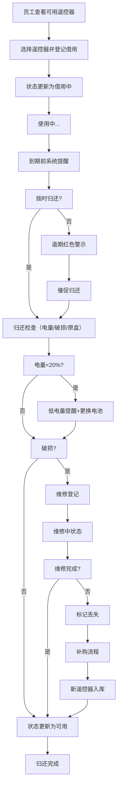

## 1. 产品概述

共享投影遥控器借还管理系统，解决会议室投影遥控器经常被拿到别的楼层、开会时找不到遥控器的痛点。系统实现遥控器全生命周期管理，包括档案管理、借还登记、状态监控、逾期提醒和统计分析，提升会议室设备管理效率。

## 2. 核心功能

### 2.1 用户角色
| 角色 | 注册方式 | 核心权限 |
|------|----------|----------|
| 管理员 | 系统配置 | 遥控器档案管理、查看所有记录、统计报表、补购流程审批 |
| 普通员工 | 无需注册 | 借用/归还遥控器、查看个人借用记录、接收提醒 |

### 2.2 功能模块
1. **首页仪表盘**：概览统计、逾期/低电量提醒、快捷借还入口
2. **遥控器档案管理**：遥控器列表、新增/编辑/删除、状态管理
3. **借还管理**：借用登记、归还检查、借用记录查询
4. **统计报表**：借用次数统计、逾期部门排行、换电池频率、可用状态
5. **补购管理**：丢失登记、补购流程、采购记录

### 2.3 页面详情
| 页面名称 | 模块名称 | 功能描述 |
|---------|---------|---------|
| 首页仪表盘 | 数据概览 | 显示总遥控器数、可用数、借用中数、需补购数 |
| 首页仪表盘 | 提醒区域 | 逾期未还红色警示、低电量橙色提醒卡片列表 |
| 首页仪表盘 | 快捷操作 | 一键借用、一键归还、快速搜索遥控器 |
| 档案管理 | 遥控器列表 | 卡片式展示，含照片、编号、状态、适配会议室 |
| 档案管理 | 新增/编辑 | 录入编号、适配会议室、电池型号、存放点、上传照片 |
| 档案管理 | 状态管理 | 可用/借用中/维修中/丢失状态切换 |
| 借还管理 | 借用登记 | 选择遥控器、填写使用人、部门、会议室、预计归还时间、用途 |
| 借还管理 | 归还检查 | 电池电量滑块、外壳破损勾选、是否放回原盒勾选 |
| 借还管理 | 借用记录 | 表格展示所有借还记录，支持筛选搜索 |
| 统计报表 | 借用统计 | 柱状图展示各会议室月度借用次数 |
| 统计报表 | 逾期统计 | 饼图展示各部门逾期占比，表格展示逾期明细 |
| 统计报表 | 电池统计 | 折线图展示换电池频率趋势 |
| 统计报表 | 可用状态 | 仪表盘展示当前可用遥控器比例 |
| 补购管理 | 丢失登记 | 标记丢失、填写丢失说明、责任人 |
| 补购管理 | 补购流程 | 申请、审批、采购、入库全流程 |

## 3. 核心流程

### 3.1 借用流程
员工打开系统 → 查看可用遥控器 → 选择遥控器 → 填写借用信息（使用人、部门、会议室、用途、预计归还时间）→ 提交 → 系统记录并更新遥控器状态为"借用中"

### 3.2 归还流程
员工进入归还页面 → 选择借用的遥控器 → 检查电池电量（滑动选择百分比）→ 检查外壳是否破损 → 确认是否放回原盒 → 提交 → 系统更新状态 → 如低电量或破损触发提醒

### 3.3 丢失补购流程
发现遥控器丢失 → 管理员标记为"丢失"状态 → 填写丢失报告 → 启动补购申请 → 审批通过 → 采购登记 → 新遥控器入库建档

### 3.4 流程图

## 4. 用户界面设计

### 4.1 设计风格
- **主色调**：深蓝色 `#1e3a5f`（专业、稳重），搭配亮橙色 `#ff6b35`（提醒、警示）
- **辅助色**：成功绿 `#10b981`、警告黄 `#f59e0b`、危险红 `#ef4444`
- **背景**：浅灰渐变 `#f8fafc` 到 `#f1f5f9`，卡片使用白色带微阴影
- **按钮风格**：圆角8px，主按钮深蓝色填充，悬停有微妙上浮效果
- **字体**：标题使用 "Noto Sans SC" 粗体，正文使用 "PingFang SC" 常规
- **布局风格**：左侧导航 + 右侧内容区，卡片式布局，信息层级分明
- **图标风格**：线性图标，统一24px尺寸，颜色与文字一致

### 4.2 页面设计概述
| 页面名称 | 模块名称 | UI元素 |
|---------|---------|---------|
| 首页仪表盘 | 概览卡片 | 4个统计卡片横向排列，数字大号显示，背景带渐变色块装饰 |
| 首页仪表盘 | 提醒区域 | 逾期卡片红色边框+图标，低电量橙色边框，支持展开详情 |
| 首页仪表盘 | 快捷入口 | 3个大按钮卡片，图标+文字，点击有缩放动效 |
| 档案管理 | 列表页 | 网格布局卡片，每个卡片含遥控器照片、编号标签、状态徽章 |
| 档案管理 | 表单页 | 双栏布局，左侧表单字段，右侧照片预览区 |
| 借还管理 | 借用表单 | 分步引导，步骤指示器，自动带出默认会议室 |
| 借还管理 | 归还检查 | 滑块组件选择电量，复选框带描述，提交按钮带确认弹窗 |
| 统计报表 | 图表区 | 带渐变填充的柱状图/饼图，支持hover显示详情 |
| 统计报表 | 数据表格 | 斑马纹，行hover高亮，支持排序 |

### 4.3 响应式
- 桌面端优先设计，适配1440px及以上
- 平板端：侧边栏可收起，卡片网格调整为2列
- 移动端：底部Tab导航，卡片单列，简化表单字段

### 4.4 动效设计
- 页面加载：元素从下往上渐入，错开50ms延迟
- 卡片hover：轻微上浮(translateY(-4px))，阴影加深
- 按钮点击：scale(0.98)缩放反馈
- 状态切换：颜色过渡动画300ms
- 提醒通知：从右侧滑入，带弹跳效果
