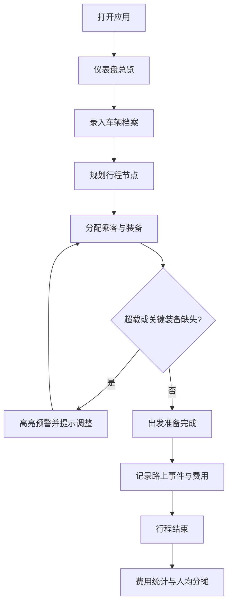

## 1. 产品概述
车队自驾露营计划管理系统，解决多车出行时的信息沟通难题。
- 核心目标：统一管理车辆信息、行程安排、人员装备分配、路上记录及费用分摊，让车队出行更高效、更有条理
- 目标用户：自驾露营爱好者、组织车队出游的领队和参与者

## 2. 核心功能

### 2.1 用户角色
| 角色 | 描述 | 核心权限 |
|------|------|----------|
| 领队 | 车队组织者 | 创建行程、编辑车辆、分配人员装备、记录路上事件 |
| 成员 | 车队参与者 | 查看行程、车辆分配、费用详情 |

### 2.2 功能模块
1. **仪表盘总览**：行程概览、车辆状态、预警提示
2. **车辆档案管理**：车辆信息的增删改查
3. **行程规划**：集合点、补给点、加油点、营地及时间安排
4. **人员与装备分配**：乘客分配、装备分配、超载/缺装备预警
5. **路上记录**：掉队记录、临时改线、费用记录
6. **费用结算**：按车辆统计、人均分摊、费用明细

### 2.3 页面详情
| 页面名称 | 模块名称 | 功能描述 |
|----------|----------|----------|
| 仪表盘 | 总览卡片 | 显示车队车辆数、总人数、行程进度、预警信息 |
| 仪表盘 | 快速操作 | 快速添加车辆、添加行程点、记录费用 |
| 车辆档案 | 车辆列表 | 卡片式展示所有车辆，显示司机、座位、油耗等关键信息 |
| 车辆档案 | 车辆详情/编辑 | 编辑司机姓名、总座位、已用座位、后备箱空间、百公里油耗、对讲频道、车辆照片 |
| 行程规划 | 时间轴行程 | 按时间顺序展示集合点、补给点、加油点、营地，支持拖拽排序 |
| 行程规划 | 地点编辑 | 编辑地点名称、类型、地址、预计到达/出发时间、备注 |
| 人员分配 | 乘客分配 | 将人员拖拽分配到各车辆，实时显示座位占用情况，超载高亮提示 |
| 人员分配 | 装备分配 | 将露营装备分配到各车辆，显示后备箱占用，关键装备缺失预警 |
| 路上记录 | 事件时间线 | 记录掉队、临时改线等事件，含时间、车辆、描述 |
| 路上记录 | 费用记录 | 记录加油费、高速费、停车费等，关联车辆和支付人 |
| 费用结算 | 车辆费用统计 | 按车辆展示油费、高速费、停车费合计 |
| 费用结算 | 人均分摊明细 | 计算每人应承担费用、已支付金额、差额（应收/应付） |

## 3. 核心流程

用户打开应用 → 查看仪表盘总览 → 录入车辆档案 → 规划行程节点 → 分配乘客与装备 → 系统检查超载/装备缺失 → 出行中记录事件与费用 → 行程结束后自动统计费用并分摊

## 4. 用户界面设计

### 4.1 设计风格
- **主色调**：森林绿 (#2D5A27) 作为主色，搭配暖橙 (#E67E22) 作为强调色，体现户外露营自然氛围
- **辅助色**：米色背景 (#F5F0E6)、深灰文字 (#2C3E50)、警告红 (#E74C3C)
- **按钮风格**：圆角 8px，主按钮实心绿，次要按钮描边绿，警告按钮橙色
- **字体**：标题使用 "Noto Serif SC" 衬线字体，正文使用 "Noto Sans SC" 无衬线字体，营造户外冒险杂志质感
- **布局风格**：卡片式布局，顶部横向导航，左侧二级菜单，柔和阴影，微妙纸质纹理背景
- **图标风格**：线性图标搭配户外元素（帐篷、汽车、篝火、指南针）

### 4.2 页面设计概览
| 页面名称 | 模块名称 | UI 元素 |
|----------|----------|---------|
| 仪表盘 | 总览卡片 | 4 张彩色统计卡片，渐变背景，大数字展示，悬停微动效 |
| 仪表盘 | 预警区域 | 红/橙底警示卡片，图标 + 文字，点击跳转修复 |
| 车辆档案 | 车辆卡片 | 圆角卡片，车辆照片居上，信息网格布局，编辑/删除悬浮按钮 |
| 行程规划 | 时间轴 | 垂直时间轴，不同颜色区分地点类型（集合-绿、补给-蓝、加油-橙、营地-深绿） |
| 人员分配 | 车辆面板 | 车辆卡片 + 座位可视化，拖拽人员标签放入车辆 |
| 费用结算 | 统计图表 | 横向条形图展示各车辆费用，明细表格展示人均分摊 |

### 4.3 响应式
- 桌面端优先（1280px+），左侧导航展开
- 平板端（768-1279px），导航折叠为图标栏
- 移动端（<768px），顶部汉堡菜单，卡片单列布局，表格可横向滚动

### 4.4 动效与交互
- 页面加载时卡片依次淡入上移（stagger animation）
- 拖拽分配时目标区域高亮脉冲效果
- 预警提示轻微抖动动画吸引注意
- 费用数字滚动递增动画
- 卡片悬停时轻微上浮 + 阴影加深
