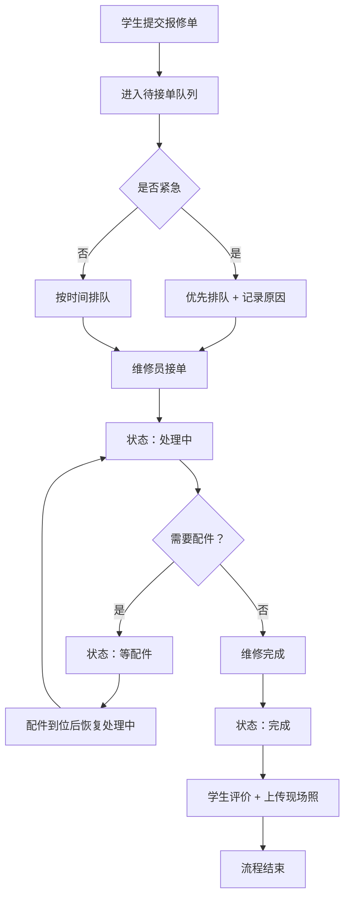

## 1. 产品概述

宿舍报修管理系统，解决学生报修后信息不透明、维修流程混乱的问题。支持学生提交报修单、维修员工单流转、管理员数据统计全流程管理。

- 目标用户：学生（报修人）、维修员、管理员
- 核心价值：报修透明化、流程标准化、数据可视化

## 2. 核心功能

### 2.1 用户角色

| 角色 | 登录方式 | 核心权限 |
|------|----------|----------|
| 学生 | 角色切换入口 | 提交报修单、查看排队位置、确认完成、评价 |
| 维修员 | 角色切换入口 | 接单、更新状态、留言、标记完成 |
| 管理员 | 角色切换入口 | 查看统计看板、紧急插队、全局管理 |

### 2.2 功能模块

1. **学生端首页**：报修单列表、新建报修、查看工单进度
2. **报修提交页**：宿舍楼、房间号、故障类型、照片、紧急程度、可上门时间
3. **工单详情页（学生）**：排队位置、预计上门、维修员留言、评价补录
4. **维修员工作台**：待接单、处理中、等配件、完成四个状态看板
5. **工单详情页（维修员）**：状态流转、留言、紧急插队
6. **管理看板**：平均处理时长、故障类型分布、问题楼栋统计

### 2.3 页面详情

| 页面名称 | 模块名称 | 功能描述 |
|----------|----------|----------|
| 学生端首页 | 工单列表 | 按状态展示当前学生的报修单，点击进入详情 |
| 学生端首页 | 新建报修按钮 | 唤起报修提交表单 |
| 报修提交页 | 基础信息 | 宿舍楼选择、房间号输入 |
| 报修提交页 | 故障信息 | 故障类型下拉、故障描述、照片上传 |
| 报修提交页 | 调度信息 | 紧急程度（普通/紧急）、可上门时间段选择 |
| 工单详情页（学生） | 进度追踪 | 排队位置、当前状态、预计上门时间时间线 |
| 工单详情页（学生） | 留言区 | 查看维修员留言、学生回复 |
| 工单详情页（学生） | 评价模块 | 评分、文字评价、补传现场照片 |
| 维修员工作台 | 状态看板 | 待接单/处理中/等配件/完成 四列拖拽看板 |
| 维修员工作台 | 工单卡片 | 展示楼栋房间、故障类型、紧急程度标签 |
| 工单详情页（维修员） | 状态流转 | 下拉选择下一个状态，自动记录时间 |
| 工单详情页（维修员） | 紧急插队 | 提升优先级，必须填写插队原因 |
| 工单详情页（维修员） | 留言 | 向学生发送消息 |
| 管理看板 | 统计卡片 | 平均处理时长、在处理工单数、今日完成数 |
| 管理看板 | 故障类型分布 | 饼图/柱状图展示各类型占比 |
| 管理看板 | 楼栋问题排行 | 柱状图展示报修最多的宿舍楼 |
| 管理看板 | 工单列表 | 全局工单搜索与筛选 |

## 3. 核心流程

学生提交报修单后进入排队队列，维修员接单后依次流转状态至完成，学生评价后流程结束。紧急故障可由维修员或管理员插队优先处理。

## 4. 用户界面设计

### 4.1 设计风格

- 主色：深青色 `#0D7377`（专业可信），辅助色：暖橙 `#FF6B35`（紧急警示）
- 中性色：米白背景 `#F7F3E9`，深灰文字 `#2D2D2D`
- 按钮风格：圆角 12px，紧急按钮为橙色渐变，普通按钮为深青色
- 字体：标题用 Playfair Display（衬线，学院气质），正文用 Manrope（现代无衬线）
- 布局风格：卡片式布局 + 顶部导航栏，维修员端采用看板布局
- 图标：Lucide 线性图标，紧急程度用不同颜色的警示图标区分

### 4.2 页面设计概览

| 页面名称 | 模块名称 | UI 元素 |
|----------|----------|---------|
| 学生端首页 | 工单列表 | 卡片堆叠，状态标签彩色，悬停上浮动画 |
| 报修提交页 | 表单 | 分区分组，必填项红星标记，照片拖拽区 |
| 工单详情页 | 时间线 | 左侧竖线时间线，节点圆圈动画 |
| 维修员工作台 | 看板列 | 四列等宽，卡片拖拽阴影，列头计数徽章 |
| 管理看板 | 统计图表 | 圆角卡片，数据渐变填充，数字滚动动画 |

### 4.3 响应式

- 桌面优先设计，断点 1024px / 768px
- 移动端维修员看板改为纵向堆叠，图表自适应宽度
- 触摸目标最小 44px，表单元素间距加大

