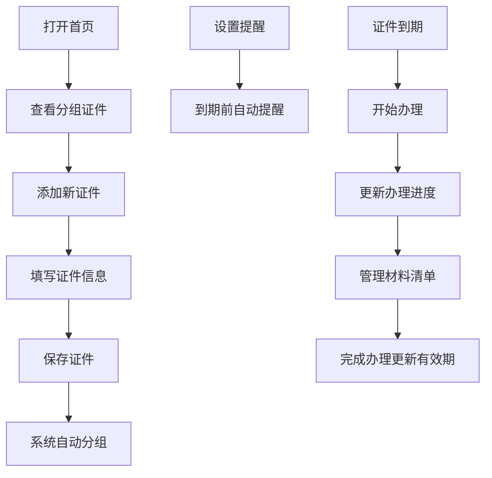

## 1. 产品概述
个人证件到期管家，帮助用户管理各类证件的有效期，避免因证件过期影响正常使用。目标用户为需要管理个人及家庭证件的用户，核心价值是提前提醒、有序管理、便捷追踪。

## 2. 核心功能

### 2.1 用户角色
| 角色 | 注册方式 | 核心权限 |
|------|----------|----------|
| 普通用户 | 无需注册，本地存储 | 证件增删改查、提醒设置、进度追踪、统计查看 |

### 2.2 功能模块
1. **首页**：证件分组展示（三个月内到期、已过期、长期有效）、快速添加入口
2. **证件详情**：证件信息展示、编辑、删除、提醒设置、办理进度、材料清单
3. **证件表单**：添加/编辑证件信息
4. **统计页**：全家快到期证件、办理中事项、过期风险分析
5. **提醒设置**：全局和单证件的提前提醒天数配置

### 2.3 页面详情
| 页面名称 | 模块名称 | 功能描述 |
|---------|----------|----------|
| 首页 | 顶部统计卡片 | 显示即将到期、已过期、长期有效证件数量 |
| 首页 | 分组证件列表 | 按三个月内到期、已过期、长期有效分组展示 |
| 首页 | 证件卡片 | 展示证件类型、持有人、到期日、状态标签 |
| 证件详情页 | 基本信息 | 展示证件类型、持有人、到期日、办理地点、照片、备注 |
| 证件详情页 | 提醒设置 | 设置该证件的提前提醒天数 |
| 证件详情页 | 办理进度 | 预约、提交材料、等待领取、已拿到四步进度追踪 |
| 证件详情页 | 材料清单 | 照片、复印件、申请表等材料勾选管理 |
| 证件表单页 | 表单输入 | 证件类型、持有人、到期日、办理地点、照片、是否年审、备注 |
| 统计页 | 概览统计 | 即将到期证件数量、过期证件数量、办理中事项 |
| 统计页 | 风险分析 | 按时间维度展示证件过期分布 |

## 3. 核心流程
用户打开应用，首页展示证件分组状态。用户可添加新证件，填写完整信息后保存。系统根据到期日自动分组，用户可设置提前提醒天数。证件即将到期时高亮显示，用户可追踪办理进度和管理所需材料。

## 4. 用户界面设计

### 4.1 设计风格
- **主色调**：深蓝色 `#1e3a5f`（专业、稳重），辅以暖橙色 `#f97316`（提醒、警示）
- **中性色**：以 slate 灰色系为主，保持简洁专业
- **按钮风格**：圆角 8px，悬停有轻微阴影和背景色变化
- **字体**：标题使用 'Noto Sans SC' 700，正文使用 'Noto Sans SC' 400
- **布局风格**：卡片式布局，信息层级分明，适当留白
- **图标**：使用 lucide-react 图标库，保持统一风格

### 4.2 页面设计概览
| 页面名称 | 模块名称 | UI元素 |
|---------|----------|--------|
| 首页 | 顶部统计 | 三色卡片横向排列，动画渐变背景，数字放大显示 |
| 首页 | 分组列表 | 可折叠分组，分组标题带计数徽章，卡片悬停微动效 |
| 首页 | 证件卡片 | 左侧图标、中间信息、右侧状态标签，过期卡片红色边框警示 |
| 证件详情 | 进度追踪 | 时间轴样式四步进度，已完成绿色高亮，当前步骤脉冲动画 |
| 证件详情 | 材料清单 | 复选框列表，缺少项红色标记，已备齐项显示对勾 |
| 统计页 | 风险分布 | 彩色进度条可视化展示各时间段证件数量 |

### 4.3 响应式
- 桌面端：三栏布局，侧边导航 + 主内容区
- 平板端：两栏布局，导航收起为图标
- 移动端：单栏布局，底部导航栏

### 4.4 动效设计
- 页面加载：卡片依次淡入，延迟 100ms 递增
- 悬停效果：卡片轻微上浮 + 阴影加深
- 状态切换：进度条平滑过渡动画
- 警示效果：过期证件红色边框呼吸动画
