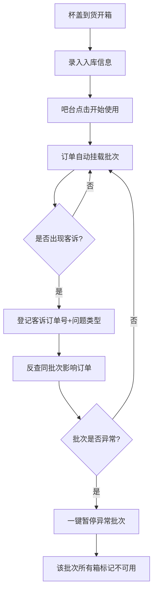

## 1. 产品概述

奶茶店杯盖批次追踪后台系统——从开箱入库到客诉反查的全链路批次管理工具，解决杯盖漏杯、爆盖等质量问题时无法快速定位同批次影响范围的痛点。
- 目标用户：奶茶连锁店店长、吧台员工、采购/供应链管理人员
- 核心价值：每一只杯盖可追溯到供应商批次，客诉发生时一键反查同批次所有订单，异常批次秒级暂停，降低质量风险扩散

## 2. 核心功能

### 2.1 用户角色

| 角色 | 登录方式 | 核心权限 |
|------|----------|----------|
| 店长 | 账号密码 | 全部功能，含供应商排行、异常批次暂停 |
| 吧台员工 | 账号密码 | 开箱入库、吧台切换使用、客诉登记 |

### 2.2 功能模块

1. **开箱入库页**：录入供应商、规格、批次号、箱号、适配杯型、到货日期、放置吧台
2. **吧台管理页**：查看各吧台当前使用批次，切换杯盖箱（点"开始使用"），后续订单自动挂载当前批次
3. **客诉追踪页**：按订单号回填问题类型（漏杯/爆盖/压不紧），反查同批次影响订单列表
4. **库存总览页**：剩余箱数、周转天数、客诉率、供应商排行，异常批次一键暂停

### 2.3 页面详情

| 页面名称 | 模块名称 | 功能描述 |
|----------|----------|----------|
| 开箱入库页 | 入库表单 | 填写供应商、规格、批次号、箱号、适配杯型、到货日期、放置吧台，提交后自动生成入库记录 |
| 开箱入库页 | 入库记录列表 | 展示最近入库的杯盖箱记录，支持按批次号/供应商筛选 |
| 吧台管理页 | 吧台状态卡片 | 每个吧台一张卡片，显示当前使用批次号、供应商、开始使用时间、已消耗杯数 |
| 吧台管理页 | 切换批次弹窗 | 选择新箱号点击"开始使用"，自动结束上一箱的使用 |
| 客诉追踪页 | 客诉登记表单 | 输入订单号，选择问题类型（漏杯/爆盖/压不紧），提交客诉 |
| 客诉追踪页 | 同批次影响查询 | 根据客诉反查同批次所有订单，展示订单号、出杯时间、吧台、是否已有客诉 |
| 库存总览页 | 库存概览卡片 | 剩余箱数、在用箱数、已消耗总杯数、平均周转天数 |
| 库存总览页 | 客诉率统计 | 按批次展示客诉率柱状图，高客诉率批次标红 |
| 库存总览页 | 供应商排行 | 按客诉率从低到高排列供应商，展示供应量、客诉数、客诉率 |
| 库存总览页 | 异常批次操作 | 一键暂停异常批次，暂停后该批次所有在用箱自动标记不可用 |

## 3. 核心流程

**入库→使用→客诉→反查→暂停** 五步闭环：

1. 杯盖到货 → 员工开箱录入供应商、批次号、箱号等信息 → 系统生成入库记录
2. 吧台需换盖 → 员工在吧台页面点"开始使用"选择箱号 → 后续订单自动挂载该批次
3. 顾客反馈漏杯/爆盖 → 员工在客诉页输入订单号+问题类型 → 系统记录客诉
4. 系统根据订单反查杯盖批次 → 列出同批次所有订单及客诉情况
5. 店长判断批次异常 → 一键暂停 → 该批次所有在用箱标记不可用

## 4. 用户界面设计

### 4.1 设计风格

- **主色调**：深棕（#3E2723）+ 奶茶色（#D7CCC8）作为品牌底色，搭配琥珀色（#FF8F00）作为强调色
- **辅助色**：红色（#D32F2F）用于异常/暂停状态，绿色（#2E7D32）用于正常/使用中状态
- **按钮风格**：圆角（8px），主按钮填充色，次按钮描边
- **字体**：思源黑体/Noto Sans SC 为主，数字使用等宽字体 JetBrains Mono
- **布局风格**：左侧固定导航栏 + 右侧内容区，卡片式布局
- **图标**：Lucide 图标库，线条风格

### 4.2 页面设计概览

| 页面名称 | 模块名称 | UI元素 |
|----------|----------|--------|
| 开箱入库页 | 入库表单 | 左侧表单区（两列布局），右侧最近入库列表；表单使用卡片包裹，输入框带图标前缀 |
| 吧台管理页 | 吧台状态卡片 | 网格布局，每卡片含状态指示灯（绿=使用中/灰=空闲）、批次信息、切换按钮 |
| 客诉追踪页 | 客诉登记+反查 | 上方登记表单，下方分为"我的客诉记录"和"同批次影响订单"两个Tab |
| 库存总览页 | 统计看板 | 顶部4个指标卡片，中部客诉率柱状图，底部供应商排行表格+异常批次操作区 |

### 4.3 响应式设计

- 桌面优先设计，最小宽度 1280px
- 吧台卡片在小屏下从4列变2列
- 表格在小屏下支持横向滚动

### 4.4 3D场景指引

不适用
