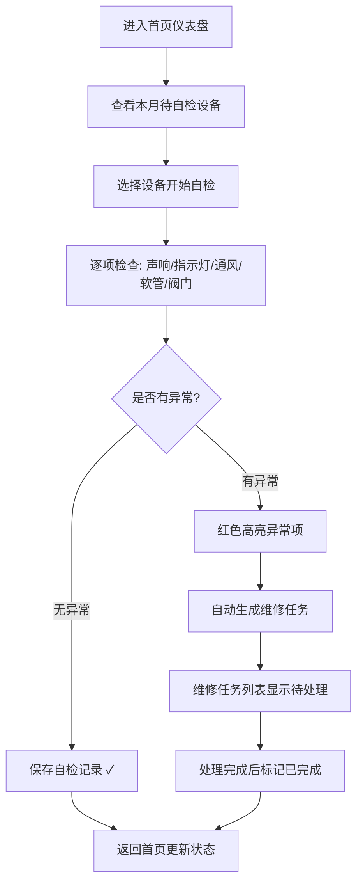

## 1. 产品概述

燃气报警器自检管理系统，帮助家庭用户管理燃气报警器的月度自检，确保设备正常运作，及时发现电池低电、传感器失效、软管老化等安全隐患。

- 解决问题：燃气报警器装后少人测试，无法确认电池和传感器是否正常工作
- 目标用户：家庭用户、物业维保人员
- 产品价值：建立规范化的自检流程，异常情况红色预警并自动生成维修任务，保障家庭用气安全

## 2. 核心功能

### 2.1 用户角色

| 角色 | 注册方式 | 核心权限 |
|------|----------|----------|
| 家庭用户 | 本地数据存储 | 查看首页、管理设备档案、录入自检记录、查看异常提醒 |

### 2.2 功能模块

1. **首页仪表盘**：本月待自检设备、异常设备列表、下次换电池提醒、最近报警记录
2. **设备档案管理**：增删改查设备基本信息（安装位置、型号、安装日期、电池类型、维保电话、设备照片）
3. **月度自检记录**：录入测试声响、指示灯状态、通风情况、灶具软管、阀门状态、现场照片
4. **异常预警与维修任务**：电池低电/测试无声/软管老化/阀门漏气红色提醒，自动生成维修任务单
5. **维修任务管理**：查看待处理/已处理维修任务，标记完成状态

### 2.3 页面详情

| 页面名称 | 模块名称 | 功能描述 |
|----------|----------|----------|
| 首页仪表盘 | 数据概览卡片 | 显示设备总数、本月自检完成率、异常设备数、待处理任务数 |
| 首页仪表盘 | 本月待自检列表 | 按设备列出未自检的报警器，支持快捷跳转自检 |
| 首页仪表盘 | 异常设备提醒 | 红色高亮显示异常设备及异常类型 |
| 首页仪表盘 | 下次换电池提醒 | 根据电池类型和安装日期计算下次更换时间 |
| 首页仪表盘 | 最近报警记录 | 时间线展示近期异常和自检记录 |
| 设备档案页 | 设备列表 | 卡片式展示所有设备，支持搜索、添加、编辑、删除 |
| 设备档案页 | 设备详情/编辑表单 | 安装位置、型号、安装日期、电池类型、维保电话、设备照片上传 |
| 自检记录页 | 自检表单 | 测试声响(正常/微弱/无声)、指示灯(正常/闪烁/不亮)、通风情况(良好/一般/差)、灶具软管(正常/老化/破损)、阀门状态(正常/松动/漏气)、现场照片 |
| 自检记录页 | 历史记录时间线 | 展示该设备历史自检记录 |
| 异常与维修页 | 异常设备红色警示卡 | 按异常类型分类展示，红色醒目标记 |
| 异常与维修页 | 维修任务列表 | 任务状态(待处理/处理中/已完成)、处理人、处理时间、备注 |

## 3. 核心流程

用户打开应用后，首页直观展示待办项和异常预警。选择未自检设备进入自检流程，逐项检查并记录。若发现异常则自动生成红色提醒和维修任务，用户或维保人员处理后标记完成。

## 4. 用户界面设计

### 4.1 设计风格

- **主色调**：深橙红色 (#E85A4F) 作为警示主色，搭配暖米色 (#F5F0E6) 背景，营造安全温暖的家庭氛围
- **辅助色**：翠绿 (#2E8B57) 表示正常，琥珀黄 (#F4A261) 表示警告，深红 (#C1121F) 表示危险异常
- **按钮风格**：圆角胶囊型按钮，主按钮实心带微妙阴影，次按钮描边样式
- **字体**：标题使用 "Noto Sans SC" 700 粗体，正文使用 "Noto Sans SC" 400 常规体
- **布局风格**：卡片式布局，大间距，信息分组清晰，异常卡片带红色左边框和微光效果
- **图标风格**：线性 SVG 图标，状态图标使用填充色实心风格
- **整体风格**：温馨安全感 + 专业安全警示感，异常信息要足够醒目但不过于恐慌

### 4.2 页面设计概览

| 页面名称 | 模块名称 | UI 元素 |
|----------|----------|---------|
| 首页仪表盘 | 数据概览卡片 | 四个统计卡片并排，渐变色块 + 大数字 + 迷你趋势图标，悬停上浮动画 |
| 首页仪表盘 | 待自检列表 | 设备卡片带「立即自检」快捷按钮，橙色标签标记状态 |
| 首页仪表盘 | 异常设备提醒 | 红色边框卡片 + 感叹号图标 + 闪烁微动效，异常类型红色标签 |
| 首页仪表盘 | 电池更换倒计时 | 进度条 + 剩余天数，接近过期时渐变转红 |
| 首页仪表盘 | 最近报警时间线 | 左侧竖线 + 节点圆点，时间倒序排列 |
| 设备档案页 | 设备卡片列表 | 网格布局，卡片含设备照片缩略图 + 位置 + 型号 + 状态标签 |
| 设备档案页 | 设备表单 | 分栏布局，左侧基本信息表单，右侧照片上传预览区 |
| 自检记录页 | 自检检查项 | 每项独立卡片，单选按钮组（正常/警告/异常），选中异常时边框变红 |
| 自检记录页 | 历史记录时间线 | 月份折叠面板，展开显示当月每次自检详情 |
| 异常与维修页 | 异常警示区 | 顶部横幅红色警告条，下方分类卡片网格 |
| 异常与维修页 | 任务看板 | 三列看板布局（待处理/处理中/已完成），任务卡片可拖拽标记 |

### 4.3 响应式设计

- 桌面端优先（≥1024px）：首页四列统计卡，设备列表三列网格
- 平板端（768-1023px）：统计卡两列，设备列表两列网格
- 移动端（<768px）：统计卡垂直堆叠，设备列表单列，底部Tab导航代替顶部菜单
- 触控优化：按钮最小高度 44px，卡片点击区域足够大
