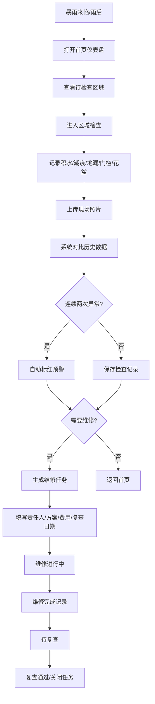

# 露台防水排查管理系统 PRD

## 1. 产品概述
露台防水排查管理系统帮助用户系统化管理家中露台的防水状况。暴雨后可快速记录检查情况，追踪渗水问题，生成维修任务，并通过数据可视化掌握整体防水状态。
- 解决痛点：暴雨后难以回忆渗水位置、花盆摆放、地漏状况等历史信息
- 目标用户：家庭业主、物业管理员
- 产品价值：通过数字化记录实现防水问题的可追溯、可预警、可管理

## 2. 核心功能

### 2.1 用户角色
| 角色 | 注册方式 | 核心权限 |
|------|----------|----------|
| 家庭用户 | 无需注册，本地使用 | 全部功能：区域管理、检查记录、维修任务、数据查看 |

### 2.2 功能模块
1. **首页仪表盘**：待检查区域、最近暴雨记录、重复渗水点、维修进度
2. **区域档案管理**：方位、面积、地漏数量、铺装材料、最近维修、照片
3. **雨后检查记录**：积水点、墙角潮痕、地漏排水、门槛渗水、花盆摆放、照片
4. **维修任务管理**：责任人、施工方案、费用、复查日期、任务状态
5. **异常预警**：连续两次异常自动标红提醒

### 2.3 页面详情
| 页面名称 | 模块名称 | 功能描述 |
|----------|----------|----------|
| 首页仪表盘 | 待检查区域卡片 | 显示需要雨后检查的区域列表，点击进入检查 |
| 首页仪表盘 | 最近暴雨记录时间线 | 展示最近几次暴雨的时间和检查状态 |
| 首页仪表盘 | 重复渗水点地图 | 高亮显示连续出现异常的位置（标红） |
| 首页仪表盘 | 维修进度条 | 显示当前进行中的维修任务及完成进度 |
| 区域档案 | 区域列表 | 展示所有露台区域卡片，含缩略图和基本信息 |
| 区域档案 | 区域详情/编辑 | 方位、面积、地漏数量、铺装材料、最近维修日期、照片上传 |
| 雨后检查 | 检查表单 | 记录积水点（多选/标注）、墙角潮痕程度、地漏排水状况、门槛是否渗水、花盆摆放位置 |
| 雨后检查 | 照片记录 | 支持上传多张现场照片并添加备注 |
| 维修任务 | 任务列表 | 按状态分类（待处理/进行中/已完成/待复查） |
| 维修任务 | 任务详情/编辑 | 责任人、施工方案、费用预估、实际费用、复查日期、完成照片 |
| 维修任务 | 异常标红 | 同一位置连续两次检查异常时自动标红并高亮显示 |

## 3. 核心流程

用户在暴雨预警或雨后，打开系统首页查看待检查区域 → 进入对应区域进行雨后检查记录（拍照、填写各项指标）→ 系统自动对比历史数据，若发现连续异常则标红 → 用户可针对渗水问题生成维修任务 → 维修完成后记录并设置复查日期 → 首页仪表盘实时更新整体状态。

## 4. 用户界面设计

### 4.1 设计风格
- **主色调**：深蓝（#1e3a5f）代表水与沉稳，配合青绿（#0d9488）作为安全状态色
- **警示色**：珊瑚红（#ef4444）用于异常标红，琥珀色（#f59e0b）用于警告
- **背景色**：浅灰蓝（#f1f5f9）主背景，白色卡片带微妙阴影
- **按钮风格**：圆角（8px）、扁平化、悬停有微妙阴影和色阶变化
- **字体**：展示字体用"Noto Serif SC"（优雅衬线），正文字体用"Noto Sans SC"（清晰易读）
- **布局风格**：卡片式布局，顶部导航栏 + 侧边区域切换，响应式网格
- **图标风格**：线性图标（Lucide风格），配合水波纹、雨滴等防水主题装饰元素

### 4.2 页面设计概览
| 页面名称 | 模块名称 | UI元素 |
|----------|----------|--------|
| 首页仪表盘 | 顶部统计卡 | 大数字展示、渐变色背景、微妙动画计数效果 |
| 首页仪表盘 | 时间线 | 垂直时间线，带雨滴图标节点，悬停展开详情 |
| 首页仪表盘 | 异常标红卡片 | 红色边框、脉冲动画阴影、醒目⚠️图标 |
| 区域档案 | 卡片网格 | 照片主图 + 底部信息条，悬停放大效果 |
| 雨后检查 | 表单 | 分段式卡片，每完成一项打勾动画，进度条在顶部 |
| 维修任务 | 看板 | 四列看板（待处理/进行中/已完成/待复查），可拖拽卡片 |

### 4.3 响应式
- 桌面端优先设计（≥1280px），使用 12 列网格
- 平板端（768-1279px）：侧边栏收起为图标菜单，卡片自适应宽度
- 移动端（<768px）：单列布局，底部导航栏替代顶部导航，卡片堆叠显示
- 所有交互元素支持触摸操作，最小点击区域 44×44px

### 4.4 视觉细节
- 背景添加微妙的水波纹纹理（SVG图案，低透明度）
- 异常卡片使用红色发光阴影（glow effect）
- 页面切换使用淡入+轻微上移动画
- 数据加载时使用骨架屏占位
