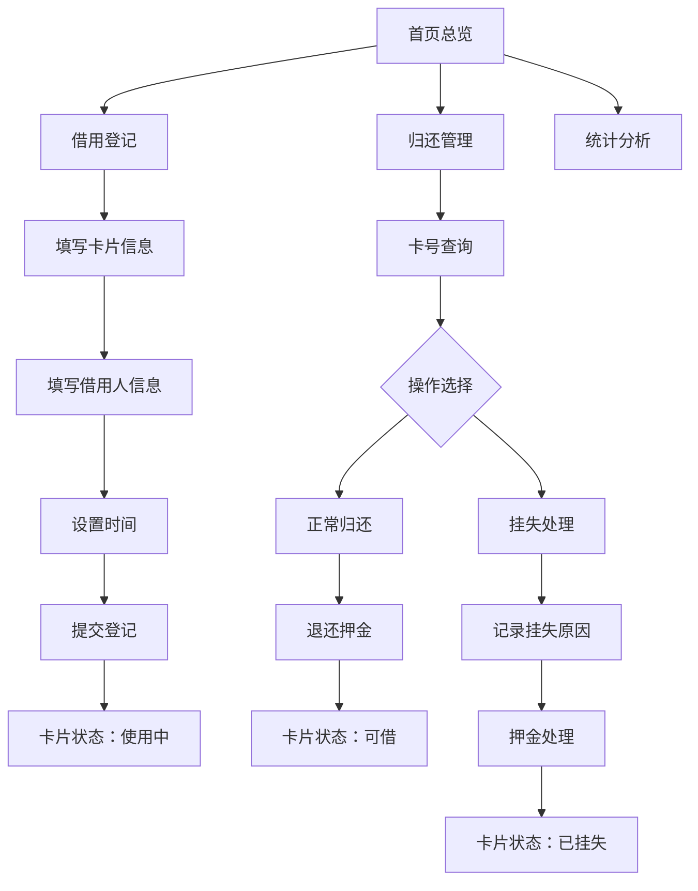

## 1. 产品概述

临时工牌借用管理系统，用于解决公司前台临时卡借用登记混乱、归还追踪困难、统计数据缺失的问题。目标用户为前台接待人员，提供卡片借用登记、归还核销、挂失管理及数据统计分析功能。

- 核心目标：替代手写登记本，实现数字化管理
- 市场价值：提升前台工作效率，减少卡片流失，便于数据分析与管理决策

## 2. 核心功能

### 2.1 用户角色

| 角色 | 注册方式 | 核心权限 |
|------|----------|----------|
| 前台管理员 | 系统内置 | 全部功能：登记、归还、挂失、统计 |

### 2.2 功能模块

1. **首页总览**：卡片状态统计面板、快速操作入口
2. **借用登记**：新借卡片登记表单（访客卡/员工临时卡分类）
3. **归还管理**：卡号查询、归还确认、押金退还、挂失流程
4. **统计分析**：每日借用量趋势、超时未还统计、部门忘带工牌排行

### 2.3 页面详情

| 页面名称 | 模块名称 | 功能描述 |
|-----------|-------------|---------------------|
| 首页总览 | 状态卡片 | 显示可借、使用中、即将超时、已挂失四种状态卡片数量，访客卡/员工卡分类展示 |
| 首页总览 | 最近记录 | 显示最近10条借用记录 |
| 首页总览 | 快捷操作 | 快速跳转借用登记、归还管理入口 |
| 借用登记 | 卡片信息 | 卡号、卡类型（访客卡/员工临时卡）、权限区域、押金金额 |
| 借用登记 | 借用人信息 | 借用人姓名、部门、联系方式 |
| 借用登记 | 时间信息 | 借出时间（默认当前）、预计归还时间 |
| 归还管理 | 卡号查询 | 通过卡号检索当前借用中的卡片信息 |
| 归还管理 | 归还确认 | 显示借用详情，确认归还并退还押金 |
| 归还管理 | 挂失流程 | 标记卡片丢失，记录挂失原因，押金处理 |
| 统计分析 | 每日借用趋势 | 按日期展示借用数量折线图，区分访客卡/员工卡 |
| 统计分析 | 超时统计 | 超时未还卡片列表及次数统计 |
| 统计分析 | 部门排行 | 按部门统计忘带工牌次数排行榜 |

## 3. 核心流程

### 3.1 借用流程
前台人员选择卡类型 → 输入卡号、权限区域、押金 → 输入借用人姓名、部门、联系方式 → 设置预计归还时间 → 提交登记 → 卡片状态变为"使用中"

### 3.2 归还流程
输入卡号查询 → 系统显示借用详情 → 核对信息无误 → 点击确认归还 → 退还押金 → 卡片状态变回"可借"

### 3.3 挂失流程
输入卡号查询 → 确认卡片丢失 → 选择挂失原因 → 选择押金处理方式（没收/部分退还）→ 提交挂失 → 卡片状态变为"已挂失"

## 4. 用户界面设计

### 4.1 设计风格
- 主色调：深蓝色（#1e3a5f）代表专业与信任
- 辅助色：青绿色（#0d9488）表示成功/可借，橙红色（#f97316）表示警告/即将超时，深红色（#dc2626）表示危险/挂失
- 中性色：锌灰色系（#fafafa ~ #18181b）
- 按钮风格：圆角 8px，带微妙阴影和悬停过渡效果
- 字体：标题使用 "Noto Sans SC" 600-700 字重，正文使用 400-500 字重
- 布局风格：顶部导航 + 卡片式内容区域，大量留白
- 图标风格：使用 lucide-react 线性图标

### 4.2 页面设计概述

| 页面名称 | 模块名称 | UI 元素 |
|-----------|-------------|-------------|
| 首页总览 | 状态卡片 | 4 个大尺寸数据卡片，各自独立配色，带图标和数值，访客卡/员工卡小标签分类 |
| 首页总览 | 最近记录 | 数据表格，斑马纹行，状态标签颜色区分 |
| 借用登记 | 表单 | 分组表单布局，左右两列，必填项红星标记，输入框聚焦动画 |
| 归还管理 | 查询区 | 大搜索框带搜索图标，结果卡片式展示 |
| 归还管理 | 操作区 | 操作按钮组，归还/挂失明确区分颜色 |
| 统计分析 | 图表区 | 简洁的 SVG 折线图和柱状图，渐变填充 |
| 统计分析 | 排行榜 | 带序号的卡片列表，前三名高亮显示 |

### 4.3 响应式
- 桌面优先设计（默认 1280px 以上）
- 平板端（768-1279px）：两列布局合并为单列
- 移动端（< 768px）：导航转为汉堡菜单，表格横向滚动
- 所有交互元素触摸尺寸 ≥ 44px
