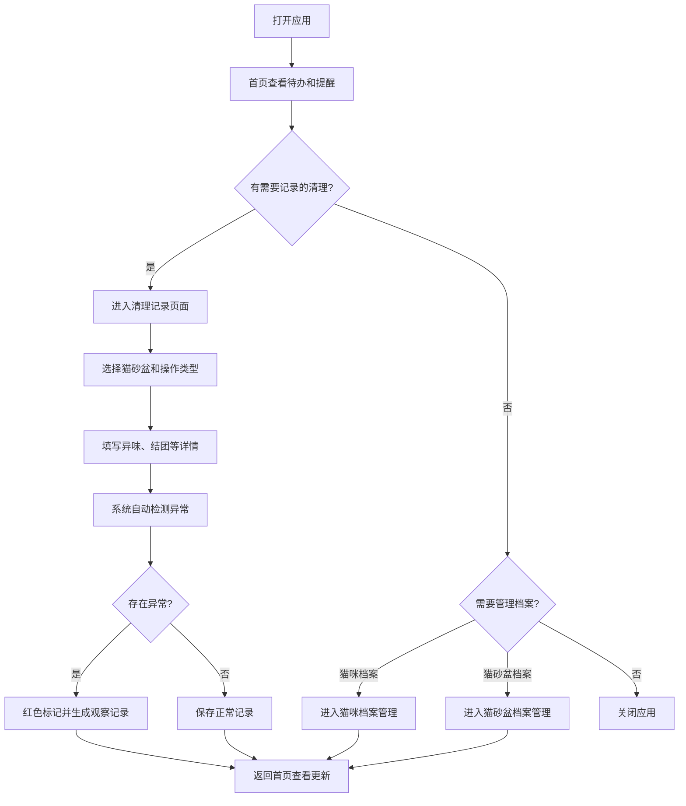
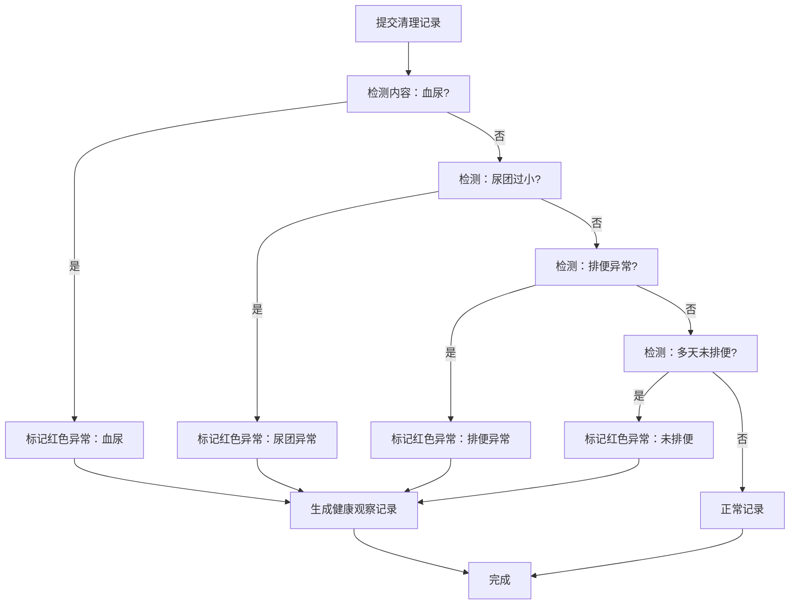

## 1. 产品概述

猫砂盆智能管家是一款帮助养猫家庭记录和管理猫砂盆日常清理工作的工具应用，解决"谁铲了屎、什么时候换砂、除臭珠还剩多少"等日常养猫痛点，同时通过智能异常检测及时发现猫咪健康问题。

- 核心用户：多猫家庭、忙碌的上班族铲屎官、关注猫咪健康的养宠人士
- 核心价值：清晰记录清理责任、智能提醒待办事项、异常排泄健康预警

## 2. 核心功能

### 2.1 用户角色

| 角色 | 注册方式 | 核心权限 |
|------|----------|----------|
| 普通用户 | 无需注册，本地存储 | 管理猫咪档案、猫砂盆档案、清理记录，查看健康预警 |

### 2.2 功能模块

1. **首页仪表盘**：今日待清理、异常排泄告警、猫砂库存、下次整盆换砂提醒
2. **猫咪档案管理**：新增/编辑/删除猫咪档案，包含基本信息和健康备注
3. **猫砂盆档案管理**：新增/编辑/删除猫砂盆信息，配置清理频率和除臭用品
4. **清理记录管理**：记录每次清理详情，自动标记异常排泄，生成观察记录

### 2.3 页面详情

| 页面名称 | 模块名称 | 功能描述 |
|-----------|-------------|---------------------|
| 首页 | 概览卡片 | 展示今日待清理数量、异常排泄数量、猫砂库存量、下次换砂倒计时 |
| 首页 | 快捷操作 | 快速进入"记录清理"、"添加猫咪"、"添加猫砂盆" |
| 首页 | 最近记录 | 展示最近5条清理记录摘要 |
| 猫咪档案 | 猫咪列表 | 卡片式展示所有猫咪，显示照片和基本信息 |
| 猫咪档案 | 猫咪表单 | 新增/编辑：名字、年龄、体重、饮食偏好、健康备注、上传照片 |
| 猫砂盆档案 | 猫砂盆列表 | 展示所有猫砂盆位置、类型、清理频率 |
| 猫砂盆档案 | 猫砂盆表单 | 新增/编辑：位置、尺寸、猫砂类型、建议清理频率、除臭用品 |
| 清理记录 | 记录列表 | 时间线展示所有清理记录，异常记录红色高亮 |
| 清理记录 | 记录表单 | 选择猫砂盆、操作类型（铲屎/补砂/整盆换砂/消毒）、异味情况、结团情况、备注 |
| 清理记录 | 异常检测 | 自动检测排便异常、血尿、尿团过小、多天未排便，标记红色并生成观察记录 |
| 清理记录 | 观察记录 | 针对异常情况自动生成健康观察记录，支持跟进状态更新 |

## 3. 核心流程

### 用户主要操作流程

### 异常检测流程

## 4. 用户界面设计

### 4.1 设计风格

- **主色调**：温暖米白色 `#FFF8F0` 为背景，柔和沙橙色 `#E8A87C` 为主色
- **辅助色**：森林绿 `#4A7C59` 代表健康，珊瑚红 `#C85A5A` 标记异常警告
- **中性色**：暖灰色系 `#6B5B4F` 文字，`#D4C8BC` 边框
- **按钮风格**：圆角 16px，柔和阴影，悬停轻微放大效果
- **字体**：标题使用圆润的 `ZCOOL KuaiLe`，正文使用清晰的 `Noto Sans SC`
- **布局风格**：卡片式设计，柔和圆角（16-24px），充足留白
- **图标风格**：Lineal 风格，使用 lucide-react 图标配合猫咪元素 emoji 🐱

### 4.2 页面设计概述

| 页面名称 | 模块名称 | UI 元素 |
|-----------|-------------|-------------|
| 首页 | 概览卡片 | 4个统计卡片网格排列，异常卡片红色边框闪烁动画，数字使用大号字体 |
| 首页 | 快捷操作 | 3个彩色图标按钮横向排列，悬停上浮效果 |
| 首页 | 最近记录 | 时间线布局，每条记录带猫咪头像和操作图标 |
| 猫咪档案 | 猫咪卡片 | 照片圆形裁剪，信息两列布局，编辑删除按钮悬停显示 |
| 猫咪档案 | 表单弹窗 | 半透明毛玻璃背景，表单字段分组，图片上传区域带拖放提示 |
| 清理记录 | 记录列表 | 时间线设计，正常记录米色背景，异常记录红色渐变边框和背景 |
| 清理记录 | 异常标记 | 红色感叹号图标 + "异常"标签，鼠标悬停显示异常详情 |
| 清理记录 | 观察记录 | 折叠面板，可展开查看历史观察和添加新备注 |

### 4.3 响应式设计

- **桌面端优先**：最大宽度 1200px 居中布局，侧边导航 + 主内容区
- **平板端**：768px-1199px，顶部导航，内容区自适应
- **移动端**：<768px，底部标签栏导航，卡片单列布局，按钮加大便于触控
- **触控优化**：所有可点击元素最小 44x44px，滑动删除记录，下拉刷新

### 4.4 动效设计

- **页面加载**：卡片依次淡入上浮（staggered animation）
- **异常告警**：红色异常卡片轻微呼吸闪烁效果
- **按钮交互**：点击缩放 0.95 → 1 弹性动画
- **记录添加**：新记录从顶部滑入动画
- **导航切换**：页面左右滑动过渡效果
