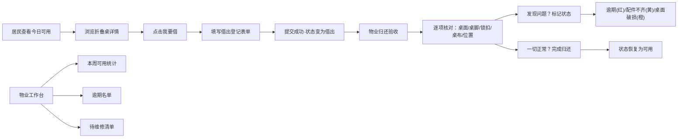

# 活动室折叠桌管理系统 PRD

## 1. 产品概述

社区活动室折叠桌租借管理系统，解决居民借桌流程不透明、归还验收不规范、配件丢失难追溯的问题。面向居民和物业两类用户，实现从"今天还能借几张"到归还验收的全流程闭环管理。

## 2. 核心功能

### 2.1 用户角色

| 角色 | 使用方式 | 核心权限 |
|------|----------|----------|
| 居民 | 直接浏览使用 | 查看可用桌子、提交借出登记 |
| 物业 | 管理端操作 | 归还验收、查看统计报表、标记维修 |

### 2.2 功能模块

1. **首页（居民端）**：今日可用数量看板、折叠桌列表、借出登记弹窗
2. **归还验收页**：逐项核对桌面/桌脚/锁扣/桌布/放回位置
3. **物业工作台**：本周可用统计、逾期名单、待维修清单

### 2.3 页面详情

| 页面名称 | 模块名称 | 功能描述 |
|----------|----------|----------|
| 首页 | 顶部数量看板 | 大字显示今日可用数量，点击可切换查看全部/仅可用 |
| 首页 | 折叠桌卡片列表 | 展示编号、尺寸、存放柜、桌面划痕、脚垫数量、照片、状态标签 |
| 首页 | 借出登记表单 | 住户姓名、用途、搬去哪里、预计归还时间、是否带桌布 |
| 归还验收页 | 逐项核对清单 | 桌面状态、桌脚状态、锁扣状态、桌布归还、放回位置确认 |
| 物业工作台 | 本周可用统计 | 本周每日可用数量趋势卡片 |
| 物业工作台 | 逾期名单 | 红色高亮显示逾期未还的住户及联系方式 |
| 物业工作台 | 待维修清单 | 橙色/黄色标记需要维修或配件不齐的桌子 |

## 3. 核心流程

居民在首页查看今日可用折叠桌数量，浏览桌子详情后点击"我要借"，填写借出信息提交。物业在归还时进入验收页面，逐项核对桌面、桌脚、锁扣、桌布和放回位置，确认无误后完成归还。系统自动标记逾期（红色）、配件不齐（黄色）、桌面破损（橙色）三种状态。物业工作台汇总本周可用数量、逾期住户和待维修桌子。

## 4. 用户界面设计

### 4.1 设计风格

- **主色调**：深蓝绿（#0F766E）作为主色，传达稳重可靠的社区服务感
- **强调色**：红色（#DC2626）逾期提醒、黄色（#D97706）配件不齐、橙色（#EA580C）桌面破损
- **中性色**：暖灰色系背景，营造社区亲切感
- **按钮风格**：圆角胶囊按钮，hover 时有轻微上浮阴影
- **字体**：标题使用思源黑体 Bold，正文使用思源黑体 Regular
- **布局风格**：卡片式布局，信息分组清晰，大量留白
- **图标风格**：线性风格图标，统一使用 lucide-react

### 4.2 页面设计概述

| 页面名称 | 模块名称 | UI 元素 |
|----------|----------|---------|
| 首页 | 顶部看板 | 大数字展示可用数量，配渐变背景和微动画 |
| 首页 | 桌子卡片 | 图片占位 + 信息网格布局，状态标签彩色圆点 |
| 首页 | 借出弹窗 | 半透明遮罩，表单分组，底部固定操作栏 |
| 归还验收页 | 核对清单 | 勾选式列表，每一项配图标和状态切换 |
| 物业工作台 | 统计卡片 | 网格布局，数据可视化，彩色指标条 |
| 物业工作台 | 列表 | 斑马纹列表，状态色条左边缘标记 |

### 4.3 响应式

桌面端优先设计，平板端自适应为两列卡片，移动端单列布局。触摸区域不小于 44x44px。

### 4.4 交互细节

- 状态标签采用脉冲动画吸引注意力（逾期红色呼吸灯效果）
- 卡片 hover 时轻微上浮 + 阴影加深
- 表单输入框 focus 时有边框颜色渐变过渡
- 页面切换使用淡入淡出过渡
