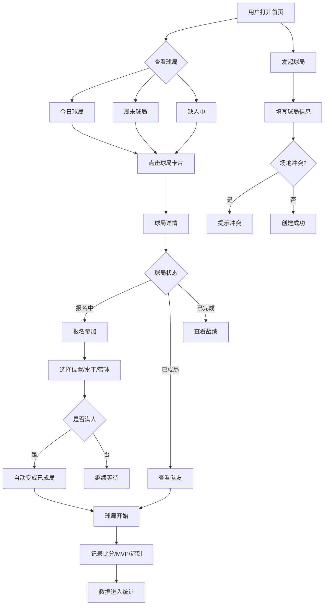

## 1. 产品概述

小区篮球场约场小程序——解决小区篮球场占场不明确、临时凑人难、信息不对称的问题。让球友能提前发起球局、快速报名、自动组队，打完后还能记录战绩和统计。
- 目标用户：小区篮球爱好者，18-50岁，习惯用手机安排运动
- 核心价值：让约球从"群里喊一声"变成"一目了然"，减少空场和冲突

## 2. 核心功能

### 2.1 用户角色
| 角色 | 注册方式 | 核心权限 |
|------|----------|----------|
| 球友 | 昵称+手机号 | 发起球局、报名、记录战绩、查看统计 |

### 2.2 功能模块
1. **首页**：球局列表（按今天/周末/缺人中分组），快捷发起入口
2. **发起球局页**：填写球局信息表单
3. **球局详情页**：报名、查看队友、退出、赛后记录
4. **统计页**：每周场次、活跃排名、时段热度

### 2.3 页面详情
| 页面名称 | 模块名称 | 功能描述 |
|----------|----------|----------|
| 首页 | 今日球局 | 展示今天的球局卡片，显示时间/场地/人数进度/状态标签 |
| 首页 | 周末球局 | 展示周末的球局卡片 |
| 首页 | 缺人中 | 展示人数未满的球局，按缺口人数排序，快满的标红 |
| 首页 | 快捷操作 | 浮动发起按钮，点击跳转发起页 |
| 发起球局页 | 时间选择 | 日期+时间段选择器 |
| 发起球局页 | 场地选择 | 选择小区内篮球场（A场/B场等） |
| 发起球局页 | 人数设置 | 半场/全场切换，对应默认人数(4v4/5v5) |
| 发起球局页 | 水平标签 | 入门/休闲/竞技 三档 |
| 发起球局页 | 分队设置 | 是否需要自动分队 |
| 发起球局页 | 联系方式 | 微信号/手机号 |
| 发起球局页 | 冲突检测 | 同一时间同一场地已有球局时提醒 |
| 球局详情页 | 球局信息 | 显示所有球局信息 |
| 球局详情页 | 报名面板 | 选择位置(G/F/C)、水平、是否带球 |
| 球局详情页 | 队友列表 | 已报名人员列表，显示位置和标签 |
| 球局详情页 | 状态流转 | 报名中→已成局→已完成 |
| 球局详情页 | 退出机制 | 退出释放名额，状态可回退 |
| 球局详情页 | 赛后记录 | 比分录入、MVP投票、迟到标记 |
| 统计页 | 周统计 | 本周打了几场球 |
| 统计页 | 活跃排行 | 谁参加最多球局 |
| 统计页 | 时段热度 | 哪个时段最抢手（热力图/柱状图） |

## 3. 核心流程

**发起球局流程**：用户点击发起→填写球局信息→系统检测场地冲突→无冲突则创建成功→球局出现在首页列表

**报名流程**：用户浏览球局→点击报名→选择位置/水平/带球→报名成功→人数+1→满人自动变成已成局

**退出流程**：用户在已报名球局点击退出→名额释放→如果已成局退人后不足人数则回退为报名中

**赛后记录流程**：球局时间过后→发起人/参与者记录比分→投票MVP→标记迟到→数据进入统计

## 4. 用户界面设计

### 4.1 设计风格
- 主色调：篮球橙 (#FF6B2B) + 深夜黑 (#0D0D0D) + 球场绿 (#2D8B4E)
- 辅助色：水泥灰 (#8C8C8C) + 警告红 (#EF4444) + 成功绿 (#22C55E)
- 按钮风格：圆角胶囊按钮，主操作用填充橙色，次要操作用描边
- 字体：标题用粗体无衬线，正文用常规无衬线
- 布局风格：卡片式布局，顶部Tab导航，底部固定操作栏
- 图标风格：线性图标，运动主题
- 整体氛围：暗色运动风，像夜间球场的灯光感

### 4.2 页面设计概述
| 页面名称 | 模块名称 | UI元素 |
|----------|----------|--------|
| 首页 | 顶部导航 | Logo + 统计入口图标，深色背景 |
| 首页 | Tab切换 | 今天/周末/缺人中 三个Tab，橙色下划线指示 |
| 首页 | 球局卡片 | 深灰卡片，左侧时间竖排，右侧信息区，底部人数进度条，快满时橙色脉冲动画 |
| 首页 | 发起按钮 | 右下角浮动橙色圆形按钮，篮球图标，点击缩放动效 |
| 发起球局页 | 表单 | 暗色背景表单，输入框带圆角，场地冲突时红色提示横幅 |
| 球局详情页 | 信息区 | 顶部球局信息卡，中部队友网格(头像+位置标签)，底部操作区 |
| 球局详情页 | 报名面板 | 底部弹出Sheet，位置选择(3个圆形按钮)，水平选择，带球开关 |
| 球局详情页 | 赛后记录 | 比分输入(大号数字)，MVP选择(点击头像高亮)，迟到标记(复选框列表) |
| 统计页 | 周统计 | 大号数字+趋势小图 |
| 统计页 | 排行榜 | 头像+名字+场次，前三名用金银铜色 |
| 统计页 | 时段热度 | 横向柱状图，颜色从绿到橙到红表示热度 |

### 4.3 响应式设计
- 桌面优先设计，最大宽度480px居中（模拟移动端体验）
- 卡片宽度自适应，间距保持一致
- 触摸优化：按钮最小44px点击区域

### 4.4 3D场景指导
- 不适用
