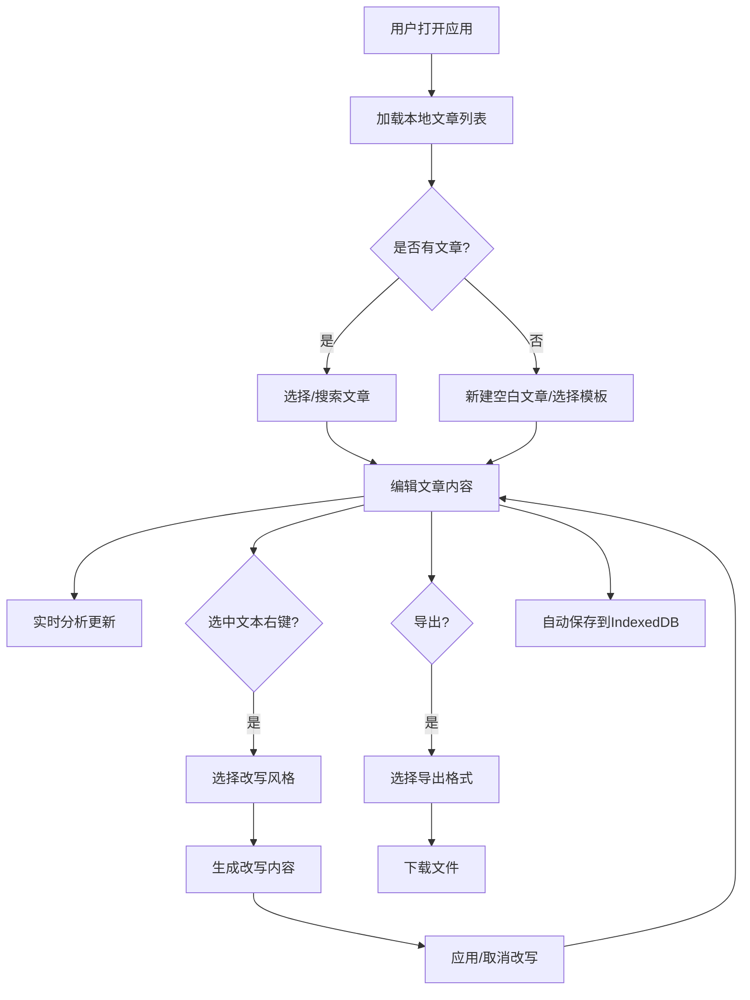

## 1. 产品概述
写作助手是一款面向内容创作者、学生、职场人士的智能写作辅助工具，提供富文本编辑、实时文章分析、智能改写、模板库、多文章管理等功能，帮助用户提升写作效率和文章质量。

- 核心目标：降低写作门槛，提升内容质量，提供一站式写作解决方案
- 目标用户：学生、作家、内容创作者、职场人士
- 产品价值：智能分析 + 风格改写 + 模板库 + 本地存储 = 高效写作体验

## 2. 核心功能

### 2.1 功能模块
1. **编辑器页面**: 富文本编辑器、工具栏、右键菜单
2. **分析面板**: 实时字数统计、错别字检测、用词重复分析、可读性评分、文章类型识别
3. **模板库**: 8种常用写作模板一键导入
4. **文章管理**: 侧边栏、文件夹分类、标签系统、搜索功能、IndexedDB本地存储
5. **导出功能**: 支持docx、markdown、PDF三种格式导出

### 2.2 页面详情
| 页面名称 | 模块名称 | 功能描述 |
|-----------|-------------|---------------------|
| 主页面 | 左侧文章管理 | 文件夹树、文章列表、搜索框、新建按钮 |
| 主页面 | 中间编辑器 | Quill富文本编辑器、格式工具栏、右键改写菜单 |
| 主页面 | 右侧分析面板 | 字数统计、错别字提示、重复词分析、可读性分数、类型分析、改写建议 |

## 3. 核心流程

## 4. 用户界面设计

### 4.1 设计风格
- **设计方向**: 简约优雅的编辑体验，类似Notion/ia Writer的沉浸式写作环境
- **主色调**: 深墨蓝 (#1e3a5f) 作为主色，搭配暖橙色 (#f59e0b) 作为强调色
- **背景**: 柔和的米白色 (#fafaf9) 减少视觉疲劳
- **字体**: 标题使用 'Playfair Display' 衬线字体，正文使用 'Inter' 无衬线字体
- **布局**: 三栏布局，左侧25%文章管理，中间50%编辑区，右侧25%分析面板
- **按钮风格**: 圆角8px，hover有轻微放大和阴影效果
- **图标风格**: lucide-react线性图标，简洁现代

### 4.2 页面设计概述
| 页面名称 | 模块名称 | UI元素 |
|-----------|-------------|-------------|
| 主页面 | 左侧边栏 | 文件夹树、文章列表项、搜索框、新建按钮、标签筛选 |
| 主页面 | 编辑区 | 标题输入、Quill编辑器、格式工具栏（加粗/斜体/下划线/高亮/列表/引用） |
| 主页面 | 分析面板 | 统计卡片、进度条、错别字列表、类型标签、改写风格按钮 |

### 4.3 响应式
- 桌面端：三栏完整布局
- 平板端：折叠左侧边栏，分析面板可切换显示
- 移动端：单栏布局，通过底部tab切换编辑/管理/分析

### 4.4 动效设计
- 页面加载：元素渐入动画，延迟100ms错落显示
- 按钮hover：缩放1.02 + 阴影加深
- 侧边栏折叠：平滑过渡动画300ms
- 分析数据更新：数字滚动动画
- 右键菜单：淡入 + 轻微上移动画
