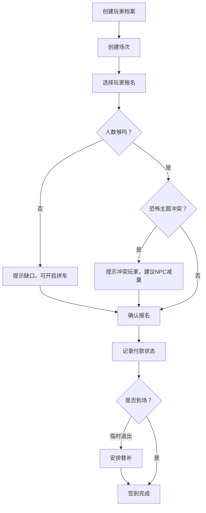

## 1. 产品概述
密室逃脱拼场系统，用于解决玩家组队时反复确认人数、胆量、付款、恐怖偏好等问题，提供从玩家档案管理、场次组织、智能报名、状态追踪到数据看板的一站式拼场体验。
- 核心用户：密室逃脱爱好者、拼场组织者
- 核心价值：减少沟通成本，智能匹配队友，可视化拼场进度

## 2. 核心功能

### 2.1 用户角色
| 角色 | 注册方式 | 核心权限 |
|------|----------|----------|
| 普通用户 | 直接创建档案 | 创建/管理玩家档案、报名场次、查看看板 |
| 组织者 | 同上 | 创建场次、管理报名、标记状态、导出数据 |

### 2.2 功能模块
1. **玩家档案页**：创建/编辑/删除玩家档案，含胆量等级、忌讳主题、常用空档
2. **场次管理页**：创建/编辑场次，查看报名情况，管理拼场状态
3. **智能报名页**：报名时智能提示人数缺口、恐怖冲突、NPC减量、拼车需求
4. **状态追踪页**：付款记录、临时退出、替补安排、到场签到
5. **数据看板页**：待成团场次、缺口人数、未付款名单、主题偏好统计、下周可约时段

### 2.3 页面详情
| 页面名称 | 模块名称 | 功能描述 |
|----------|----------|----------|
| 玩家档案页 | 档案列表 | 卡片式展示所有玩家，支持搜索筛选 |
| 玩家档案页 | 档案表单 | 昵称、联系方式、胆量等级(1-5)、忌讳主题、是否新手、常用空档 |
| 场次管理页 | 场次列表 | 展示门店、主题、时间、人数进度，状态标签 |
| 场次管理页 | 场次表单 | 门店、主题、类型、时长、最低/满员人数、价格、难度 |
| 智能报名页 | 报名弹窗 | 选择玩家，实时展示人数是否够、恐怖冲突提示、NPC减量建议、拼车需求 |
| 状态追踪页 | 报名名单 | 展示付款状态、签到状态、替补标记 |
| 数据看板页 | 统计卡片 | 待成团数、总缺口、未付款数、热门主题 |
| 数据看板页 | 可约时段 | 日历热力图展示下周空档重叠情况 |

## 3. 核心流程
创建玩家档案 → 创建场次 → 邀请/选择玩家报名 → 智能检测冲突与缺口 → 确认报名 → 记录付款 → 签到到场（或替补）

## 4. 用户界面设计
### 4.1 设计风格
- 主色：深靛蓝 `#1e1b4b`，强调悬疑密室氛围
- 辅助色：荧光绿 `#4ade80`（正常状态）、琥珀橙 `#f59e0b`（警告/缺口）、玫红 `#f43f5e`（冲突/紧急）
- 按钮风格：胶囊圆角，悬停有发光效果
- 字体：标题使用 `Space Grotesk` 粗体，正文使用 `Noto Sans SC`
- 布局：顶部导航 + 侧边菜单 + 主内容区卡片式布局
- 图标：使用 lucide-react，线条风格统一

### 4.2 页面设计概述
| 页面名称 | 模块名称 | UI元素 |
|----------|----------|--------|
| 看板首页 | 统计卡片 | 渐变色背景，大数字指标，微动效 |
| 看板首页 | 可约时段 | 热力网格，颜色越深表示越多玩家有空 |
| 玩家档案 | 档案卡片 | 头像占位 + 胆量星级 + 主题标签 |
| 场次管理 | 场次进度条 | 人数进度条，缺口数字高亮 |
| 报名弹窗 | 智能提示 | 分级提示：绿色(✓)、橙色(!)、红色(✗) |

### 4.3 响应性
- Desktop-first，1440px 基准设计
- 断点：1024px（平板）、768px（手机）
- 移动端：侧边栏折叠为底部Tab，卡片单列布局
- 触控优化：按钮最小 44x44px，触摸反馈
