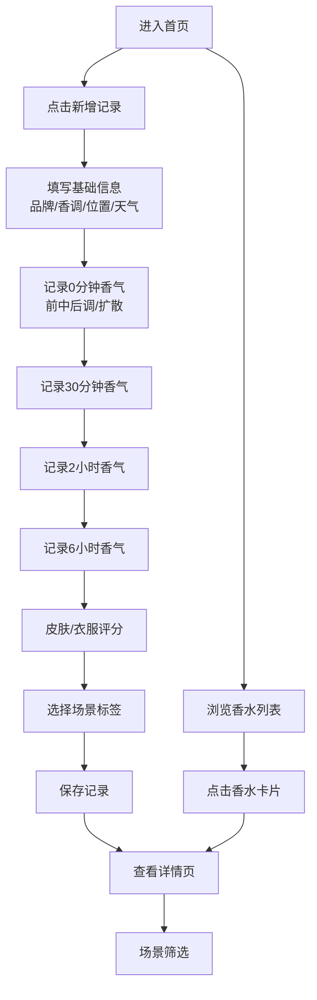

## 1. 产品概述

留香实验记录应用，帮助香水爱好者系统记录和追踪每支香水小样的香气变化过程。用户可以按时间节点记录前中后调的演变，对比皮肤与衣服上的不同表现，并根据场景自动分类推荐。

- 核心价值：解决香水小样试香后遗忘后续香气表现的痛点，建立个人香水数据库
- 目标用户：香水爱好者、小样收藏家、需要根据场景选香的用户

## 2. 核心功能

### 2.1 功能模块
1. **香水小样管理**：新增/编辑/删除香水小样记录
2. **留香时间线记录**：0分钟、30分钟、2小时、6小时四个时间节点的香气记录
3. **双载体评分**：皮肤与衣服上的香气表现分别打分
4. **场景分类推荐**：基于记录数据自动归类为通勤/约会/雨天/睡前
5. **记录列表与详情**：浏览所有实验记录，查看详细的留香时间线

### 2.2 页面详情
| 页面名称 | 模块名称 | 功能描述 |
|-----------|-------------|---------------------|
| 首页/列表页 | 顶部导航 | 应用标题、新增记录按钮、场景筛选标签 |
| 首页/列表页 | 香水卡片列表 | 展示所有香水记录，包含品牌、香调、评分缩略信息 |
| 详情页 | 香水基础信息 | 品牌、香调、喷洒位置、天气湿度 |
| 详情页 | 留香时间线 | 四个时间节点的前/中/尾调及扩散范围记录 |
| 详情页 | 双载体评分 | 皮肤评分、衣服评分、综合评分展示 |
| 详情页 | 场景标签 | 自动归类的场景标签展示 |
| 新增/编辑页 | 基础信息表单 | 品牌、香调、喷洒位置、天气湿度输入 |
| 新增/编辑页 | 时间线记录表单 | 四个时间点的香气描述输入 |
| 新增/编辑页 | 评分与场景 | 皮肤/衣服评分、场景标签选择 |

## 3. 核心流程

用户从首页浏览香水记录列表，点击新增可创建新的留香实验记录。填写香水基础信息后，在四个时间节点依次记录香气变化。完成记录后提交，系统自动计算综合评分并生成场景分类。用户可在详情页查看完整的留香时间线，也可通过场景标签筛选适合特定场合的香水。

## 4. 用户界面设计

### 4.1 设计风格
- **设计调性**：精致优雅的杂志风，呼应香水产品的轻奢质感
- **主色调**：米杏色 (#F5F0EB) 背景，暖棕色 (#8B7355) 主色，玫瑰粉 (#D4A5A5) 点缀
- **字体**：标题使用衬线字体 (Playfair Display) 营造优雅感，正文使用无衬线字体 (Noto Sans SC) 保证可读性
- **卡片风格**：圆角卡片，柔和阴影，细腻的纹理质感
- **视觉元素**：香水瓶简笔画装饰，渐变色香气扩散效果

### 4.2 页面设计概览
| 页面名称 | 模块名称 | UI元素 |
|-----------|-------------|-------------|
| 首页 | 顶部区域 | 品牌式标题、渐变色装饰条、新增按钮 |
| 首页 | 场景筛选栏 | 横向滚动胶囊标签，选中态为实心填充 |
| 首页 | 香水卡片 | 品牌+香调标题、评分星级、场景标签、留香时长标记 |
| 详情页 | 头部信息 | 大字号品牌名、香调标签、基础信息网格 |
| 详情页 | 时间线 | 垂直时间轴，四个节点，扩散范围可视化 |
| 详情页 | 评分区 | 双列评分卡片，皮肤/衣服图标，星级评分条 |
| 详情页 | 场景标签 | 彩色圆角标签，带emoji图标 |
| 表单页 | 输入框 | 简约边框，聚焦时主色高亮 |
| 表单页 | 时间线分组 | 可折叠的时间节点面板，分步填写 |

### 4.3 响应式
- 采用桌面端优先设计，向下适配平板与手机
- 卡片列表在桌面端为 3 列，平板 2 列，手机 1 列
- 时间线在移动端改为紧凑布局
- 触摸交互优化：增大按钮点击区域，支持滑动切换场景标签

### 4.4 动效设计
- 页面加载时卡片渐入并轻微上浮
- 时间线节点滚动触发时依次亮起
- 香气扩散范围使用呼吸动画效果
- 场景标签切换时平滑过渡
- 评分星星点击时带有缩放反馈
