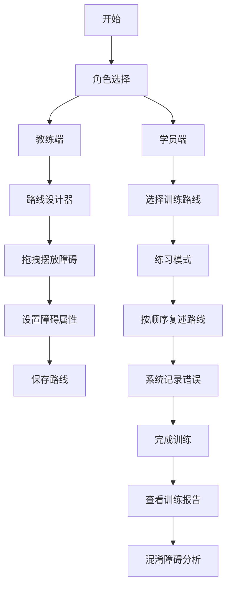

# 马术训练路线记忆板 - 产品需求文档

## 1. 产品概述

马术训练路线记忆板是一款帮助骑手在实际骑乘前熟悉障碍路线的交互式训练工具。教练可以在可视化画布上设计障碍路线，学员通过按顺序复述路线进行记忆训练，系统自动记录错误并生成个性化分析报告。

- **核心目标**：提升骑手对障碍路线的记忆效率，减少实际训练中的失误
- **目标用户**：马术教练、各级别马术学员
- **产品价值**：降低上马练习风险，提高训练效率，提供数据化的训练反馈

## 2. 核心功能

### 2.1 用户角色

| 角色 | 登录方式 | 核心权限 |
|------|----------|----------|
| 教练 | 本地身份选择 | 设计路线、管理学员、查看训练报告 |
| 学员 | 本地身份选择 | 进行路线练习、查看个人成绩 |

### 2.2 功能模块

1. **路线设计器**：教练可视化设计障碍路线
2. **练习模式**：学员按顺序复述路线并获得即时反馈
3. **训练报告**：记录错误类型，分析混淆障碍组合
4. **学员管理**：管理学员信息和训练历史

### 2.3 页面详情

| 页面名称 | 模块名称 | 功能描述 |
|----------|----------|----------|
| 首页 | 角色选择、快捷入口 | 选择教练/学员身份，快速进入训练或设计 |
| 路线设计器 | 画布工具栏、障碍库、路线属性 | 拖拽摆放障碍编号、方向箭头、步数提示、转弯半径、禁入区域 |
| 练习模式 | 路线展示、复述交互、实时反馈 | 学员按顺序点击障碍复述路线，实时提示正误 |
| 训练报告 | 错误统计、混淆分析、历史记录 | 展示漏跳、反向、绕行、停顿等错误统计，分析最易混淆障碍组合 |

## 3. 核心流程

### 教练设计路线流程
教练选择身份 → 进入路线设计器 → 从工具栏拖入障碍/箭头/标记 → 设置属性（编号、方向、步数等）→ 保存路线

### 学员练习流程
学员选择身份 → 选择训练路线 → 进入练习模式 → 按记忆顺序点击障碍 → 系统实时反馈 → 完成后查看报告

## 4. 用户界面设计

### 4.1 设计风格
- **设计主题**：优雅马术风格，传达专业、精准的运动精神
- **主色调**：深棕色 (#5D4037) 搭配米金色 (#D4AF37) 点缀
- **辅助色**：森林绿 (#2E7D32) 表示正确，砖红色 (#C62828) 表示错误
- **背景色**：米白色底色，模拟马场沙地质感
- **按钮风格**：圆角矩形，微立体效果，优雅的悬停动效
- **字体**：标题使用衬线字体体现优雅感，正文使用无衬线保证可读性
- **布局风格**：卡片式布局，清晰的功能分区
- **图标风格**：线性图标，配合马术主题元素

### 4.2 页面设计概览

| 页面名称 | 模块名称 | UI元素 |
|----------|----------|--------|
| 首页 | 角色选择 | 双卡片布局，教练/学员两个入口，优雅的图标和动画 |
| 路线设计器 | 画布 + 工具栏 | 左侧工具栏（可拖拽元素），中央画布，右侧属性面板 |
| 练习模式 | 路线展示区 | 中央画布显示路线，底部进度条，实时反馈提示 |
| 训练报告 | 数据可视化 | 错误统计图表，混淆障碍热力图，历史记录列表 |

### 4.3 响应式
- **桌面优先**设计，确保在大屏幕上的操作体验
- **平板适配**：优化触摸操作，增大点击区域
- **画布自适应**：根据屏幕尺寸自动缩放路线画布

### 4.4 交互动效
- 障碍拖拽时的阴影和缩放效果
- 正确/错误反馈的颜色渐变动画
- 页面切换的平滑过渡
- 路线回放的流畅动画
