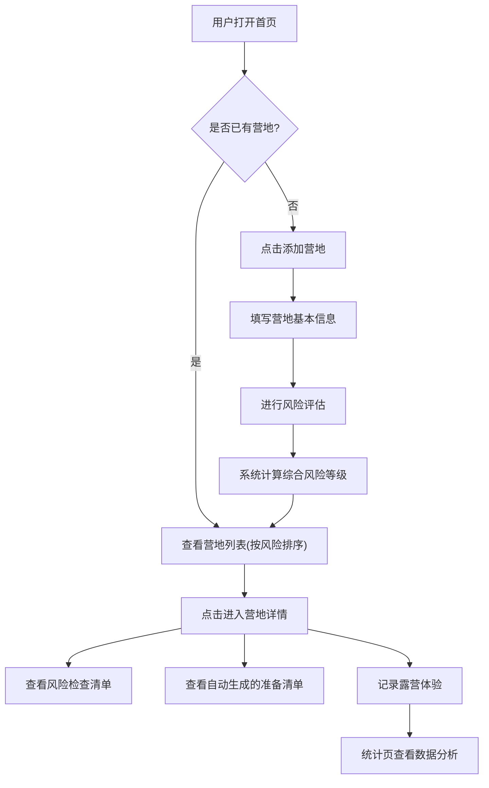

## 1. 产品概述

露营营地风险清单是一款帮助露营爱好者科学评估营地风险的工具应用。用户不再只看照片选营地，而是通过系统化的风险检查清单，全面评估天气、风力、落石、涨水、蚊虫、野狗、夜间照明和逃生路线等关键风险因素，做出更安全的露营决策。

- 核心问题：露营者选营地时往往只看照片和评价，忽略了安全风险，导致露营体验差甚至出现危险
- 目标用户：户外露营爱好者、自驾露营者、新手露营者

## 2. 核心功能

### 2.1 用户角色

| 角色 | 注册方式 | 核心权限 |
|------|----------|----------|
| 普通用户 | 无需注册 | 添加营地、评估风险、记录体验、查看统计 |

### 2.2 功能模块

1. **首页**：候选营地列表，按风险等级排序，高风险原因直接展示
2. **添加/编辑营地页**：填写营地基本信息和风险评估
3. **营地详情页**：风险检查清单、准备清单、露营体验记录
4. **统计页**：营地稳定性排行、风险频率统计

### 2.3 页面详情

| 页面名称 | 模块名称 | 功能描述 |
|----------|----------|----------|
| 首页 | 营地风险列表 | 展示所有候选营地，按风险等级从高到低排序；高风险营地用红色醒目标记，直接显示高风险原因标签；支持按风险等级筛选 |
| 首页 | 快速添加入口 | 顶部醒目的「添加营地」按钮 |
| 添加/编辑营地页 | 营地基本信息 | 位置（文本）、海拔（数字+米）、水源（选项：无/溪流/湖泊/自来水）、厕所（选项：无/简易/标准）、停车距离（数字+米）、能否生火（是/否）、手机信号（选项：无/弱/中/强） |
| 添加/编辑营地页 | 营地照片 | 上传营地照片（支持多张） |
| 添加/编辑营地页 | 风险评估 | 天气多变、强风、落石风险、涨水风险、蚊虫多、野狗出没、夜间照明不足、逃生路线不清——每项风险可选低/中/高 |
| 营地详情页 | 风险总览 | 综合风险等级展示，各风险项分布图 |
| 营地详情页 | 风险检查清单 | 8项风险检查项，每项可展开查看详情和注意事项 |
| 营地详情页 | 准备清单 | 根据风险评估自动生成准备建议，如：风大→带地钉加固、无厕所→带便携袋、蚊虫多→带驱蚊喷雾等 |
| 营地详情页 | 露营体验记录 | 记录实际体验：夜里冷不冷（温度感受）、有无积水、邻居吵不吵、整体评分 |
| 统计页 | 营地稳定性排行 | 根据历史体验记录，展示最稳定营地排行 |
| 统计页 | 风险频率统计 | 各类风险出现的频率排行，帮助用户了解最常见风险 |

## 3. 核心流程

用户添加营地 → 填写基本信息和风险评估 → 系统自动计算风险等级 → 首页按风险排序展示 → 用户查看营地详情 → 根据准备清单准备装备 → 露营后记录实际体验 → 统计页查看数据分析

## 4. 用户界面设计

### 4.1 设计风格

- **主色调**：深森林绿（#1B4332）+ 琥珀橙（#E76F51）作为警告色 + 米白色（#FEFAE0）背景
- **辅助色**：风险等级用红/橙/绿三色标识，红色高危、橙色中等、绿色低风险
- **按钮风格**：圆角带微阴影，主按钮深绿色，危险操作橙红色
- **字体**：标题用粗体无衬线，正文清晰易读
- **布局风格**：卡片式布局，顶部导航栏，左侧菜单
- **图标风格**：线条图标，与户外主题契合
- **整体风格**：户外探险风，粗犷但不失精致，像一份专业的野外手册

### 4.2 页面设计概览

| 页面名称 | 模块名称 | UI要素 |
|----------|----------|--------|
| 首页 | 营地风险卡片 | 卡片左侧风险等级色条（红/橙/绿），右侧营地名称+位置，底部风险标签（如"⚠ 强风"），卡片进入动画 |
| 首页 | 筛选栏 | 顶部水平筛选按钮：全部/高风险/中风险/低风险 |
| 添加/编辑营地页 | 表单区域 | 分步表单：基本信息→风险评估→照片上传，进度条指示当前步骤 |
| 添加/编辑营地页 | 风险评估滑块 | 每项风险用三段式选择器（低/中/高），选中项变色 |
| 营地详情页 | 风险雷达图 | 八维雷达图展示各项风险分布 |
| 营地详情页 | 准备清单 | 自动生成的清单项，带图标和说明，可勾选已完成 |
| 营地详情页 | 体验记录表单 | 星级评分+文字描述+标签选择 |
| 统计页 | 柱状图 | 各风险类型出现频率柱状图 |
| 统计页 | 排行榜 | 营地稳定性排行卡片列表 |

### 4.3 响应式设计

- 桌面优先设计，适配平板和手机
- 移动端卡片改为单列，表单改为分步全屏
- 触摸优化：按钮最小44px，滑块适配手指操作

### 4.4 视觉氛围

- 背景使用微妙的等高线纹理，呼应户外地形图
- 卡片边框使用细线，像地图标注框
- 过渡动画使用缓入缓出，模拟自然节奏
- 高风险元素使用脉冲动画吸引注意力
