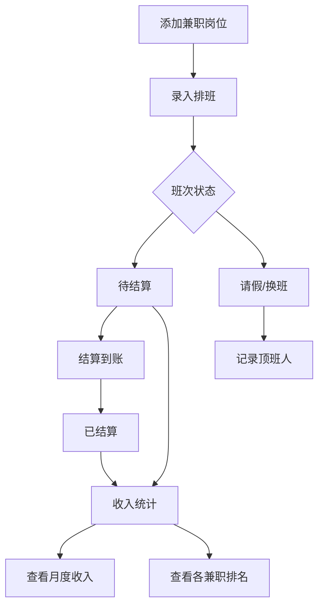

## 1. 产品概述

兼职排班收入账是一款面向多份兼职混着工作的用户群体设计的排班与收入管理工具。解决多份兼职（如咖啡店、家教、活动兼职）同时进行时排班混乱、收入算不清、结算不透明的痛点。

- 核心目标：让同时身兼数职的人清楚知道"今天去哪上班、这月赚了多少、哪些钱还没到账"
- 目标用户：在校大学生、自由职业者、多份兼职劳动者

## 2. 核心功能

### 2.1 用户角色

| 角色 | 注册方式 | 核心权限 |
|------|----------|----------|
| 个人用户 | 无需注册，本地使用 | 管理自己的兼职、排班、收入数据 |

### 2.2 功能模块

1. **首页**：本周班次概览、待结算/已结算分组、即将开始班次提醒、月收入摘要
2. **兼职管理页**：添加/编辑兼职岗位，管理岗位详细信息
3. **排班记录页**：记录每次排班的详细信息和费用
4. **收入明细页**：按兼职分类查看收入、月度总收入、未到账金额
5. **请假换班页**：记录请假和换班信息，标记顶班人
6. **统计页**：兼职赚钱排名、平均时薪、通勤时间、缺勤分析

### 2.3 页面详情

| 页面名称 | 模块名称 | 功能描述 |
|----------|----------|----------|
| 首页 | 本周班次卡片 | 显示本周所有排班，按时间排序，高亮即将开始的班次 |
| 首页 | 待结算分组 | 列出所有待结算的班次记录，标注兼职名称和金额 |
| 首页 | 已结算分组 | 列出已结算的班次记录，可折叠展开 |
| 首页 | 即将开始提醒 | 距离开始时间1小时内的班次醒目提醒，带脉冲动画 |
| 首页 | 月收入摘要卡片 | 显示本月总收入、未到账金额、各兼职收入占比 |
| 兼职管理 | 兼职列表 | 展示所有兼职卡片，显示岗位、时薪、结算周期 |
| 兼职管理 | 添加/编辑兼职 | 表单：岗位名称、时薪、结算周期（日/周/月）、联系人、地点 |
| 排班记录 | 班次列表 | 按日期排列所有班次，显示兼职名称、时间、状态 |
| 排班记录 | 添加排班 | 表单：选择兼职、开始/结束时间、是否加班、交通费、餐补、迟到扣款 |
| 排班记录 | 班次状态切换 | 可标记班次为待结算/已结算 |
| 收入明细 | 按兼职分类收入 | 每份兼职的收入小计，可展开查看班次明细 |
| 收入明细 | 月度总收入 | 本月所有兼职收入汇总 |
| 收入明细 | 未到账金额 | 所有待结算班次的收入合计 |
| 请假换班 | 请假记录列表 | 按时间列出所有请假记录，标注对应的兼职和班次 |
| 请假换班 | 换班记录列表 | 列出所有换班记录，标注谁帮你顶班 |
| 请假换班 | 添加请假/换班 | 表单：选择班次、类型（请假/换班）、顶班人姓名、备注 |
| 统计 | 最赚钱兼职排名 | 按收入排序各兼职，可视化柱状图 |
| 统计 | 平均时薪 | 各兼职平均时薪对比 |
| 统计 | 通勤时间统计 | 各兼职平均通勤时间 |
| 统计 | 缺勤次数 | 按兼职统计请假次数和换班次数 |

## 3. 核心流程

1. **添加兼职**：用户首次使用时添加兼职岗位 → 填写岗位名称、时薪、结算周期、联系人、地点
2. **排班录入**：选择兼职 → 填写开始/结束时间 → 标记加班/交通/餐补/迟到 → 保存班次
3. **日常查看**：打开首页 → 查看本周班次安排 → 确认即将开始的班次提醒
4. **结算确认**：兼职结算后 → 在排班记录中标记班次为已结算 → 收入自动更新
5. **请假换班**：选择班次 → 标记请假/换班 → 填写顶班人 → 记录保存

## 4. 用户界面设计

### 4.1 设计风格

- **主色调**：暖橙色 (#F97316) 作为主色，搭配深灰 (#18181B) 和暖白 (#FAFAF9)，传达温暖务实的兼职氛围
- **辅助色**：浅绿 (#22C55E) 表示已结算/收入到账，浅红 (#EF4444) 表示迟到扣款/缺勤，浅蓝 (#3B82F6) 表示待结算
- **按钮风格**：圆角按钮 (rounded-xl)，主操作按钮实心填充，次操作按钮描边
- **字体**：标题使用 "DM Sans"（粗体有力量感），正文使用 "Noto Sans SC"（中文友好）
- **布局风格**：卡片式布局，底部标签栏导航，圆角阴影卡片
- **图标风格**：使用 lucide-react 图标库，线条风格，与整体简洁调性一致

### 4.2 页面设计概览

| 页面名称 | 模块名称 | UI 元素 |
|----------|----------|---------|
| 首页 | 本周班次 | 水平滚动卡片，每张卡显示兼职名+时间+状态色标 |
| 首页 | 提醒区 | 顶部横幅，脉冲动画，橙色背景，显示即将开始的班次 |
| 首页 | 分组列表 | 可折叠分组，待结算蓝色标签、已结算绿色标签 |
| 首页 | 收入摘要 | 渐变卡片，大字体显示总收入，小字未到账金额 |
| 兼职管理 | 兼职列表 | 网格卡片，每张卡左侧色条标识，显示岗位+时薪 |
| 兼职管理 | 添加表单 | 底部弹出抽屉式表单，输入框带图标前缀 |
| 排班记录 | 班次列表 | 时间轴样式，左侧日期轴线，右侧卡片 |
| 排班记录 | 添加表单 | 底部弹出抽屉，时间选择器+费用输入+开关 |
| 收入明细 | 分类收入 | 手风琴式展开，每个兼职一个色块，展开显示班次明细 |
| 收入明细 | 总额区 | 顶部大卡片，总收入+未到账+环形占比图 |
| 请假换班 | 记录列表 | 标签页切换（请假/换班），卡片带类型图标 |
| 统计 | 排名图 | 横向柱状图，颜色按兼职对应，第一名高亮 |
| 统计 | 数据卡 | 网格布局数据卡片，图标+数值+标签 |

### 4.3 响应式设计

- 桌面优先设计，最大内容宽度 480px 居中（模拟手机端体验）
- 移动端自适应，底部标签栏固定
- 触摸优化：卡片点击区域 ≥ 44px，表单输入框高度 ≥ 48px

### 4.4 无3D场景

本项目为纯数据管理类应用，不涉及3D场景。
