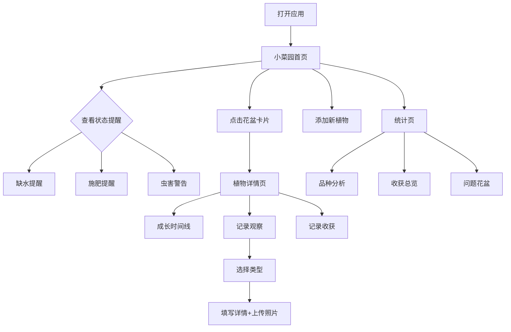

## 1. 产品概述

露台小菜园观察本是一款为阳台种植爱好者打造的植物生长记录与管理工具。用户可以追踪每一盆蔬菜从播种到收获的全过程，记录日常观察、浇水施肥、虫害防治等信息，并通过可视化时间线回顾植物成长轨迹。
- 解决阳台种植缺乏系统化记录、容易遗忘养护节点的问题
- 目标用户：在城市阳台、露台种植番茄、薄荷、辣椒、生菜等蔬菜的爱好者

## 2. 核心功能

### 2.1 用户角色
| 角色 | 注册方式 | 核心权限 |
|------|----------|----------|
| 普通用户 | 无需注册，本地使用 | 管理自己的菜园植物与观察记录 |

### 2.2 功能模块
1. **小菜园首页**：阳台平面图式布局展示所有花盆卡片，醒目提醒缺水/施肥/虫害
2. **植物详情页**：单盆植物完整信息、成长时间线、观察记录列表、收获记录
3. **添加植物**：填写品种、播种日期、盆大小、土壤、光照位置、浇水频率、上传照片
4. **记录观察**：长高记录、开花结果、叶片异常、虫害、施肥、换盆、对比照片
5. **统计页**：品种存活率、年度收获统计、问题花盆排行

### 2.3 页面详情
| 页面名称 | 模块名称 | 功能描述 |
|----------|----------|----------|
| 小菜园首页 | 阳台平面图 | 以网格布局展示花盆卡片，每张卡片显示植物品种缩略图、名称、状态标签（缺水/该施肥/有虫害提醒），支持拖拽排列位置 |
| 小菜园首页 | 状态提醒栏 | 顶部醒目横幅，汇总今日需要浇水、施肥、可能有问题需检查的花盆数量，点击跳转对应植物 |
| 小菜园首页 | 快捷操作 | 添加新植物按钮、快速浇水打卡按钮 |
| 添加植物页 | 基本信息表单 | 填写品种名称（支持常见蔬菜预设）、播种日期、盆大小（小/中/大）、土壤类型、光照位置（全日照/半日照/阴凉）、浇水频率（每天/隔天/每周几次） |
| 添加植物页 | 照片上传 | 上传植物初始照片，作为成长起点记录 |
| 植物详情页 | 基本信息卡 | 显示植物品种、播种天数、盆大小、土壤、光照、浇水频率等基础信息，支持编辑 |
| 植物详情页 | 成长时间线 | 纵向时间线，按日期排列所有观察记录，每条显示缩略图、文字描述、类型标签（生长/开花/异常/施肥/换盆） |
| 植物详情页 | 观察记录列表 | 可筛选的记录列表，按类型（全部/生长/开花/异常/施肥/换盆）过滤 |
| 植物详情页 | 收获记录 | 记录收获日期、重量、口感评价（1-5星）、备注，展示累计收获数据 |
| 记录观察页 | 观察类型选择 | 选择记录类型：长高/开花/结果/叶片异常/虫害/施肥/换盆/其他 |
| 记录观察页 | 详细描述 | 根据类型显示对应字段：长高数值、虫害描述、施肥种类用量等 |
| 记录观察页 | 照片上传 | 支持上传多张对比照片，自动标注日期水印 |
| 统计页 | 品种分析 | 各品种种植数量、存活率、平均收获量、推荐指数 |
| 统计页 | 收获总览 | 本年度收获总量（按重量）、收获次数、品种分布饼图 |
| 统计页 | 问题花盆 | 出现异常次数最多的花盆排行，异常类型分布（虫害/缺水/黄叶等） |

## 3. 核心流程

用户打开应用 → 看到小菜园首页的阳台平面图 → 所有花盆卡片一览，醒目标记需要关注的花盆 → 点击"添加植物"填写信息和上传照片 → 每天进入植物详情记录观察 → 成长时间线自动积累 → 收获时记录重量和口感 → 统计页查看整体菜园数据

## 4. 用户界面设计

### 4.1 设计风格
- 主色调：温暖的大地色系 — 土黄（#C4A35A）、叶绿（#4A7C59）、番茄红（#D4573B）
- 辅助色：晨露蓝（#7FB5C4）、薄荷绿（#98D4A8）、辣椒橙（#E8854A）
- 按钮：圆角胶囊按钮，带轻微阴影，hover 时微上浮
- 字体：中文使用"霞鹜文楷"风格的手写感字体，营造田园笔记本质感；数字使用等宽字体
- 布局：卡片式布局，首页模拟阳台平面图的网格排列，带木纹质感背景
- 图标：手绘线条风格植物图标，搭配 emoji 增加趣味性
- 整体氛围：手账/观察笔记本风格，纸张质感、手写字体、贴纸标签装饰

### 4.2 页面设计概览
| 页面名称 | 模块名称 | UI 元素 |
|----------|----------|---------|
| 小菜园首页 | 阳台平面图 | 木纹底色网格，花盆卡片带植物缩略图，状态用彩色标签（红=缺水、橙=该施肥、紫=虫害），卡片有轻微倾斜随机感，像真实摆放在阳台 |
| 小菜园首页 | 状态提醒栏 | 顶部彩色横幅条，圆角气泡图标+数字，可点击展开详情 |
| 添加植物页 | 基本信息表单 | 纸张纹理背景的表单卡片，输入框带植物装饰边框，品种选择用图标化的预设按钮 |
| 植物详情页 | 成长时间线 | 左侧竖线连接圆形节点，节点颜色按类型区分，右侧卡片显示记录内容，照片并排对比展示 |
| 植物详情页 | 收获记录 | 金色装饰边框的收获卡片，重量用大号数字，口感用番茄/辣椒图标评级 |
| 记录观察页 | 类型选择 | 手绘图标网格选择器，选中带彩色高亮，照片上传区域带虚线框+相机图标 |
| 统计页 | 品种分析 | 横向柱状图+植物图标，存活率用进度条，推荐指数用星级 |
| 统计页 | 收获总览 | 大号总重量数字，品种分布环形图，月度趋势折线图 |
| 统计页 | 问题花盆 | 排行榜样式，每行带警告图标+异常次数，点击跳转详情 |

### 4.3 响应式设计
- 桌面优先设计，最大宽度 1200px 居中
- 平板适配：阳台平面图自动调整列数
- 移动端适配：单列布局，底部导航栏切换页面，卡片堆叠展示

### 4.4 3D 场景指导
- 不适用，本项目为 2D 界面
