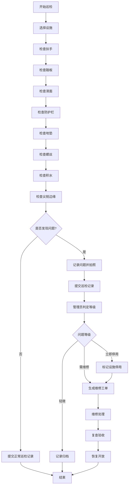

## 1. 产品概述

儿童滑梯巡检管理系统，用于社区儿童游乐设施的日常巡检、问题上报、维修记录和数据分析，保障儿童游玩安全。解决雨后滑梯湿滑、螺丝松动难以及时发现等安全隐患问题。

- 主要目的：建立规范化的设施巡检流程，让居民参与问题上报，管理员快速响应处理
- 目标用户：社区管理员、巡检人员、社区居民
- 产品价值：降低安全事故风险，提高设施完好率，实现巡检数字化管理

## 2. 核心功能

### 2.1 用户角色

| 角色 | 登录方式 | 核心权限 |
|------|----------|----------|
| 管理员 | 账号密码登录 | 设施档案管理、巡检记录查看、问题判定、维修记录管理、数据看板 |
| 巡检人员 | 账号密码登录 | 执行巡检任务、提交巡检记录、查看待巡检列表 |
| 居民 | 无需登录/访客模式 | 浏览设施信息、提交问题照片和描述 |

### 2.2 功能模块

1. **数据看板**：待巡检统计、停用设施、重复问题、雨后重点检查、各区域完好率
2. **设施档案**：设施列表、新增/编辑设施、设施详情（含照片）
3. **巡检管理**：巡检任务、巡检项勾选、巡检记录、问题提报
4. **维修记录**：维修工单、处理记录、复查结果、开放时间
5. **问题中心**：居民上报问题、管理员判定等级（轻微/需维修/立即停用）

### 2.3 页面详情

| 页面名称 | 模块名称 | 功能描述 |
|-----------|-------------|---------------------|
| 数据看板 | 统计卡片 | 显示待巡检数、停用设施数、重复问题数、完好率等关键指标 |
| 数据看板 | 雨后重点检查 | 展示降雨后需优先检查的设施列表 |
| 数据看板 | 区域完好率图表 | 按区域展示设施完好率的柱状图/饼图 |
| 设施档案 | 设施列表 | 卡片式展示所有设施，支持筛选和搜索 |
| 设施档案 | 设施表单 | 位置、类型、材质、适用年龄、安装日期、维保单位、照片上传 |
| 设施档案 | 设施详情 | 展示设施完整信息、历史巡检和维修记录 |
| 巡检管理 | 巡检列表 | 待巡检/已巡检任务列表，支持状态筛选 |
| 巡检管理 | 巡检执行 | 勾选巡检项（扶手、踏板、滑面、防护栏、地垫、螺丝、积水、尖锐边缘），添加备注和照片 |
| 问题中心 | 问题列表 | 居民上报的问题，支持按状态和等级筛选 |
| 问题中心 | 问题判定 | 管理员对问题进行等级判定（轻微/需维修/立即停用） |
| 问题中心 | 问题上报 | 居民选择设施、上传问题照片、填写问题描述 |
| 维修记录 | 维修列表 | 所有维修工单列表，支持按状态筛选 |
| 维修记录 | 维修处理 | 填写处理人、使用材料、复查结果、重新开放时间 |

## 3. 核心流程

### 3.1 巡检流程
管理员创建巡检任务 → 巡检人员查看待巡检列表 → 选择设施开始巡检 → 逐项检查8个巡检项 → 发现问题记录并拍照 → 提交巡检记录 → 管理员审核 → 生成维修工单（如需）

### 3.2 居民上报流程
居民选择问题设施 → 上传问题照片 → 填写问题描述 → 提交问题 → 管理员查看并判定等级 → 轻微问题记录归档 / 需维修生成工单 / 立即停用并通知

### 3.3 维修流程
接收维修工单 → 分配处理人 → 维修处理（记录材料）→ 复查验收 → 填写开放时间 → 设施恢复使用

## 4. 用户界面设计

### 4.1 设计风格
- **主色调**：温暖的橙黄色系 (#FF8A3D) 搭配清新的蓝绿色 (#2EC4B6)，传达安全、关爱、活力的感觉
- **辅助色**：警示红 (#E63946)、成功绿 (#2A9D8F)、中性灰 (#6C757D)
- **按钮风格**：圆角胶囊按钮，带有微阴影，hover时有轻微放大效果
- **字体**：标题使用圆润可爱的"ZCOOL KuaiLe"，正文使用"Noto Sans SC"
- **布局风格**：卡片式布局，顶部导航栏 + 左侧菜单，响应式设计
- **图标风格**：使用 Lucide React 图标，风格统一简洁

### 4.2 页面设计概述

| 页面名称 | 模块名称 | UI元素 |
|-----------|-------------|-------------|
| 数据看板 | 统计卡片 | 渐变色卡片背景，大数字+小标签，图标装饰，微动画悬浮效果 |
| 数据看板 | 区域完好率 | 彩色柱状图，悬停显示详情，渐变色填充 |
| 设施档案 | 设施卡片 | 圆角卡片，设施照片主图，标签状态角标，悬停阴影加深 |
| 巡检管理 | 巡检项 | 勾选式列表，图标+文字，异常项高亮红色，正常项绿色勾选 |
| 问题中心 | 问题卡片 | 问题缩略图，等级徽章（红/黄/蓝），状态标签 |
| 维修记录 | 时间线 | 时间轴样式展示维修流程节点，状态图标指示 |

### 4.3 响应式
- 桌面端优先设计（≥1280px）
- 平板端（≥768px）：侧边栏折叠为图标模式
- 移动端（<768px）：底部Tab导航，卡片单列布局

### 4.4 动效设计
- 页面加载：卡片渐入上浮动画（staggered）
- 数据看板数字：滚动数字动画
- 按钮点击：缩放+涟漪效果
- 状态变更：徽章颜色过渡动画
