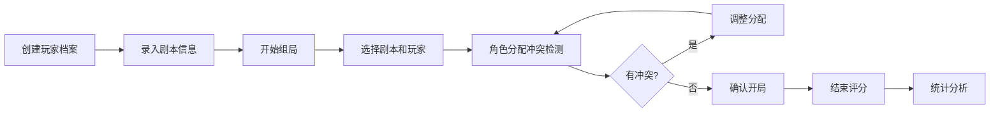

## 1. 产品概述

剧本杀组局角色偏好管理系统，帮助玩家记录个人偏好、避免踩雷，提升剧本杀体验。解决选本时角色分配冲突、雷点踩中、体验不佳的痛点。

- 主要功能：玩家偏好档案、剧本信息录入、角色分配冲突检测、评分记录、数据统计分析
- 目标用户：剧本杀爱好者、DM（主持人）、组局组织者
- 核心价值：通过系统化的偏好管理和冲突检测，减少踩雷概率，提升整体游戏体验

## 2. 核心功能

### 2.1 用户角色
| 角色 | 登录方式 | 核心权限 |
|------|----------|----------|
| 普通玩家 | 本地数据 | 管理个人档案、参与组局、评分、查看统计 |
| 组局组织者 | 本地数据 | 录入剧本、分配角色、查看冲突提示、管理局次 |

### 2.2 功能模块
1. **玩家档案页**：玩家列表、偏好设置（题材、雷点、情感接受度、恐怖程度、反串意愿、历史角色）
2. **剧本管理页**：剧本列表、剧本录入（名称、人数、角色简介、时长、店家、价格）
3. **组局分配页**：选择剧本和玩家、角色分配、冲突检测提示（情侣线、恐怖线、边缘位）
4. **评分统计页**：角色/剧本打分、玩家适配统计、雷点踩中统计、历史记录

### 2.3 页面详情
| 页面名称 | 模块名称 | 功能描述 |
|-----------|-------------|---------------------|
| 玩家档案页 | 玩家列表 | 展示所有玩家卡片，支持新增/编辑/删除 |
| 玩家档案页 | 偏好表单 | 题材多选、雷点多选、情感接受度滑块、恐怖程度滑块、反串意愿开关、历史角色开关 |
| 剧本管理页 | 剧本列表 | 展示所有剧本卡片，支持新增/编辑/删除 |
| 剧本管理页 | 剧本表单 | 剧本名称、人数、时长、店家、价格、角色列表（姓名+简介+标签） |
| 组局分配页 | 局次信息 | 选择剧本、选择参与玩家、开始分配 |
| 组局分配页 | 角色分配 | 拖拽/下拉分配角色，实时显示冲突提示 |
| 组局分配页 | 冲突检测 | 高亮显示情侣线冲突、恐怖线冲突、边缘位警告、雷点匹配 |
| 评分统计页 | 评分表单 | 为每个角色和剧本打分（1-5星）、填写评语 |
| 评分统计页 | 数据统计 | 玩家角色适配度排行、雷点踩中频率统计、剧本评分排行 |

## 3. 核心流程

玩家创建个人档案 → 组织者录入剧本信息 → 开始组局选择剧本和玩家 → 系统进行角色分配冲突检测 → 确认分配并开局 → 结束后玩家评分 → 系统统计分析数据

## 4. 用户界面设计

### 4.1 设计风格
- **主色调**：深紫色（#6366f1）作为主色，营造神秘悬疑的剧本杀氛围
- **辅助色**：琥珀色（#f59e0b）作为强调色，用于重要提示和冲突警告
- **背景**：深色主题，深灰蓝底色，搭配渐变和微光效果
- **按钮风格**：圆角中等，带悬停微动效，主按钮有渐变光晕
- **字体**：标题使用具有衬线感的字体增加故事感，正文使用现代无衬线字体保证可读性
- **布局风格**：卡片式布局，带微妙阴影和边框，层次分明
- **图标风格**：线性图标，配合主题色填充

### 4.2 页面设计概述
| 页面名称 | 模块名称 | UI元素 |
|-----------|-------------|-------------|
| 玩家档案页 | 玩家列表 | 头像卡片、标签云、悬停浮起效果 |
| 玩家档案页 | 偏好设置 | 滑块控件、多选标签、开关按钮 |
| 剧本管理页 | 剧本卡片 | 封面图占位、元信息标签、角色预览 |
| 组局分配页 | 角色分配 | 拖拽交互、冲突高亮、提示气泡 |
| 组局分配页 | 冲突面板 | 警示色边框、图标提示、严重程度分级 |
| 评分统计页 | 评分卡片 | 星星评分、进度条、数据可视化 |
| 评分统计页 | 统计图表 | 柱状图、雷达图、排行列表 |

### 4.3 响应式
- 桌面端优先设计，左侧导航 + 主内容区布局
- 平板端：导航折叠为侧边栏
- 移动端：底部 Tab 导航，卡片单列排列

### 4.4 动效设计
- 页面切换：淡入 + 轻微位移
- 卡片悬停：上移 2px + 阴影加深
- 冲突提示：脉冲呼吸动画吸引注意
- 评分星星：悬停时依次点亮效果
