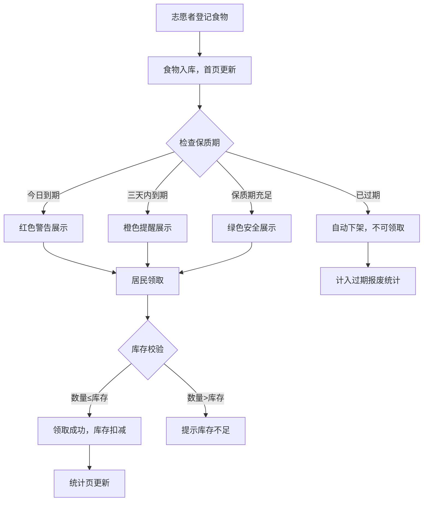

## 1. 产品概述

社区共享冰箱看板——一款面向社区公益冰箱的透明化管理工具，让冰箱里有什么、快过期什么、谁领走了都一目了然。目标用户为社区志愿者和居民，旨在减少食物浪费、保障食品安全、提升社区互助效率。

## 2. 核心功能

### 2.1 用户角色

| 角色 | 说明 | 核心权限 |
|------|------|----------|
| 志愿者 | 负责食物入库、清洁记录 | 登记食物、记录清洁、查看统计 |
| 居民 | 领取食物 | 领取食物、查看冰箱状态 |

### 2.2 功能模块

1. **首页（冰箱看板）**：冰箱分层可视化图、今日到期/三天内到期/可放心领取分类展示、快捷领取入口
2. **食物登记页**：志愿者录入食物信息（名称、数量、来源、存放层、保质期、冷链、过敏原、照片）
3. **领取页**：居民选择食物和数量领取、记录领取时间和备注、库存校验
4. **清洁记录页**：冰箱温度记录、消毒时间、异常异味记录
5. **统计页**：本月减少浪费份数、热门食物排行、过期报废统计

### 2.3 页面详情

| 页面名称 | 模块名称 | 功能描述 |
|----------|----------|----------|
| 首页 | 冰箱分层图 | 模拟冰箱层架，按存放层分组展示食物，视觉化区分到期状态 |
| 首页 | 今日到期 | 列出今天到期的食物，红色警告标识 |
| 首页 | 三天内到期 | 列出三天内到期的食物，橙色提醒标识 |
| 首页 | 可放心领取 | 列出余下保质期充足的食物，绿色安全标识 |
| 首页 | 过期自动下架 | 超过保质期的食物自动标记为已下架，不允许领取 |
| 食物登记页 | 基本信息表单 | 填写名称、数量、来源、存放层（1-5层） |
| 食物登记页 | 安全信息表单 | 填写保质期、是否冷链、过敏原标签 |
| 食物登记页 | 照片上传 | 拍照或选择食物照片 |
| 领取页 | 食物选择 | 从可领取列表中选择食物 |
| 领取页 | 数量确认 | 输入领取数量，校验不超过库存 |
| 领取页 | 领取记录 | 记录领取时间、备注，扣减库存 |
| 清洁记录页 | 温度记录 | 记录冰箱当前温度 |
| 清洁记录页 | 消毒记录 | 记录消毒时间和方式 |
| 清洁记录页 | 异常记录 | 记录异味等异常情况 |
| 统计页 | 减少浪费 | 本月通过领取减少浪费的食物份数 |
| 统计页 | 热门食物 | 最常被领取的食物排行 |
| 统计页 | 过期报废 | 过期需报废处理的食物统计 |

## 3. 核心流程

**志愿者登记食物流程**：志愿者打开食物登记页 → 填写食物名称、数量、来源 → 选择存放层 → 填写保质期、冷链标记、过敏原 → 上传照片 → 提交入库 → 首页看板自动更新

**居民领取食物流程**：居民打开首页查看冰箱分层图 → 查看到期状态分类 → 选择需领取的食物 → 输入数量（不超过库存）→ 填写备注 → 确认领取 → 库存自动扣减

**过期自动下架流程**：系统每日检查保质期 → 超过保质期的食物自动标记为"已下架" → 看板中不再显示为可领取 → 统计中计入过期报废

## 4. 用户界面设计

### 4.1 设计风格

- **主色调**：清新绿色系（#22C55E 为主色，象征新鲜与环保），辅以暖白色（#FAFAF9）背景
- **警告色**：红色（#EF4444）表示今日到期，橙色（#F97316）表示三天内到期，绿色（#22C55E）表示安全
- **冰箱视觉**：深灰色冰箱外壳质感，内部按层架分区，每层有不同背景色区分
- **按钮风格**：圆角大按钮，带轻微阴影，hover 有上浮效果
- **字体**：标题使用 Noto Sans SC 粗体，正文使用 Noto Sans SC 常规
- **布局风格**：顶部导航 + 内容区，卡片式布局，冰箱分层图占首页视觉中心
- **图标**：Lucide 图标库，食物用 🥬🍞🥛 等 emoji 辅助

### 4.2 页面设计概述

| 页面名称 | 模块名称 | UI 元素 |
|----------|----------|---------|
| 首页 | 冰箱分层图 | 深灰冰箱外壳，5层白色层架，每层放置食物卡片，卡片含名称/数量/到期状态色条 |
| 首页 | 到期状态分类 | 三栏横排：红色/橙色/绿色卡片组，每张卡片含食物名/剩余天数/领取按钮 |
| 食物登记页 | 表单 | 居中卡片式表单，分步填写，输入框带图标前缀，日期选择器，多选标签（过敏原） |
| 领取页 | 领取面板 | 左侧食物列表带搜索，右侧领取详情面板，数量用加减按钮 |
| 清洁记录页 | 记录表单+时间线 | 上方快速录入表单，下方历史记录时间线 |
| 统计页 | 数据卡片+图表 | 顶部三个数据大卡片（浪费减少/热门食物/过期报废），下方详情列表 |

### 4.3 响应式设计

- 桌面优先设计，最小宽度 1024px
- 平板适配：冰箱分层图从横排变为纵排
- 移动端适配：导航变为底部标签栏，卡片单列展示
