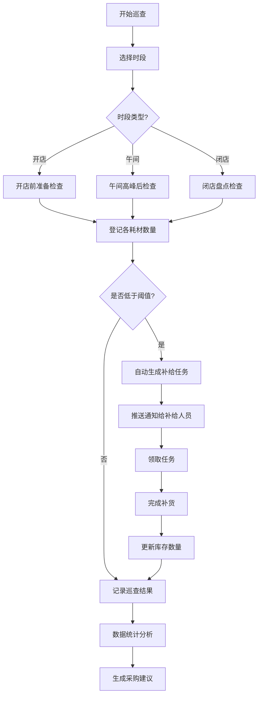

## 1. 产品概述

香水门店试香耗材智能补给系统，解决试香纸、咖啡豆、一次性喷头等耗材消耗快、补货不及时的问题，通过数字化巡查、智能任务生成和数据分析，确保门店耗材供应持续稳定。

- **主要目标**：建立标准化的耗材管理流程，实现库存透明化、巡查自动化、补给智能化
- **目标用户**：门店导购、店长、区域运营管理人员
- **核心价值**：减少因耗材缺货导致的客户体验下降，降低采购成本，提升运营效率

## 2. 核心功能

### 2.1 用户角色

| 角色 | 核心权限 |
|------|----------|
| 导购 | 执行巡查、登记库存、完成补给任务 |
| 店长 | 管理柜台档案、设置阈值、查看统计、审核采购建议 |
| 管理员 | 全功能权限、活动日配置、系统设置 |

### 2.2 功能模块

1. **柜台档案**：品牌区配置、导购分配、试香台/展示瓶管理、照片上传
2. **耗材库存**：五大类耗材（试香纸、咖啡豆、一次性喷头、清洁布、标签贴）库存管理，含批次、存放位置、阈值设置
3. **巡查任务**：每日三次巡查（开店/午间/闭店）、库存登记、缺货自动触发补给单
4. **补给工单**：待办任务看板、任务分配与跟踪、完成确认
5. **活动管理**：活动日日历、阈值加倍系数、活动用量追踪
6. **数据统计**：品牌区消耗分析、缺货时长统计、活动用量对比、智能采购建议

### 2.3 页面详情

| 页面名称 | 模块名称 | 功能描述 |
|-----------|-------------|---------------------|
| 工作台首页 | 数据概览卡 | 今日待办、库存预警、巡查进度、补给统计 |
| 工作台首页 | 任务时间线 | 今日关键事件和任务状态时间轴 |
| 柜台档案 | 品牌区列表 | 各品牌区卡片展示，含导购、试香台数、展示瓶数 |
| 柜台档案 | 档案详情 | 品牌区详细信息编辑、照片管理、导购分配 |
| 耗材库存 | 库存总览 | 五大类耗材库存状态看板（正常/预警/缺货） |
| 耗材库存 | 库存明细 | 批次、数量、存放抽屉、阈值、最近变更记录 |
| 巡查登记 | 巡查表单 | 按时段选择品牌区，逐项登记耗材数量 |
| 巡查登记 | 巡查记录 | 历史巡查记录查询与对比 |
| 补给任务 | 待办看板 | 按品牌区分组的待补给任务列表 |
| 补给任务 | 任务详情 | 缺货明细、紧急程度、操作记录、完成确认 |
| 活动设置 | 活动日历 | 活动日标记、阈值加倍系数配置 |
| 数据统计 | 消耗分析 | 各品牌区耗材消耗趋势图、对比表 |
| 数据统计 | 缺货分析 | 缺货时长排名、缺货品类分析 |
| 数据统计 | 采购建议 | 基于消耗数据的智能采购量推荐 |

## 3. 核心流程

### 3.1 日常巡查与补给流程

导购登录系统 → 进入巡查登记页 → 选择当前时段（开店/午间/闭店）→ 逐个品牌区登记各耗材实际数量 → 系统自动比对阈值 → 低于阈值自动生成补给任务 → 补给人员领取任务 → 从存放抽屉取货补充 → 确认任务完成 → 库存自动更新

### 3.2 活动日流程

店长提前在活动日历标记活动日 → 设置阈值加倍系数（如1.5倍/2倍）→ 活动日当天系统自动启用加倍阈值 → 巡查时按加倍阈值判断是否缺货 → 活动结束后自动统计活动期间增量消耗

### 3.3 采购建议流程

系统收集近30天消耗数据 → 计算各耗材日均消耗量 → 结合现有库存和安全库存天数 → 生成采购建议清单（品类、数量、建议采购日期）→ 店长审核 → 导出采购单

### 3.4 流程图

## 4. 用户界面设计

### 4.1 设计风格

- **主色调**：深酒红色 #722F37（香水轻奢感）+ 金色 #C9A962（点缀，高端质感）
- **辅助色**：米白色 #FAF8F5（背景，干净优雅）、深灰 #2C2C2C（文字）
- **状态色**：正常 #4CAF50、预警 #FF9800、缺货 #E53935
- **按钮风格**：圆角 8px，主按钮渐变酒红配金色边框，次要按钮描边风格
- **字体**：标题使用 Noto Serif SC（衬线体，优雅高端），正文使用 Noto Sans SC（无衬线，清晰易读）
- **布局风格**：卡片式布局，柔和阴影，精致分隔线，留白充足
- **图标风格**：线性图标 + 精致填充，配合轻微金色点缀
- **整体调性**：高端香水门店质感，精致、优雅、专业

### 4.2 页面设计概述

| 页面名称 | 模块名称 | UI元素 |
|-----------|-------------|-------------|
| 工作台首页 | 数据概览卡 | 渐变背景卡片、金色数字、图标点缀、悬浮动画 |
| 工作台首页 | 任务时间线 | 竖线时间轴、状态彩色圆点、卡片式事件节点 |
| 柜台档案 | 品牌区列表 | 网格卡片布局、品牌色标识条、照片缩略图、状态角标 |
| 柜台档案 | 档案详情 | 左右分栏、照片轮播、表单分组、标签式信息展示 |
| 耗材库存 | 库存总览 | 分类标签页、状态色进度条、预警闪烁动画、库存仪表盘 |
| 耗材库存 | 库存明细 | 表格+卡片混合视图、抽屉位置图标、批次标签、变更历史时间线 |
| 巡查登记 | 巡查表单 | 步进式流程、大数字输入框、快速+/-按钮、自动保存 |
| 巡查登记 | 巡查记录 | 日期选择器、品牌区筛选、数据对比高亮 |
| 补给任务 | 待办看板 | 看板列布局（待处理/进行中/已完成）、拖拽卡片、紧急标识 |
| 补给任务 | 任务详情 | 缺货清单表格、操作记录时间轴、状态流转按钮 |
| 活动设置 | 活动日历 | 月视图日历、活动日高亮、悬浮详情、系数设置弹窗 |
| 数据统计 | 消耗分析 | 多折线图、堆叠柱状图、品牌区对比卡片 |
| 数据统计 | 缺货分析 | 热力图、排名条形图、时长分布饼图 |
| 数据统计 | 采购建议 | 建议清单表格、数量调节滑块、一键导出按钮 |

### 4.3 响应式设计

- **桌面端优先**：最小支持 1440px 宽度，采用 12 列栅格系统
- **平板适配**：1024px-1439px，侧边栏折叠，卡片重新排列
- **移动端**：768px-1023px，底部 Tab 导航，全宽卡片，触控优化按钮
- **触控优化**：按钮最小 44x44px，输入框增大内边距，滑动手势支持

### 4.4 动效与交互

- **页面加载**：卡片渐入+上浮动画，按序延迟（staggered reveal）
- **状态变化**：预警状态呼吸灯动画，任务完成勾选动效
- **数据更新**：数字滚动动画（count-up），库存变化滑入提示
- **悬停效果**：卡片轻微上浮+阴影加深，按钮金色光效扫过
- **转场动画**：页面切换淡入淡出，模态框缩放+背景模糊
